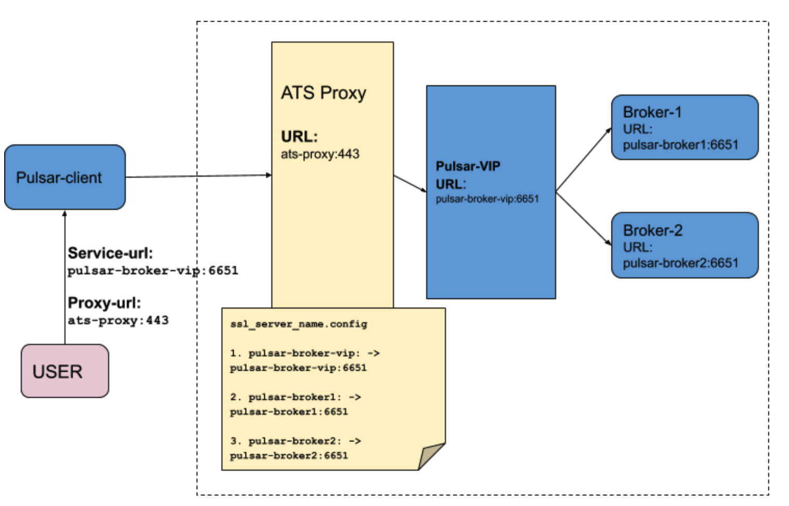
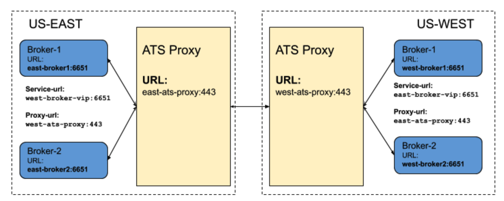

# 使用 SNI 路由的代理支持
    代理服务器是一种中间服务器，它将来自多个客户机的请求通过Internet转发到不同的服务器。代理服务器在正向代理和反向代理场景中都扮演着“traffic cop”的角色，
    并在负载平衡、性能、安全性、自动伸缩等方面为系统带来好处
Pulsar中的代理充当反向代理，并在代理前面创建网关。Pulsar不支持Apache Traffic Server (ATS)、HAProxy、Nginx、Envoy等代理。
这些代理服务器支持SNI路由。SNI路由用于在不终止SSL连接的情况下将流量路由到目的地。第4层路由提供了更高的透明度，因为出站连接是通过检查客户端TCP数据包中的目的地址来确定的

Pulsar客户端(Java, c++， Python)支持SNI路由协议，因此我们可以通过代理连接到代理。本文档向我们介绍如何设置ATS代理、启用SNI路由以及通过ATS代理将Pulsar客户端连接到代理

# Pulsar中的ATS-SNI路由
    为了支持带有ATS的第4层SNI路由，入站连接必须是TLS连接。Pulsar客户端支持TLS连接上的SNI路由协议，因此当Pulsar客户端通过ATS代理连接到代理时，Pulsar使用ATS作为反向代理
Pulsar支持用于地理复制的SNI路由，因此代理可以通过ATS代理连接到其他集群中的代理

# 为四层SNI路由设置ATS代理
    为了支持四层SNI路由，需要配置records.conf和ssl_server_name.conf文件

records.config文件的默认路径为/usr/local/etc/trafficserver/，该文件列出了ATS使用的可配置变量。
配置records.config文件，完成以下步骤：
- 更新TLS端口(http.server_ports)，并更新代理证书(ssl.client.cert.path)路径和(ssl.client.cert.filename)来保护TLS隧道
- 配置服务器端口(http.connect_ports)，用于通过隧道连接到代理。如果Pulsar broker侦听4443和6651端口，则在文件中添加broker服务http.connect_ports配置
```text
# PROXY TLS PORT
CONFIG proxy.config.http.server_ports STRING 4443:ssl 4080
# PROXY CERTS FILE PATH
CONFIG proxy.config.ssl.client.cert.path STRING /proxy-cert.pem
# PROXY KEY FILE PATH
CONFIG proxy.config.ssl.client.cert.filename STRING /proxy-key.pem

# The range of origin server ports that can be used for tunneling via CONNECT. # Traffic Server allows tunnels only to the specified ports. Supports both wildcards (*) and ranges (e.g. 0-1023).
CONFIG proxy.config.http.connect_ports STRING 4443 6651 
```
- ssl_server_name文件用于为入站和出站连接配置TLS连接处理。配置由入站连接提供的SNI值决定。该文件由一组配置项组成，每个配置项由一个SNI值(fqdn)标识。
当建立入站TLS连接时，来自TLS协商的SNI值将与此文件中指定的项匹配。如果值匹配，则该项中指定的值将覆盖默认值

下面的示例显示了来自客户端的入站SNI主机名和请求应该重定向的实际代理服务URL之间的映射。例如，如果客户端发送了SNI报头pulse-broker1，
代理会通过将请求重定向到pulse-broker1:6651服务URL来创建TLS隧道
```text
server_config = {
  {
     fqdn = 'pulsar-broker-vip',
     # Forward to Pulsar broker which is listening on 6651
     tunnel_route = 'pulsar-broker-vip:6651'
  },
  {
     fqdn = 'pulsar-broker1',
     # Forward to Pulsar broker-1 which is listening on 6651
     tunnel_route = 'pulsar-broker1:6651'
  },
  {
     fqdn = 'pulsar-broker2',
     # Forward to Pulsar broker-2 which is listening on 6651
     tunnel_route = 'pulsar-broker2:6651'
  },
}
```
配置ssl_server_name.config和records.config文件，ATS-proxy服务器处理SNI路由并在客户端和代理之间创建TCP隧道

# 配置带有SNI路由的pulse-client
ATS SNI-routing只支持TLS。首先需要为ATS代理和代理启用TLS，配置SNI路由协议，然后通过ATS代理将Pulsar客户端连接到代理。Pulsar客户端通过连接到代理来支持SNI路由，
并将目标代理URL发送到SNI报头。这个过程是内部处理的。在创建Pulsar客户端以使用SNI路由协议时，最初只需要配置以下代理配置:
```java
String brokerServiceUrl = "pulsar+ssl://pulsar-broker-vip:6651/";
String proxyUrl = "pulsar+ssl://ats-proxy:443";
ClientBuilder clientBuilder = PulsarClient.builder()
        .serviceUrl(brokerServiceUrl)
        .tlsTrustCertsFilePath(TLS_TRUST_CERT_FILE_PATH)
        .enableTls(true)
        .allowTlsInsecureConnection(false)
        .proxyServiceUrl(proxyUrl, ProxyProtocol.SNI)
        .operationTimeout(1000, TimeUnit.MILLISECONDS);

Map<String, String> authParams = new HashMap();
authParams.put("tlsCertFile", TLS_CLIENT_CERT_FILE_PATH);
authParams.put("tlsKeyFile", TLS_CLIENT_KEY_FILE_PATH);
clientBuilder.authentication(AuthenticationTls.class.getName(), authParams);

PulsarClient pulsarClient = clientBuilder.build();
```
# Pulsar地理复制与SNI路由
    我们可以使用ATS代理进行地理复制。Pulsar代理可以使用SNI路由连接到地理复制中的代理。要启用SNI路由用于跨集群的代理连接，需要将SNI代理URL配置到集群元数据。
    如果在集群元数据中配置了SNI代理URL，则可以通过SNI路由通过代理连接到跨集群的代理

在这个例子中，pulsar 集群被部署在两个独立的区域，美国西部和美国东部。两个区域都配置了ATS代理，每个区域中的代理在ATS代理之后运行。
我们为两个集群配置集群元数据，这样一个集群中的代理就可以使用SNI路由，并通过ATS代理连接到其他集群中的代理
使用us-east代理服务URL配置us-east的集群元数据，使用SNI代理协议配置us-east ATS代理URL
```shell
./pulsar-admin clusters update \
    --broker-url-secure pulsar+ssl://east-broker-vip:6651 \
    --url http://east-broker-vip:8080 \
    --proxy-protocol SNI \
    --proxy-url pulsar+ssl://east-ats-proxy:443
```
使用us-west代理服务URL配置us-west的集群元数据，使用SNI代理协议配置us-west ATS代理URL
```shell
./pulsar-admin clusters update \
    --broker-url-secure pulsar+ssl://west-broker-vip:6651 \
    --url http://west-broker-vip:8080 \
    --proxy-protocol SNI \
    --proxy-url pulsar+ssl://west-ats-proxy:443
```