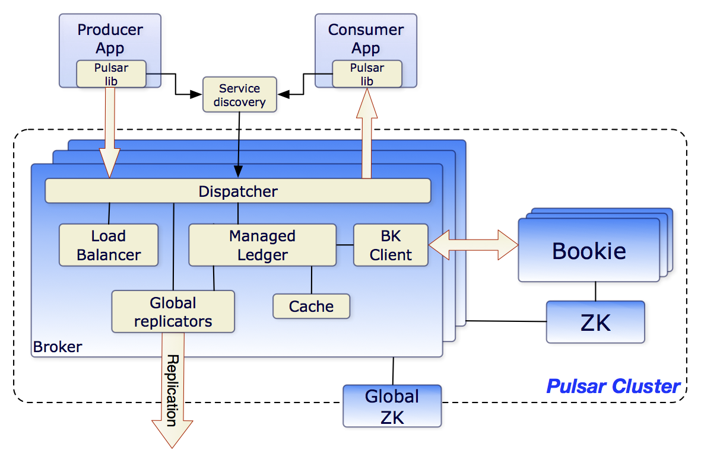
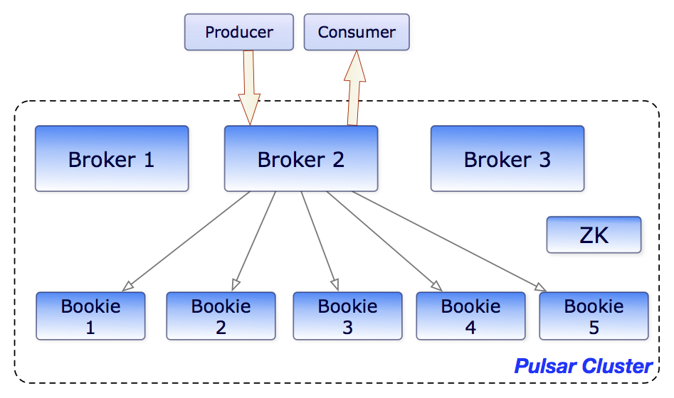
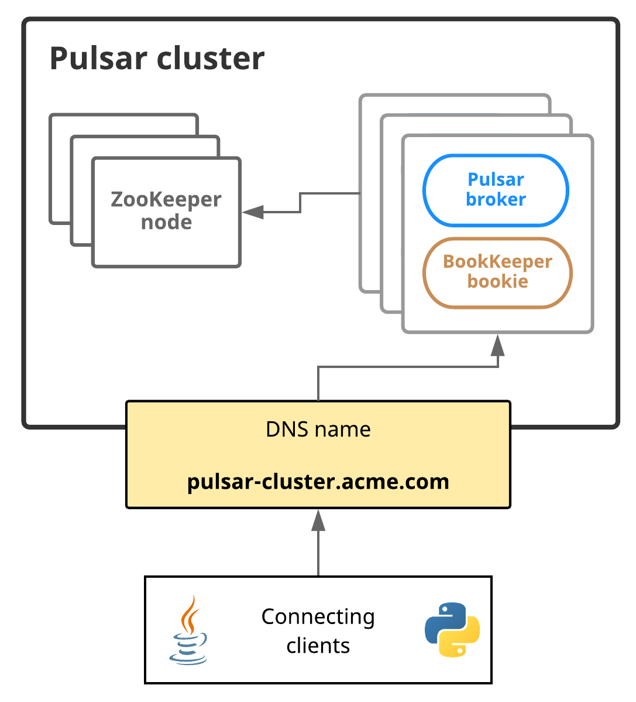

# Pulsar 之 架构总览
    在最高级别上，Pulsar实例由一个或多个Pulsar clusters组成。实例中的集群可以在它们之间复制数据
在一个pulsar cluster中：

- 一个或多个代理处理和负载平衡来自生产者的传入消息，将消息分发给消费者，与Pulsar配置存储通信以处理各种协调任务，将消息存储在BookKeeper实例(又名bookies)中，依赖于特定于集群的ZooKeeper集群来完成某些任务，等等
- 由一个或多个BookKeeper集群组成的BookKeeper集群处理消息的持久存储
- 特定于该集群的ZooKeeper集群处理Pulsar集群之间的协调任务

下图展示了一个pulsar cluster：

在更广泛的实例级，一个称为配置存储的实例级ZooKeeper集群处理涉及多个集群的协调任务
# Brokers
Pulsar消息代理是一个无状态组件，主要负责运行另外两个组件:

- 为生产者和消费者的管理任务和主题查找公开REST API的HTTP服务器。生产者连接到代理以发布消息，消费者连接到代理以消费消息
- 调度程序，它是一个异步TCP服务器，使用自定义二进制协议进行所有数据传输

出于性能考虑，消息通常从托管分类账缓存中分派，除非积压超过缓存大小。如果积压对缓存来说太大，代理将开始从BookKeeper读取条目

最后，为了支持全局主题上的地理复制，代理管理复制器，跟踪在本地区域发布的条目，并使用Pulsar Java客户端库将它们重新发布到远程区域
# Clusters
pulsar实例由一个或多个pulsar clusters组成。集群依次由:
- 一个或者多个pulsar brokers
- 用于集群级配置和协调的ZooKeeper仲裁
- 用于持久存储消息的bookies集合

# 元数据存储
    Pulsar元数据存储维护Pulsar集群的所有元数据，比如主题元数据、模式、代理加载数据等等。Pulsar使用Apache ZooKeeper进行元数据存储、集群配置和协调。
    Pulsar元数据存储可以部署在单独的ZooKeeper集群上，也可以部署在已有的ZooKeeper集群上。可以使用一个ZooKeeper集群同时存储Pulsar元数据和BookKeeper元数据。
    如果要部署连接到已有BookKeeper集群的Pulsar broker，则需要分别部署用于Pulsar元数据存储和BookKeeper元数据存储的ZooKeeper集群
Pulsar还支持更多的元数据后端服务，包括etcd和RocksDB(仅适用于独立的Pulsar)

在pulsar 实例中：
- 配置存储仲裁存储租户、名称空间和其他需要全局一致的实体的配置
- 每个集群都有自己的本地ZooKeeper集合，存储特定于集群的配置和协调，比如哪个代理负责哪个主题，以及所有权元数据、代理加载报告、BookKeeper账本元数据等等
# 配置存储区
    配置存储维护Pulsar实例的所有配置，例如集群、租户、名称空间、与分区主题相关的配置，等等.
    一个Pulsar实例可以有一个本地集群、多个本地集群或多个跨区域集群。因此，配置存储可以跨Pulsar实例下的多个集群共享配置。
    配置存储可以部署在单独的ZooKeeper集群上，也可以部署在已有的ZooKeeper集群上。
# 持久存储
    Pulsar为应用程序提供有保证的消息传递。如果消息成功到达Pulsar代理，它将被发送到预定目标.此保证要求以持久的方式存储未确认的消息，
    直到它们可以交付给消费者并被消费者确认为止。这种消息传递模式通常称为持久消息传递。在Pulsar中，所有消息的N个副本存储在磁盘上并同步，
    例如在两台服务器上存储4个副本，每个服务器上都有镜像RAID卷
# Apache BookKeeper
    Pulsar使用名为Apache BookKeeper的系统进行持久消息存储。BookKeeper是一种分布式预写日志(WAL)系统，为Pulsar提供了许多关键优势
优势：

- 使Pulsar能够利用许多独立的日志，称为ledgers。随着时间的推移，可以为主题创建多个ledgers
- 为处理条目复制的顺序数据提供了非常有效的存储
- 保证了账本在各种系统故障时的读一致性
- 在bookies提供均匀分布 I/O
- 在容量和吞吐量上都是水平可扩展的。可以通过向集群中添加更多的赌徒来立即增加容量
- bookies被设计用来处理成千上万的同时读写的ledgers。通过使用多个磁盘设备(一个用于日志，另一个用于一般存储)，bookies能够将读操作的影响与正在进行的写操作的延迟隔离开来

除了消息数据外，游标还持久地存储在BookKeeper中。游标是消费者的订阅位置。BookKeeper使Pulsar能够以可伸缩的方式存储消费者位置

目前，Pulsar支持持久消息存储。这说明了所有主题名称中的持久性
```text
persistent://my-tenant/my-namespace/my-topic
```
可以在下面的图表中看到brokers和bookies如何交互的说明:

## Ledgers
    Ledgers是一种仅可追加的数据结构，具有单个写入器，该写入器被分配给多个BookKeeper存储节点(或bookies)。Ledger条目被复制到多个bookies
Ledger本身的语义:

- Pulsar代理可以创建一个Ledgers，将条目追加到Ledgers，并关闭Ledgers
- 在关闭Ledgers之后——无论是显式关闭还是因为写入进程崩溃——它只能以只读模式打开
- 最后，当Ledgers中的条目不再需要时，整个Ledgers可以从系统中删除(包括所有的bookies)
### Ledgers读一致性
    Bookkeeper的主要优点是在出现故障时，它可以保证Ledgers的读一致性。由于Ledgers只能由单个进程写入，因此该进程可以非常有效地自由添加条目，而不需要获得共识。
    在发生故障后，Ledgers将经历一个恢复过程，该过程将最终确定Ledgers的状态，并确定最后提交给日志的条目是哪个。在此之后，保证Ledger的所有读者都能看到完全相同的内容
### 托管Ledgers
    考虑到Bookkeeper Ledgers提供了单一的日志抽象，在分类账之上开发了一个库，称为托管Ledgers，它代表单个主题的存储层。
    托管Ledgers表示消息流的抽象，其中有一个写入器，它不断在流的末尾追加内容，多个游标正在使用流，每个游标都有自己的关联位置。
在内部，单个托管Ledgers使用多个BookKeeper Ledgers来存储数据。使用多个Ledgers有两个原因：

- 失败后，Ledger不再可写，需要创建一个新的Ledger
- 当所有游标都使用了Ledger所包含的消息时，可以删除Ledger。这允许Ledger的周期性滚动
## 日志存储
    在BookKeeper中，日志文件包含BookKeeper事务日志。在对Ledgers进行更新之前，bookies需要确保将描述更新的事务写入持久性(非易失性)存储。
    一旦bookies启动或旧日志文件达到日志文件大小阈值(使用journalMaxSizeMB参数配置)，就会创建一个新的日志文件。
# Pulsar 代理
    Pulsar客户端与Pulsar集群交互的一种方法是直接连接到Pulsar消息代理。然而，在某些情况下，这种直接连接要么是不可行的，要么是不可取的，因为客户端不能直接访问代理地址。
    例如，如果在云环境或Kubernetes或类似的平台上运行Pulsar，那么直接连接到代理的客户端可能是不可能的
Pulsar代理通过充当集群中所有代理的单一网关，为这个问题提供了解决方案。如果运行Pulsar代理(这也是可选的)，所有与Pulsar集群的客户端连接都将通过代理而不是与代理通信

```text
为了提高性能和容错性，可以运行任意数量的Pulsar代理实例
```
从体系结构上讲，Pulsar代理从ZooKeeper获得所需的所有信息。在计算机上启动代理时，只需为特定于集群的和实例范围的配置存储集群提供元数据存储连接字符串
```shell
$ cd /path/to/pulsar/directory
$ bin/pulsar proxy \
  --metadata-store zk:my-zk-1:2181,my-zk-2:2181,my-zk-3:2181 \
  --configuration-metadata-store zk:my-zk-1:2181,my-zk-2:2181,my-zk-3:2181
```
关于pulsar代理需要知道的一些重要事情:

- 连接客户机不需要提供任何特定的配置就可以使用Pulsar代理。除了更新用于服务URL的IP之外，不需要为现有应用程序更新客户端配置(例如，如果正在Pulsar代理上运行负载平衡器)
- Pulsar代理支持TLS加密和身份验证
# 服务发现
    连接到Pulsar代理的客户端需要能够使用单个URL与整个Pulsar实例通信
如果可以的话，可以使用自己的服务发现系统。如果使用自己的系统，只有一个要求:当客户机向端点执行HTTP请求时，如http://pulsar.us-west.example.com:8080。
客户端需要被重定向到所需集群中的某个活动代理，无论是通过DNS、HTTP或IP重定向，还是其他方式。
下图展示了Pulsar服务发现：

在这个图中，Pulsar集群可以通过一个DNS名称来寻址:pulsar-cluster.acme.com 例如，Python客户端可以像这样访问Pulsar集群:
```python
from pulsar import Client

client = Client('pulsar://pulsar-cluster.acme.com:6650')
```
    注意:在Pulsar中，每个主题只由一个经纪人处理。客户端读取、更新或删除主题的初始请求被发送到可能不是主题所有者的代理。如果代理不能处理此主题的请求，则它将请求重定向到适当的代理
