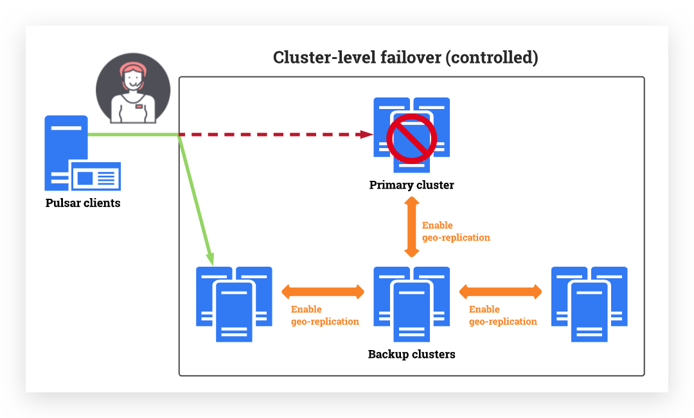
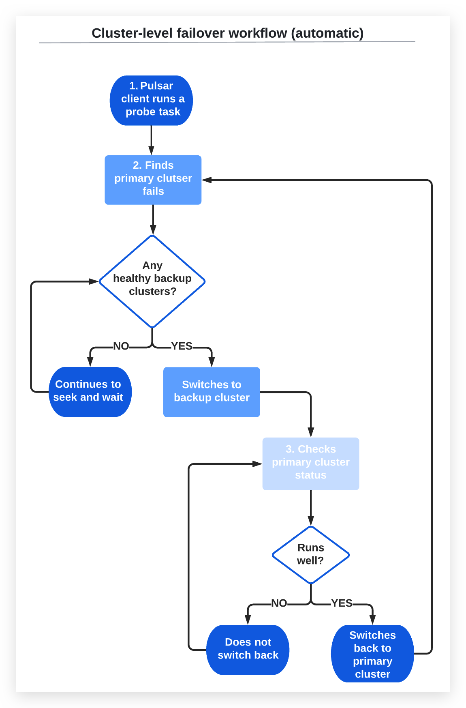
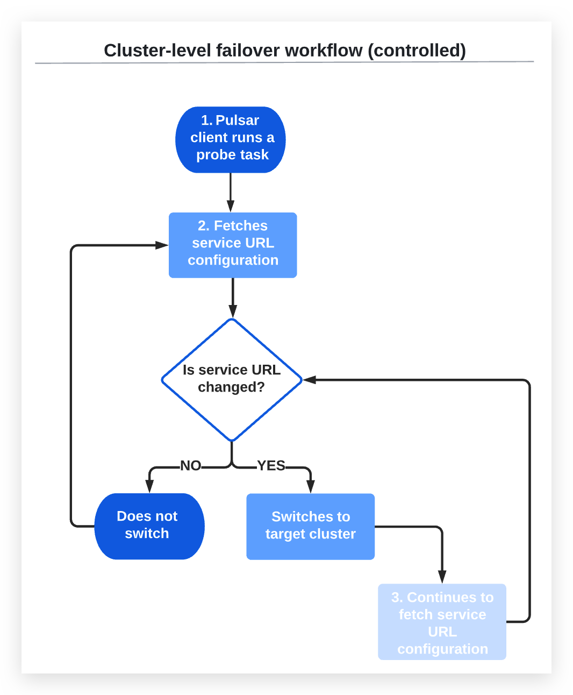

# 集群级故障转移 
    概念：自动集群级故障转移支持Pulsar客户端在检测到故障转移事件时，根据用户设置的检测策略自动无缝地从主集群切换到一个或多个备份集群

受控集群级故障转移支持Pulsar客户端从主集群切换到一个或多个备份集群。切换由管理员手动设置

一旦主集群重新起作用，Pulsar客户端就可以切换回主集群。大多数时候，用户甚至不会注意到任何事情。用户可以继续使用应用程序和服务，而不会中断或超时。

# 为什么使用群集级故障转移？
集群级故障转移同时提供容错、持续可用性和高可用性。它带来了许多好处，包括但不限于：
- 降低成本:可自动切换和恢复业务，无数据丢失
- 简化管理:业务可以在“始终在线”的基础上运行，因为不需要用户立即干预
- 提高稳定性和健壮性:确保持续性能并最大限度地减少服务停机时间

# 什么时候使用群集级故障转移？
集群级故障转移以多种方式保护我们的环境，包括但不限于：
- 灾难恢复:集群级故障转移可以自动无缝地将主集群上的生产工作负载转移到一个或多个备份集群，从而确保最小的数据丢失和减少恢复时间
- 计划性迁移:如果希望将生产工作负载从旧集群迁移到新集群，可以使用集群级故障转移来提高迁移效率。例如，您可以在发生故障转移事件时测试数据迁移是否顺利进行，在迁移之前识别可能的问题和风险

# 当触发集群级故障转移时
当Pulsar客户端长时间无法连接到主集群时，将触发自动集群级故障转移。这可能是由许多原因引起的，包括但不限于：
- 网络故障:internet连接中断
- 下电:主集群关机时间超过限制
- 业务错误:主集群出现错误(如主集群因时间限制而无法正常工作)
- 存储空间崩溃:主集群存储空间不足，备份服务器上对应的存储空间正常

当管理员手动设置切换时，会触发受控的集群级故障转移
# 为什么集群级故障转移失败？
显然，如果活动Pulsar客户端无法访问备份集群，则集群级故障转移不会成功。这种情况的发生有很多原因，包括但不限于：
- 掉电:备份集群关闭或不能正常工作
- 存储空间崩溃:主集群和备份集群的存储空间不足
- 如果启动了故障转移，但由于错误导致没有集群可以承担可用集群的角色，主集群无法正常提供服务
- 如果手动切换，但业务无法切换到备份集群服务器，则系统将尝试切换回主集群
- 1)主集群和备份集群之间或2)两个备份集群之间无法进行身份验证或授权

# 集群级故障转移的局限性是什么？
目前，集群级故障转移可以进行探测以防止数据丢失，但不能检查备份集群的状态。如果备份集群状态不正常，则无法生产或使用数据
# 集群级故障转移和地理复制之间的关系是什么？
集群级故障转移是geo-replication的扩展，可以提高稳定性和健壮性。集群级故障转移依赖于地理复制，它们之间有一些区别，如下所示：

|   影响   |   集群级故障转移  | Geo-replication |
| ---- | ---- | ---- |
|   管理员是否有繁重的工作负载？   |  不，也许吧。1. 集群级自动倒换是根据用户设置的策略自动触发集群倒换。2. 对于受控集群级故障切换，由管理员手动触发。  | 是的。如果集群发生故障，则需要立即进行管理干预 | 
|   导致数据丢失？    | 不会，对于自动和受控的集群级故障转移，如果失败的主集群没有立即将消息复制到备份集群，那么Pulsar客户机就不能使用未复制的消息。当主集群恢复后，Pulsar客户端切换回来，未复制的数据仍然可以被Pulsar客户端使用。因此，数据不会丢失 1.对于集群级自动故障转移，可以实现业务的自动切换和恢复，不丢失数据。 2.对于受控的集群级故障转移，可以手动切换和恢复业务，可能会导致数据丢失。  | 是，Pulsar客户端和DNS系统都有缓存。当管理员将DNS从主集群切换到备份集群时，缓存触发超时时间较长，导致客户端恢复时间较长，无法生成或使用消息。 |
|  导致Pulsar客户端故障？   |  没有或也许，1.对于自动集群级故障转移，可以自动切换和恢复服务，Pulsar客户端不会出现故障。2.对于受控的集群级故障转移，可以手动切换和恢复服务，但Pulsar客户端在管理员采取行动之前出现故障   | 是，Pulsar客户端和DNS系统都有缓存。当管理员将DNS从主集群切换到备份集群时，缓存触发超时时间较长，导致客户端恢复时间较长，无法生成或使用消息。 |

# 集群级故障转移是如何工作的？
在自动故障转移集群中，主集群和备份集群都知道彼此的可用性。自动故障转移集群在没有管理员干预的情况下执行以下操作：
- Pulsar客户端以checkInterval中定义的时间间隔运行探测任务
- 如果探测任务发现主集群的故障时间超过failoverDelay参数中设置的时间，则会在备份集群中搜索可用的健康集群，1.如果存在正常运行的备份集群，Pulsar客户端将按照次要集群中定义的顺序切换到备份集群。 2. 如果没有正常运行的备份集群，Pulsar客户端将不执行切换，探测任务将继续寻找可用的备份集群
- 探测任务检查主集群是否正常工作。1.如果主集群返回，且连续健康时间超过switchBackDelay中设置的时间，Pulsar客户端将切换回主集群 2.如果主集群没有返回，Pulsar客户端不会执行切换

- Pulsar客户端以checkInterval中定义的时间间隔运行探测任务
- 探测任务从URL提供程序服务获取服务URL配置，该服务由urlProvider配置，1.如果修改了服务URL配置，探针任务将跳转到目标集群，而不检查目标集群的健康状态。 2.如果没有更改服务URL配置，则Pulsar客户端不会进行切换
- 如果Pulsar客户端切换到目标集群，探测任务将继续以checkInterval中定义的时间间隔从URL提供程序服务获取服务URL配置。1.如果修改了服务URL配置，探针任务将跳转到目标集群，而不检查目标集群的健康状态 2.如果服务URL配置没有改变，则不进行倒换
