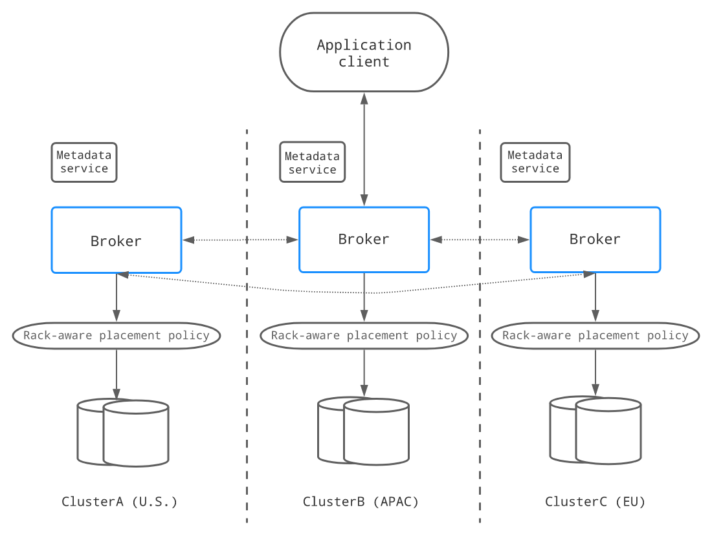
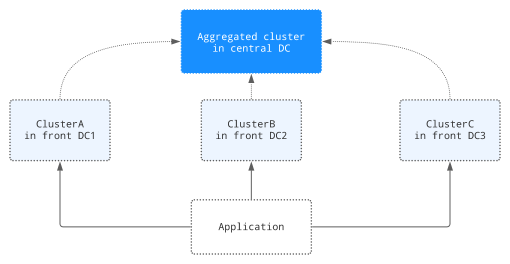

# 多区域容灾备份(GEO-REPLICATION)
    无论在哪个行业，当不可预见的事件发生并导致日常操作停止时，组织都需要一个准备充分的灾难恢复计划来快速恢复对客户的服务。然而，灾难恢复计划通常需要多数据中心部署，
    数据中心在地理上分散。这种多数据中心部署需要一个GEO复制机制，以便在数据中心发生故障时提供额外的冗余。
Pulsar的地理复制机制通常用于灾难恢复，支持跨多个数据中心复制持久存储的消息数据。例如，应用程序正在一个区域发布数据，而希望在其他区域处理数据以供使用。
利用Pulsar的地理复制机制，信息可以在不同的地理位置产生和消费

下图说明了地理复制的过程。当三个生产者(P1、P2和P3)分别向三个集群中的T1主题发布消息时，这些消息将立即跨集群复制。一旦消息被复制，
两个消费者(C1和C2)就可以从它们的集群中使用这些消息:

# 复制机制
Pulsar支持这两种复制机制:

- 同步geo-replication策略
- 异步geo-replication策略

# Pulsar 中的异步异地复制
    异步地理复制集群由建立在不同数据中心的多个物理集群组成。在Pulsar主题上产生的消息首先持久化到本地集群，然后由代理异步复制到远程集群

在正常情况下，当不存在连接问题时，消息会立即被复制，同时被发送到本地使用者。通常，端到端交付延迟由数据中心之间的网络往返时间(RTT)定义。
应用程序可以在任何集群中创建生产者和消费者，即使远程集群不可达(例如，在网络分区期间).

异步地理复制提供了较低的延迟，但由于潜在的复制延迟(某些数据尚未复制)，可能会导致较弱的一致性保证

# 通过BookKeeper进行同步异地复制
在同步地理复制中，数据被同步复制到多个数据中心，客户端必须等待来自其他数据中心的确认。

如下所示，当客户机向一个集群发出写请求时，写入的数据将被复制到其他两个数据中心。只有当大多数数据中心(在本例中，至少有2个数据中心)已经确认写操作已经持久化时，
才会向客户端确认写请求:

Pulsar中的同步地理复制是由BookKeeper实现的。一个同步的地理复制集群包括一个运行在多个数据中心的bookies集群和一个运行在多个数据中心的代理集群，
以及一个全局Zookeeper安装(一个Zookeeper集成运行在多个数据中心)。需要配置BookKeeper区域感知的放置策略，以跨数据，多个数据中心存储并保证写入时的可用性约束.

同步地理复制提供了最高的可用性，并保证了不同数据中心之间更强的数据一致性。但是，应用程序必须跨数据中心支付额外的延迟代价.

# 复制模式
    Pulsar为自定义复制策略提供了很大程度的灵活性。可以设置不同的复制模式，为多个数据中心之间的应用程序提供复制策略
## 全网格复制
    使用全网格复制和应用选择性消息复制，可以在任意数量的数据中心之间自定义复制策略和拓扑

## 双活复制
    双活复制是全网格复制的一种变体，只有两个数据中心。生产者可以在任何数据中心运行以生成消息，而消费者可以使用来自所有数据中心的所有消息

## 聚合复制
    聚合复制模式通常用于将消息从边缘复制到云。例如，假设在3个前端数据中心中有3个集群，在一个中央数据中心中有一个聚合集群，
    并且希望将来自多个前端数据中心的消息复制到中央数据中心以实现聚合。然后，可以为每个前端数据中心使用的主题创建单独的名称空间，并将聚合的数据中心分配给这些名称空间

