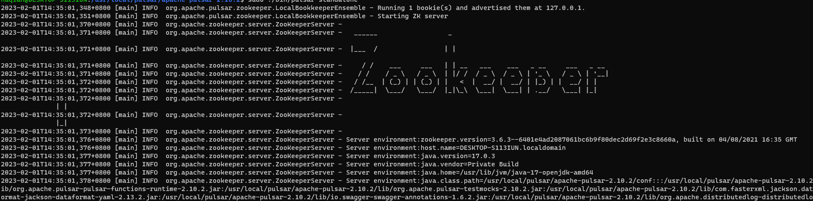
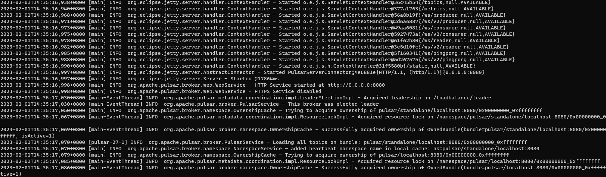
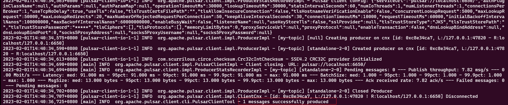
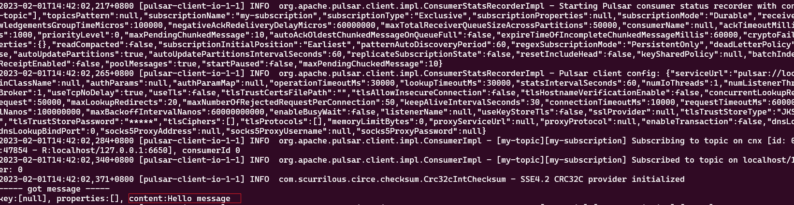

# Pulsar 本地安装与运行Pulsar集群
    对于本地开发和测试，您可以在机器上以独立模式运行Pulsar。独立模式在单个Java虚拟机(JVM)进程中运行所有组件。
# 安装
## jdk版本映射关系
    在安装pulsar之前，我们需要了解pulsar相关对应的java的版本信息，如下：
 pulsar运行时Java版本推荐

- pulsar 版本 > 2.10 and master 分支：
  
|   Pulsar组件   |   Java版本   |
| ---- | ---- |
|   Broker   |    17  |
|   Functions / IO   |   17   |
|   CLI   |   17   |
|   Java Client   |  8 or 11 or 17    |

- 2.8 <= pulsar 版本 <= 2.10：

|   Pulsar组件   |   Java版本   |
| ---- | ---- |
|   Broker   |    11  |
|   Functions / IO   |   11   |
|   CLI   |   8 or 11   |
|   Java Client   |  8 or 11   |

- pulsar 版本 < 2.8：

|   Pulsar组件   |   Java版本   |
| ---- | ---- |
|   Broker   |    8 or 11  |
|   Functions / IO   |   8 or 11   |
|   CLI   |   8 or 11   |
|   Java Client   |  8 or 11   |

## 下载
```shell
/usr/local/pulsar$ wget https://archive.apache.org/dist/pulsar/pulsar-2.10.2/apache-pulsar-2.10.2-bin.tar.gz
```
## 解压
```shell
/usr/local/pulsar$ tar -xvfz apache-pulsar-2.10.2-bin.tar.gz
```

## 解压目录介绍
解压出来的目录结构如下：

- bin：pulsar入口点脚本，以及许多其他命令行工具
- conf：配置文件，包括broker.conf,zookeeper.conf等
- lib：Pulsar使用的jar包
- examples：pulsar函数示例
- instances：Artifacts for Pulsar Functions
- data：数据目录
- logs：日志目录
# 启动
```shell
/usr/local/pulsar/apache-pulsar-2.10.2$ sudo ./bin/pulsar standalone
```



    提示：如果我们想使用后台进程去启动pulsar的话，可以使用bin/pulsar-daemon start standalone命令。当plusar集群启动的完成之后，会默认
    创建一个public/default命名空间，此名称空间用于开发目的，所有Pulsar主题都在名称空间中管理。

# 创建topic
```shell
/usr/local/pulsar/apache-pulsar-2.10.2$ sudo ./bin/pulsar-admin topics create persistent://public/default/my-topic
```
如果topic已经存在，会报如下错误：

# 发送消息
    可以使用pulsar命令行工具将消息写入主题。在实践中，您将在应用程序代码中使用Producer API，或Pulsar IO
    连接器将数据从其他系统拉到Pulsar。
```shell
/usr/local/pulsar/apache-pulsar-2.10.2$ sudo ./bin/pulsar-client produce my-topic --messages 'Hello message'
```

# 消费消息
     在实践中，您将在应用程序代码中使用Consumer API，或者使用Pulsar IO连接器从Pulsar读取数据以推送到其他系统。
```shell
/usr/local/pulsar/apache-pulsar-2.10.2$ sudo ./bin/pulsar-client consume my-topic -s 'my-subscription' -p Earliest -n 0
```

Earliest意味着从最早的未使用的消息进行消费。-n:配置要消耗的消息数量，0表示永远消耗.
# 停止
    可以使用Ctrl+C终止相关进程
   