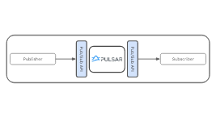
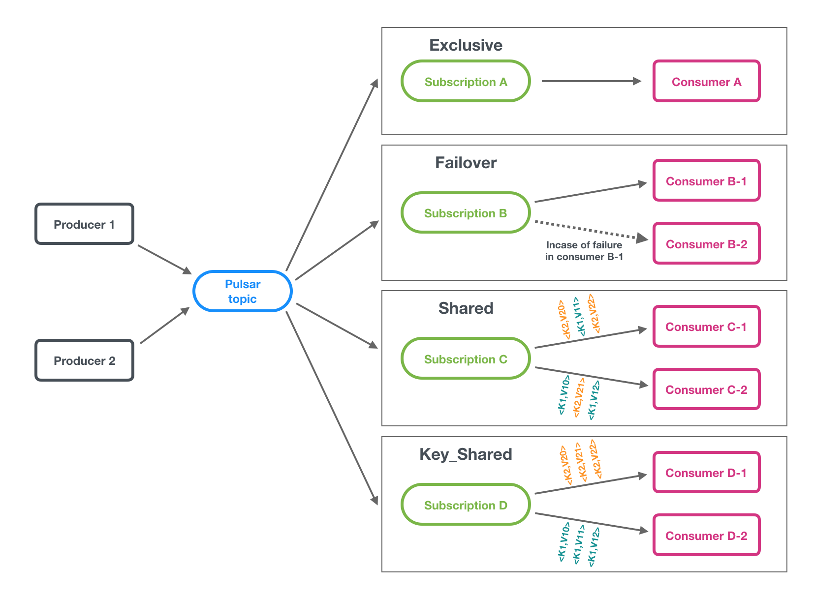
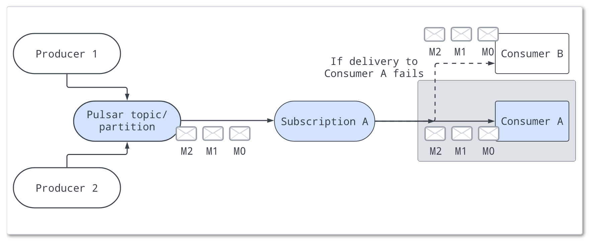
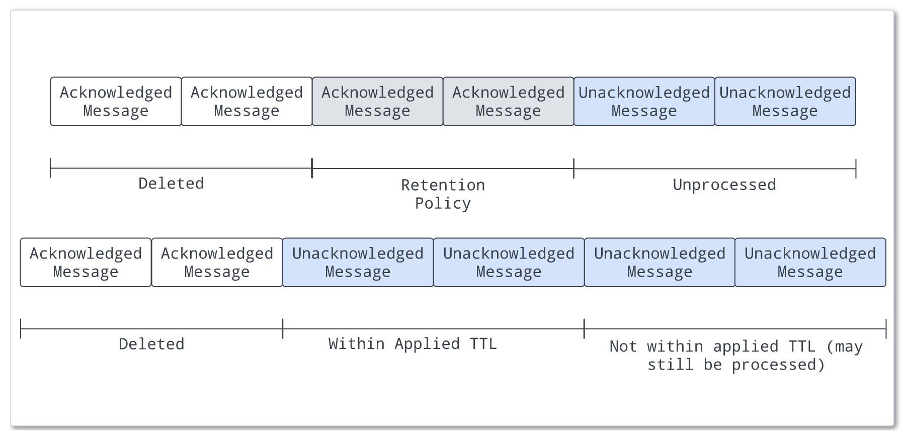

# Pulsar 之Messaging(消息)
    Pulsar基于发布-订阅模式(通常缩写为发布-订阅)。在此模式中，生产者将消息发布到主题;使用者订阅这些主题，处理传入消息，并在处理完成时向代
    理发送确认。


创建订阅时，Pulsar保留所有消息，即使使用者断开连接。只有当使用者确认所有这些消息都已成功处理时，保留的消息才会被丢弃。

如果消息的使用失败，而您希望再次使用此消息，则可以启用消息重新传递机制来请求代理重新发送此消息。
# Messages(消息)
信息是Pulsar的基本“单位”。消息的组件如下：
- Value/data payload:消息所携带的数据。所有Pulsar消息都包含原始字节，尽管消息数据也可以符合数据模式(schemas)
- Key:消息的键(字符串类型)。是消息键或分区键的简称。消息可选地使用键标记，这对于主题压缩(topic compaction)之类的功能非常有用
- Properties: 一个可选的键值对作为用户定义的属性
- Producer name：产生消息的生产者的名称。如果不指定生产者名称，则使用默认名称
- Topic name：消息发布到的主题的名称
- Schema version：用于生成消息的模式的版本号
- Sequence ID：每条Pulsar信息都属于其主题的有序序列。消息的序列ID最初由其生产者分配，表示其在该序列中的顺序，也可以自定义。
序列ID可用于消息重复数据删除。如果brokerDeduplicationEnabled设置为true，则每个消息的序列ID在主题(非分区)或分区的生产者中是唯一的
- Message ID：消息的消息ID在消息持久存储时由庄家分配。消息ID表示消息在分类账中的特定位置，在Pulsar集群中是唯一的
- Publish time：发布消息的时间戳。时间戳由生产者自动应用
- Event time：应用程序附加到消息的可选时间戳。例如，应用程序在处理消息时附加一个时间戳。如果没有设置事件时间，则该值为0

缺省情况下，消息大小为5mb。可以通过以下配置配置消息的最大大小：
- broker.conf：
```text
# The max size of a message (in bytes).
maxMessageSize=5242880
```
- bookkeeper.conf:
```text
# The max size of the netty frame (in bytes). Any messages received larger than this value are rejected. The default value is 5 MB.
nettyMaxFrameSizeBytes=5253120
```
# Producers(发布者)
    生产者是附加到主题并将消息发布到Pulsar代理的进程。Pulsar代理处理消息。
## 发送模式
    生产者以同步(sync)或异步(async)的方式向代理发送消息。
- Sync send(同步发送)：生产者在发送每条消息后等待来自代理的确认。如果没有收到确认，则生产者将发送操作视为失败
- Async send(异步发送)：生产者将消息放入阻塞队列并立即返回。客户端库将消息发送到后台的代理。如果队列已满(`可以配置最大大小`)，则在调用API时，生成器将被阻塞或立即失败，这取决于传递给生成器的参数。
## 存取方式
    对于生产者，可以有不同类型的主题访问模式.
- Shared(共享)：多个生产者可以在一个主题上发布。`默认设置`
- Exclusive(独占):一个主题只能由一个发布者发表，如果已经有一个生产者连接，其他生产者试图发布这个主题立即得到错误。如果“旧”生产者与代理发生网络分区，“旧”生产者将被驱逐，“新”生产者将被选为下一个独占生产者
- ExclusiveWithFencing:一个主题只能由一个发布者发表，如果已经连接了一个生产者，它将被删除并立即失效
- WaitForExclusive:如果已经连接了一个生产者，那么生产者的创建将挂起(而不是超时)，直到生产者获得独占访问权限,成功成为独家生产者的生产者将被视为领导者。因此，如果希望为应用程序实现领导者选举方案，可以使用这种访问模式。
  注意，前面提到的leader模式方案是指使用Pulsar作为Write-Ahead Log (WAL)，这意味着leader将其“决定”写入主题。在出现错误的情况下，只有当leader尝试写入消息并在适当的错误上失败时，broker才会通知它不再是leader。
```text
一旦应用程序成功地创建了具有Exclusive或WaitForExclusive访问模式的生产者，该应用程序的实例就保证是该主题的唯一写入者。任何试图生成关于此主题的消息的其他生产者要么立即得到错误，要么必须等到获得独占访问权。
```
## Compression(压缩)
    消息压缩可以通过支付一些CPU开销来减少消息大小。
Pulsar客户端支持以下压缩类型:
- LZ4
- ZLIB
- ZSTD
- SNAPPY 

压缩类型存储在消息元数据中，因此消费者可以根据需要自动采用不同的压缩类型。

下面的示例代码展示了如何为生成器启用压缩类型:
```java
client.newProducer()
    .topic("topic-name")
    .compressionType(CompressionType.LZ4)
    .create();
```
## Batching(批处理)
    启用批处理时，生成器将在单个请求中累积并发送一批消息。批处理大小由消息的最大数量和最大发布延迟定义。因此，backlog大小表示批的总数，而不是消息的总数

在Pulsar中，批量跟踪和存储为单个单元，而不是单独的消息。使用者将批消息解绑定为单独的消息。但是即使启用了批处理，预定消息(通过deliverAt或deliverAfter参数配置)也始终作为单独的消息发送

通常，当消费者确认批处理的所有消息时，批处理将被确认。这意味着，当不是所有批处理消息都得到确认时，意外的失败、负确认或确认超时都可能导致重新交付此批处理中的所有消息

为了避免将已确认的消息以批方式重新传递给使用者，Pulsar从Pulsar 2.6.0开始引入了批索引确认。当启用批索引确认时，使用者将过滤已确认的批索引，并将批索引确认请求发送给代理。
代理维护批索引确认状态并跟踪每个批索引的确认状态，以避免向使用者发送确认消息。当批处理中的消息的所有索引都得到确认时，该批处理将被删除。

默认情况下，批处理索引确认是禁用的(`acknowledgmentAtBatchIndexLevelEnabled=false`)。您可以通过在代理端将`acknowledgmentAtBatchIndexLevelEnabled`参数设置为`true`来启用批索引确认。启用批处理索引确认会导致更多的内存开销。

批索引确认也必须在消费者中通过调用`.enableBatchIndexAcknowledgment(true)`来启用:
```java
Consumer<byte[]> consumer = pulsarClient.newConsumer()
        .topic(topicName)
        .subscriptionName(subscriptionName)
        .subscriptionType(subType)
        .enableBatchIndexAcknowledgment(true)
        .subscribe();
```
## Chunking(分块)
    消息分块使Pulsar能够通过在生产者端将消息分割成块并在消费者端聚合分块消息来处理大型有效负载消息
启用消息分块后，当消息的大小超过允许的最大有效负载大小(代理的maxMessageSize参数)时，消息传递的工作流如下所示：
1. 生产者将原始消息拆分为分块消息，并将它们与分块元数据一起按顺序分别发布给代理
2. 代理以与普通消息相同的方式将分块消息存储在一个托管分类账中，并使用chunkedMessageRate参数记录主题上的分块消息速率
3. 消费者在接收到消息的所有块时，对分块的消息进行缓冲，并将它们聚合到接收队列中
4. 客户端使用来自接收队列的聚合消息

限制：
- 分块只适用于持久化主题
- 分块只对排他性(exclusive)和故障转移(failover)订阅类型可用
- 分块不能与批处理同时启用

使用一个已订购的消费者处理连续的分块消息:
下图显示了一个主题，该主题具有一个生产者，该生产者以分块消息和常规非分块消息的形式发布大型消息有效负载.生产者以标记为M1-c1、M1-c2和M1-c3的三个块发布消息M1.
代理broker保存所有的分块消息M1-c1、M1-c2和M1-c3在托管账本中，并且分发他们给消费者按照相同的顺序。
使用者在内存中缓冲所有分块消息，直到它接收到所有分块消息，将它们聚合成一条消息，然后将原始消息M1交给客户机。


用一个有序的消费者处理交织的分块消息：
当多个生产者将分块消息发布到单个主题中时，代理将来自不同生产者的所有分块消息存储在同一个托管分类账中。
托管分类账中的分块消息可以相互交织。如下所示，生产者1将消息M1分为三个块M1- c1、M1- c2和M1- c3发布。生产者2以三个块M2- c1、M2- c2和M2- c3发布消息M2。特定消息的所有分块消息仍然是有序的，但在托管分类账中可能不是连续的

注意：
在这种情况下，交织的块消息可能会给使用者带来一些内存压力，因为使用者为每个大型消息保留一个单独的缓冲区，以便将其所有块聚合到一条消息中。您可以通过配置`maxPendingChunkedMessage`参数来限制消费者同时维护的分块消息的最大数量。当达到阈值时，使用者通过静默确认或请求代理稍后重新交付来丢弃挂起的消息，从而优化内存利用率。

启用消息组块

前提条件:通过将`enableBatching`参数设置为`false`来禁用批处理

消息分块功能默认是关闭的。要启用消息分块，请在创建生产者时将chunkingEnabled参数设置为true

    如果使用者在指定的时间内未能收到消息的所有块，则消息块将不完整地过期。缺省值为1分钟
# Consumers(消费者)
    使用者是通过订阅附加到主题，然后接收消息的流程

使用者向代理发送流许可请求以获取消息。在使用者端有一个队列用于接收从代理推送的消息。可以使用receiverQueueSize参数配置队列大小。默认大小为1000)。每次调用consumer.receive()时，都会从缓冲区中取出一条消息。
## 接受模式
    消息以同步(sync)或异步(async)的方式从代理接收
- Sync receive(同步接受)：同步接收被阻塞，直到消息可用为止
- Async receive(异步接受)：异步接收立即返回一个未来值。例如，Java中的CompletableFuture在新消息可用时完成
## 监听器
    客户端库为使用者提供侦听器实现。例如，Java客户机提供了MesssageListener接口。在此接口中，每当接收到新消息时，都会调用received方法
## 消息确认
使用者在成功使用消息后向代理发送确认请求。然后，此消费的消息将被永久存储，只有在所有订阅都确认后才会删除它。如果希望存储已被使用者确认的消息，则需要配置消息保留策略

对于批处理消息，可以启用批处理索引确认，以避免将已确认的消息发送给使用者

可以通过以下两种方式之一确认消息：
1. 得到个别的认可。使用个别确认，使用者确认每条消息并向代理发送确认请求
```java
consumer.acknowledge(msg);
```
2. 被累积地确认。使用累积确认，使用者只确认它收到的最后一条消息。流中的所有消息直到(并包括)所提供的消息都不会重新交付给该使用者。
```java
consumer.acknowledgeCumulative(msg);
```
注意：
累积确认不能在共享订阅类型中使用，因为共享订阅类型涉及多个有权访问同一订阅的使用者。在共享订阅类型中，消息是单独确认的
## 消息否认确认
    否定确认机制允许您向代理发送通知，指出使用者没有处理消息。当使用者未能使用消息并需要重新使用它时，使用者向代理发送否定确认(nack)，触发代理将此消息重新交付给使用者
消息被单独或累积地否定确认，取决于消费订阅类型

在排他性和故障转移订阅类型中，使用者只消极地确认他们收到的最后一条消息

在共享订阅和密钥共享订阅类型中，使用者可以逐个否定消息

注意：对已排序订阅类型(如排他、故障转移和密钥共享)的否定确认可能会导致将失败的消息发送到原始顺序之外的消费者

如果要对消息使用否定确认，请确保在确认超时之前对消息进行否定确认
```java
Consumer<byte[]> consumer = pulsarClient.newConsumer()
                .topic(topic)
                .subscriptionName("sub-negative-ack")
                .subscriptionInitialPosition(SubscriptionInitialPosition.Earliest)
                .negativeAckRedeliveryDelay(2, TimeUnit.SECONDS) // the default value is 1 min
                .subscribe();

Message<byte[]> message = consumer.receive();

// call the API to send negative acknowledgment
consumer.negativeAcknowledge(message);

message = consumer.receive();
consumer.acknowledge(message);
```
要以不同的延迟重新交付消息，您可以通过设置重新交付消息的重试次数来使用重新交付回退机制
```java
Consumer<byte[]> consumer = pulsarClient.newConsumer()
        .topic(topic)
        .subscriptionName("sub-negative-ack")
        .subscriptionInitialPosition(SubscriptionInitialPosition.Earliest)
        .negativeAckRedeliveryBackoff(MultiplierRedeliveryBackoff.builder()
            .minDelayMs(1000)
            .maxDelayMs(60 * 1000)
            .multiplier(2)
            .build())
        .subscribe();
```
消息重新传递行为应该如下所示:

|   返还计数（Redelivery count）   |   返回延迟 （Redelivery delay）  |
| ---- | ---- |
|   1   |    1 seconds  |
|   2    |   2 seconds   |
|   3   |   4 seconds   |
|   4    |   8 seconds   |
|   5    |   16 seconds   |
|   6    |   32 seconds   |
|   7    |   60 seconds   |
|   8    |   60 seconds   |
如果启用了批处理，则将一个批处理中的所有消息重新交付给使用者
## 消息确认超时
    默认情况下，确认超时被禁用，这意味着传递给使用者的消息将不会被重新传递，除非使用者崩溃
确认超时机制允许您设置客户端跟踪未确认消息的时间范围。在此确认超时(ackTimeout)之后，客户端向代理发送重新发送未确认消息请求，因此代理将未确认消息重新发送给使用者

可以配置确认超时机制，以便在`ackTimeout`之后没有得到确认时重新发送消息，或者在每个`ackTimeoutTickTime`期间执行计时器任务来检查确认超时消息

还可以使用重新交付回退机制，通过设置消息重试的次数，以不同的延迟重新交付消息
```java
consumer.ackTimeout(10, TimeUnit.SECOND)
        .ackTimeoutRedeliveryBackoff(MultiplierRedeliveryBackoff.builder()
            .minDelayMs(1000)
            .maxDelayMs(60 * 1000)
            .multiplier(2)
            .build());
```
消息重新传递行为应该如下所示:

|   返还计数（Redelivery count）   |   返回延迟 （Redelivery delay）  |
| ---- | ---- |
|   1   |  10 +  1 seconds  |
|   2    | 10 +  2 seconds   |
|   3   |  10 + 4 seconds   |
|   4    | 10 +  8 seconds   |
|   5    | 10 +  16 seconds   |
|   6    | 10 +  32 seconds   |
|   7    | 10 +  60 seconds   |
|   8    | 10 +  60 seconds   |
如果启用了批处理，则将一个批处理中的所有消息重新交付给使用者

与确认超时相比，优先选择否定确认。首先，很难设置超时值。其次，当消息处理时间超过确认超时时，代理重新发送消息，但可能不需要重新使用这些消息

使用以下API启用确认超时:
```java
Consumer<byte[]> consumer = pulsarClient.newConsumer()
                .topic(topic)
                .ackTimeout(2, TimeUnit.SECONDS) // the default value is 0
                .ackTimeoutTickTime(1, TimeUnit.SECONDS)
                .subscriptionName("sub")
                .subscriptionInitialPosition(SubscriptionInitialPosition.Earliest)
                .subscribe();

Message<byte[]> message = consumer.receive();

// wait at least 2 seconds
message = consumer.receive();
consumer.acknowledge(message);
```
## 重试信件topic
    “重试信件主题”允许存储未能使用的消息，并在以后重试使用它们。使用此方法，可以自定义重新传递消息的间隔。原始主题上的消费者也会自动订阅重试信件主题。
    一旦达到最大重试次数，未使用的消息将被移动到死信主题以进行手动处理。重试信件主题的功能由消费者实现。
下图说明了重试信件主题的概念：

使用重试信件主题的目的不同于使用延迟消息传递，尽管两者都旨在稍后使用消息。“重试邮件”主题通过消息重新传递提供故障处理，以确保不会丢失关键数据，而“延迟消息传递”旨在以指定的时间延迟传递消息

默认情况下，系统未开启自动重试功能。可以将`enableRetry`设置为`true`，以便在使用者上启用自动重试

使用以下API使用来自重试信件主题的消息。当达到maxRedeliverCount的值时，未使用的消息将被移动到死信主题:
```java
Consumer<byte[]> consumer = pulsarClient.newConsumer(Schema.BYTES)
                .topic("my-topic")
                .subscriptionName("my-subscription")
                .subscriptionType(SubscriptionType.Shared)
                .enableRetry(true)
                .deadLetterPolicy(DeadLetterPolicy.builder()
                        .maxRedeliverCount(maxRedeliveryCount)
                        .build())
                .subscribe();
```
默认的重试信件主题使用如下格式：
```text
<topicname>-<subscriptionname>-RETRY
```
使用Java客户端指定重试信件主题的名称:
```java
Consumer<byte[]> consumer = pulsarClient.newConsumer(Schema.BYTES)
        .topic("my-topic")
        .subscriptionName("my-subscription")
        .subscriptionType(SubscriptionType.Shared)
        .enableRetry(true)
        .deadLetterPolicy(DeadLetterPolicy.builder()
                .maxRedeliverCount(maxRedeliveryCount)
                .retryLetterTopic("my-retry-letter-topic-name")
                .build())
        .subscribe();
```

重试邮件主题中的消息包含一些由客户端自动创建的特殊属性:

- REAL_TOPIC:真正的主题名称
- ORIGIN_MESSAGE_ID:源消息ID。这对于消息跟踪至关重要
- RECONSUMETIMES:重试使用消息的次数
- DELAY_TIME:消息重试间隔(毫秒)

```text
REAL_TOPIC = persistent://public/default/my-topic
ORIGIN_MESSAGE_ID = 1:0:-1:0
RECONSUMETIMES = 6
DELAY_TIME = 3000
```
使用下面的API将消息存储在重试队列中:
```java
consumer.reconsumeLater(msg, 3, TimeUnit.SECONDS);
```
使用下面的API为`reconsumeLater`函数添加自定义属性。在下一次尝试消费时，可以从消息#getProperty中获取自定义属性:
```java
Map<String, String> customProperties = new HashMap<String, String>();
customProperties.put("custom-key-1", "custom-value-1");
customProperties.put("custom-key-2", "custom-value-2");
consumer.reconsumeLater(msg, customProperties, 3, TimeUnit.SECONDS);
```
目前，“共享订阅类型”中启用了“重试邮件主题”

与否定确认相比,重试信主题更适合于需要大量重试且重试间隔可配置的消息。因为重试信件主题中的消息被持久化到BookKeeper，而由于否定确认而需要重试的消息被缓存到客户端
## 死信topic
    死信主题允许继续使用消息，即使某些邮件没有被成功使用。未被使用的消息存储在一个特定的主题中，该主题称为死信主题。
    死信主题的功能是由消费者实现的。可以决定如何处理死信主题中的消息
在Java客户端中使用默认的死信主题启用死信主题：
```java
Consumer<byte[]> consumer = pulsarClient.newConsumer(Schema.BYTES)
                .topic("my-topic")
                .subscriptionName("my-subscription")
                .subscriptionType(SubscriptionType.Shared)
                .deadLetterPolicy(DeadLetterPolicy.builder()
                      .maxRedeliverCount(maxRedeliveryCount)
                      .build())
                .subscribe();
```
默认的死信主题使用如下格式:
```text
<topicname>-<subscriptionname>-DLQ
```
使用Java客户机指定死信主题的名称:
```java
Consumer<byte[]> consumer = pulsarClient.newConsumer(Schema.BYTES)
                .topic("my-topic")
                .subscriptionName("my-subscription")
                .subscriptionType(SubscriptionType.Shared)
                .deadLetterPolicy(DeadLetterPolicy.builder()
                      .maxRedeliverCount(maxRedeliveryCount)
                      .deadLetterTopic("my-dead-letter-topic-name")
                      .build())
                .subscribe();
```
默认情况下，在DLQ主题创建期间没有订阅。如果不及时订阅DLQ主题，可能会丢失消息。要为DLQ自动创建初始订阅，可以指定`initialSubscriptionName`参数。
如果设置了这个参数，但是禁用了代理的`allowAutoSubscriptionCreation`，那么将无法创建DLQ生成器
```java
Consumer<byte[]> consumer = pulsarClient.newConsumer(Schema.BYTES)
                .topic("my-topic")
                .subscriptionName("my-subscription")
                .subscriptionType(SubscriptionType.Shared)
                .deadLetterPolicy(DeadLetterPolicy.builder()
                      .maxRedeliverCount(maxRedeliveryCount)
                      .deadLetterTopic("my-dead-letter-topic-name")
                      .initialSubscriptionName("init-sub")
                      .build())
                .subscribe();
```
死信主题服务于消息重送，该消息重送由确认超时或否定确认或重试信件主题触发

目前，死信主题在共享订阅类型和密钥共享订阅类型中启用

# Topics
    与其他发布-订阅系统一样，Pulsar中的主题被命名为从生产者向消费者传输消息的通道。主题名称是具有良好定义的结构的url
```java
{persistent|non-persistent}://tenant/namespace/topic
```
- persistent / non-persistent:这确定了主题的类型。Pulsar支持两种主题:持久性和非持久性。默认值是持久性的，因此如果没有指定类型，则主题是持久性的。使用持久主题，所有消息都持久地保存在磁盘上(如果代理不是独立的，则消息持久地保存在多个磁盘上)，而非持久主题的数据不持久地保存在存储磁盘上。
- tenant:实例中的主题租户。租户对于Pulsar的多租户至关重要，并且分布在多个集群中。
- namespace:主题的管理单元，它作为相关主题的分组机制。大多数主题配置都是在名称空间级别执行的。每个租户都有一个或多个名称空间。
- topic:名字的最后一部分。主题名称在Pulsar实例中没有特殊含义
```text
不需要显式地在Pulsar中创建主题,如果一个客户端向一个主题发送或接受消息时，主题不存在，Pulsar自动在主题名称中提供的名称空间下创建该主题，
如果客户端在创建主题时没有指定租户和命名空间，则主题将在默认租户和命名空间中创建。还可以在指定的租户和命名空间中创建主题，如persistent://my-tenant/my-namespace/my-topic
persistent://my-tenant/my-namespace/my-topic表示在my-tenant租户的my-namespace命名空间中创建my-topic主题
```
# Namespaces(命名空间)
    名称空间是租户中的逻辑命名法。租户通过管理API创建名称空间。例如，拥有不同应用程序的租户可以为每个应用程序创建单独的名称空间。名称空间允许应用程序创建和管理主题的层次结构。
    如my-tenant/app1，表明一个命名空间my-tenant/app1为租户my-tenant的应用app1提供的，可以在名称空间下创建任意数量的主题
# 订阅
    订阅是一个命名的配置规则，它决定如何将消息传递给使用者。Pulsar中有四种订阅类型:独占、共享、故障转移和密钥共享

```text
在Pulsar中，可以灵活地使用不同的订阅.
如果希望在消费者中实现传统的“扇出发布-订阅消息传递”，请为每个消费者指定唯一的订阅名称。这是一种独占订阅类型
如果希望在使用者之间实现“消息排队”，请在多个使用者之间共享相同的订阅名称(共享、故障转移、密钥共享)
如果希望同时实现这两种效果，可以将专用订阅类型与其他订阅类型结合起来供消费者使用。
```
## 订阅类型
    当订阅没有消费者时，其订阅类型是未定义的。订阅的类型是在使用者连接到订阅时定义的，并且可以通过重新启动具有不同配置的所有使用者来更改类型。
### 独占
在Exclusive类型中，只允许将单个使用者附加到订阅。如果多个使用者使用同一个订阅订阅了一个主题，就会发生错误。注意，如果主题是分区的，那么所有分区都将由允许连接到订阅的单个使用者使用。

在下面的图表中，只有消费者A被允许消费消息。
```text
Exclusive是默认的订阅类型
```

### 失效转移
    在故障转移类型中，多个使用者可以附加到同一个订阅。为非分区主题或分区主题的每个分区选择主使用者并接收消息。当主使用者断开连接时，
    所有(未确认的和后续的)消息都被传递到队列中的下一个使用者。
- 对于分区主题，代理将根据优先级级别和消费者名称的字典顺序对消费者进行排序。代理将尝试将分区平均分配给具有最高优先级的使用者。
- 对于非分区主题，代理将按照消费者订阅非分区主题的顺序选择消费者。

如下例子：分区主题有3个分区和15个消费者。每个分区将有1个活动消费者和4个备用消费者

如下图中，消费者A是主消费者，而如果消费者A断开连接，消费者B将是排队接收消息的下一个消费者

### 共享模式
    在共享或轮询类型中，多个使用者可以附加到同一个订阅。消息以循环分发的方式在消费者之间传递，任何给定的消息都只传递给一个消费者。
    当一个消费者断开连接时，所有发送给它但未被确认的消息将被重新调度，以发送给剩余的消费者
如下图中，消费者A、消费者B和消费者C都能够订阅主题：

共享类型的限制：

在使用共享类型时，请注意:

- 不能保证消息排序
- 不能对共享类型使用累积确认
### key共享模式
    在密钥共享类型中，多个使用者可以附加到同一个订阅。消息是跨消费者分发的，具有相同密钥或相同排序密钥的消息仅被传递给一个消费者。
    无论消息被重新传递多少次，它都会被传递给同一个使用者。

有三种类型的映射算法规定了如何为给定的消息键(或排序键)选择消费者:
  - 粘性
  - 自动分割哈希范围
  - 自动分割一致哈希

所有算法的步骤是：
  - 消息键(或排序键)被传递给一个哈希函数(例如，Murmur3 32位)，产生一个32位整数哈希
  - 该哈希号被输入到算法中，以从现有连接的消费者中选择一个消费者
```text
                      +--------------+                              +-----------+
Message Key ----->  / Hash Function / ----- hash (32-bit) -------> / Algorithm / ----> Consumer   
                   +---------------+                               +----------+
```
当连接新的消费者并将其添加到连接的消费者列表中时，算法将重新调整映射，以便当前映射到现有消费者的一些键将映射到新添加的消费者。
当一个消费者断开连接，从而从连接的消费者列表中删除时，映射到它的键将映射到其他消费者。
下面的部分将解释在给定消息散列的情况下如何选择消费者，以及在每个算法连接新消费者或断开现有消费者时如何调整映射

#### 自动分割哈希范围
    该算法假设数字的范围在0到2^16(65,536)之间。每个消费者都被映射到该范围内的单个区域，因此所有映射的区域都覆盖整个范围，没有区域重叠。
    通过按范围大小(65,536)对消息散列运行取模操作，为给定的键选择消费者。接收到的数字(0 <= i < 65,536)包含在单个区域中。映射到该区域的消费者就是所选的消费者
如下，我们有四个consumers：
```text
 0               16,384            32,768           49,152             65,536
 |------- C3 ------|------- C2 ------|------- C1 ------|------- C4 ------|
```
    给定消息键Order-3459134，其哈希值为murmur32("Order-3459134") = 3112179635，其范围内的索引值为3112179635 mod 65536 = 6067。
    该索引包含在区域[0,16384)中，因此消费者C3将被映射到此消息键
当连接一个新的消费者时，将选择最大的区域，然后将其分成两半——下半部分将映射到新添加的消费者，上半部分将映射到拥有该区域的消费者。这是从1到4个消费者的情况:
```text
C1 connected:
|---------------------------------- C1 ---------------------------------|

C2 connected:
|--------------- C2 ----------------|---------------- C1 ---------------|

C3 connected:
|------- C3 ------|------- C2 ------|---------------- C1 ---------------|

C4 connected:
|------- C3 ------|------- C2 ------|------- C4 ------|------- C1 ------|
```
当一个消费者断开连接时，它的区域将被合并到它右边的区域。当C4断开连接
```text
|------- C3 ------|------- C2 ------|---------------- C1 ---------------|
```
当C1断开连接
```text
|------- C3 ------|-------------------------- C2 -----------------------|
```
这种算法的优点是它只影响一个现有的消费者的添加或在删除，以面积不均匀为代价。这意味着一些消费者比其他消费者获得更多的key
#### 自动拆分一致哈希
    该算法使用哈希环。这是一个从0到MAX INT(32位)的数字范围，如果你遍历这个范围，当达到MAX INT时，下一个数字将是零。这就像你从0开始，
    在MAX INT结束的一条线，弯曲成一个圆，这样结束就粘到开始
```text
 MAX_INT -----++--------- 0
              ||
         , - ~ ~ ~ - ,
     , '               ' ,
   ,                       ,
  ,                         ,
 ,                           ,
 ,                           ,
 ,                           ,
  ,                         ,
   ,                       ,
     ,                  , '
       ' - , _ _ _ ,  '
```
当添加一个消费者时，我们在这个圆上标记100个点，并将它们与新添加的消费者关联起来。对于1到100之间的每个数字，我们将消费者名称与该数字连接起来，并对其运行哈希函数，以获得将被标记的圆上点的位置。
例如，如果消费者的名称是“orders-aggregator-pod-2345-consumer”，那么我们将在这个圆上标记100点:
```text
    murmur32("orders-aggregator-pod-2345-consumer1") = 1003084738
    murmur32("orders-aggregator-pod-2345-consumer2") = 373317202
    ...
    murmur32("orders-aggregator-pod-2345-consumer100") = 320276078
```
由于哈希函数具有均匀分布属性，这些点将在圆上均匀分布
```text
    C1-100                 
         , - ~ ~ ~ - ,   C1-1
     , '               ' ,
   ,                       ,
  ,                         , C1-2
 ,                           ,
 ,                           ,
 ,                           ,
  ,                         ,  C1-3
   ,                       ,
     ,                  , '
       ' - , _ _ _ ,  '      ...
 
```
为给定的消息键选择一个消费者，方法是将其哈希放在圆上，然后在圆上顺时针继续，直到到达标记点。该点上可能有多个消费者(哈希函数可能有冲突)，
我们运行以下操作来获得该点在消费者列表中的位置，然后我们取该位置的消费者:_hash % consumer_list_size = index_

当添加消费者时，如前所述，我们向圆中添加100个标记点。由于哈希函数的均匀分布，这100个点就好像新消费者从每个现有消费者那里拿走了一小部分密钥。
它以影响所有现有消费者为代价，维持了均匀的分布
#### 粘性
    该算法假设数字的范围在0到2^16(65,536)之间。每个消费者被映射到这个范围内的多个区域，区域之间没有重叠。通过对范围大小(65,536)的消息散列运行取模操作来选择消费者，
    接收到的数字(0 <= i < 65,536)包含在单个区域中。映射到区域的消费者就是所选的消费者。在这个算法中你有完全的控制权。
    每个新添加的使用者都使用使用者API指定它希望映射到的范围.在构造使用者对象时，可以指定范围列表。你有责任确保没有重叠，所有的范围都由区域覆盖
假设我们有两个消费者(C1和C2)，每个消费者都指定了他们的范围:
```text
C1 = [0, 16384), (32768, 49152]
C2 = [16384, 32768), (49,152, 65536]
 
 0               16,384            32,768           49,152             65,536
 |------- C1 ------|------- C2 ------|------- C1 ------|------- C2 ------|
```
给定一个消息键Order-3459134，它的哈希值将是murmur32("Order-3459134") = 3112179635，其范围内的索引值将是3112179635 mod 65536 = 6067。
该索引包含在[0,16384)中，因此消费者C1将映射到此消息键。

如果新连接的消费者没有提供它们的范围，或者它们与现有的消费者范围重叠，则断开连接，从消费者列表中删除并恢复，就像它从未尝试连接一样

### 如何使用?
    在构建使用者时，可以指定密钥共享模式:
    1.AUTO_SPLIT - Auto-split Hash Range
    2. STICKY - Sticky
如果代理配置subscriptionKeySharedUseConsistentHashing启用，则一致哈希将用于自动分割而不是哈希范围

### 维护消费次序
    密钥共享订阅类型确保密钥在任何给定时间都将由单个使用者处理。当连接一个新的消费者时，一些键将改变它们从现有消费者到新消费者的映射。
    一旦建立了连接，代理将记录当前的读位置并将其与新的使用者关联起来。读取位置是一个标记，指示到目前为止消息已经被分派到消费者，
    在此之后，还没有消息分派。只有在读取位置之前的所有消息都已确认时，代理才会开始向新的使用者交付消息。这将保证某个密钥在任何给定时间由单个消费者处理。
    这样做的代价是，如果一个现有的消费者被卡住了，并且没有定义超时(自行指定)，那么新的消费者将不会收到任何消息，直到卡住的消费者恢复或断开连接。
    这个需求可以通过通过消费者API启用allowOutOfOrderDelivery来释放。如果在新消费者上设置，那么当它连接时，代理将允许它接收消息，
    因为该密钥的一些消息此时可能仍在其他消费者中处理，因此在添加新消费者的短时间内，订单可能会受到影响。
### 密钥共享订阅的批处理
    当使用者使用密钥共享订阅类型时，需要为生产者禁用批处理或使用基于密钥的批处理
基于密钥的批处理对于密钥共享订阅类型是必要的，原因有两个：

- 代理根据消息的密钥分发消息，但是默认批处理方法可能无法将具有相同密钥的消息打包到同一批处理中
- 由于是消费者而不是代理从批中分发消息，因此一个批中第一个消息的键被认为是该批中所有消息的键，从而导致上下文错误

基于键的批处理就是为了解决上述问题。这种批处理方法确保生产者将具有相同密钥的消息打包到相同的批处理中。没有密钥的消息被打包到一个批中，这个批没有密钥。
当代理从这个批分发消息时，它使用NON_KEY作为密钥。此外，每个使用者只与一个密钥相关联，并且应该只接收连接的密钥的一个消息批处理。默认情况下，可以通过配置生产者允许发送的消息数量来限制批处理。

下面是在密钥共享订阅类型下启用基于密钥的批处理的示例
```java
Producer<byte[]> producer = client.newProducer()
        .topic("my-topic")
        .batcherBuilder(BatcherBuilder.KEY_BASED)
        .create();
```
    密钥共享类型的限制:
    1. 需要为消息指定一个键或排序键
    2. 不能对密钥共享类型使用累积确认
    3. 当主题中最新消息的位置为X时，新附加到同一订阅并连接到主题的密钥共享使用者将不会接收任何消息，直到X之前的所有消息都已确认
## 订阅模式
### 什么是订阅模式?
    订阅模式表示游标类型
1. 创建订阅时，将创建一个关联游标来记录最后消耗的位置
2. 当订阅的使用者重新启动时，它可以继续使用它使用的最后一条消息

### 订阅模式
- 持久化（Durable）：游标是持久的，它保留消息并保持当前位置。如果代理从失败中重新启动，它可以从持久存储(BookKeeper)中恢复游标，这样消息就可以继续从上次使用的位置使用。是默认的订阅模式
- 非持久化（NonDurable）：游标是非持久的。一旦代理停止，游标就会丢失，并且永远无法恢复，因此消息就不能从上一个被消费的位置继续被消费，Reader订阅模式本质上是非持久的，它不阻止主题中的数据被删除。读者订阅模式不可更改。
  
订阅可以有一个或多个消费者。当使用者订阅主题时，必须指定订阅名称。持久订阅和非持久订阅可以使用相同的名称，它们彼此独立。如果使用者指定的订阅以前不存在，则自动创建该订阅。

默认情况下，没有任何持久订阅的主题的消息被标记为已删除。如果希望防止消息被标记为已删除，可以为此主题创建持久订阅。在这种情况下，只有确认的消息被标记为已删除
```java
Consumer<byte[]> consumer = pulsarClient.newConsumer()
        .topic("my-topic")
        .subscriptionName("my-sub")
        .subscriptionMode(SubscriptionMode.Durable)
        .subscribe();
```
## 订阅多个topic
    当一个消费者订阅一个Pulsar topic，默认需要指定一个topic，如：persistent://public/default/my-topic
    在1.23.0版本之后，一个消费者可以同时订阅多个topic，可以通过如下两种方式：
    1. 通过正则表达式指定，如：persistent://public/default/finance-.*，但是当通过regex订阅多个主题时，所有主题必须在同一个名称空间中
    2. 通过显式定义主题列表

当订阅多个主题时，pulsar client会自动调用pulsar api发现topic通过regx或者list，并且全部订阅。如果任何主题不存在，则在主题创建后，使用者自动订阅它们

    当生产者向单个主题发送消息时，所有消息都保证以相同的顺序从该主题读取。然而，这些保证并不适用于多个主题。因此，当生产者向多个主题发送消息时，
    不能保证从这些主题读取消息的顺序相同
```java
import java.util.regex.Pattern;

import org.apache.pulsar.client.api.Consumer;
import org.apache.pulsar.client.api.PulsarClient;

PulsarClient pulsarClient = // Instantiate Pulsar client object

// Subscribe to all topics in a namespace
Pattern allTopicsInNamespace = Pattern.compile("persistent://public/default/.*");
Consumer<byte[]> allTopicsConsumer = pulsarClient.newConsumer()
                .topicsPattern(allTopicsInNamespace)
                .subscriptionName("subscription-1")
                .subscribe();

// Subscribe to a subsets of topics in a namespace, based on regex
Pattern someTopicsInNamespace = Pattern.compile("persistent://public/default/foo.*");
Consumer<byte[]> someTopicsConsumer = pulsarClient.newConsumer()
                .topicsPattern(someTopicsInNamespace)
                .subscriptionName("subscription-1")
                .subscribe();
```
## 分区主题
    普通主题仅由单个代理提供服务，这限制了主题的最大吞吐量。分区主题是由多个代理处理的一种特殊类型的主题，因此允许更高的吞吐量
    一个分区主题被实现为N个内部主题，其中N是分区的数量。当向分区主题发布消息时，每条消息都被路由到多个代理之一。跨代理的分区分布由Pulsar自动处理
如下图：

Topic1主题有5个分区(P0到P4)，分别分布在三个代理上。因为分区比代理多，所以两个代理每个分区处理两个分区，而第三个代理只处理一个分区(同样，Pulsar自动处理这种分区分布)

此主题的消息将广播给两个使用者。路由模式决定了每个消息应该发布到哪个分区，而订阅类型决定了哪些消息将发送到哪个使用者

在大多数情况下，关于路由和订阅模式的决策可以分别做出,一般来说，应该以吞吐量问题为指导分区/路由订阅决策应该由应用程序语义指导

就订阅类型的工作方式而言，分区主题与普通主题之间没有区别，因为分区仅决定消息由生产者发布和由消费者处理和确认之间发生了什么

分区主题需要通过管理API显式创建。分区的数量可以在创建主题时指定
## 路由模式
    当发布到分区主题时，必须指定路由模式。路由模式决定每条消息应该发布到哪个分区(即哪个内部主题)
有三种MessageRoutingMode可用：
1. 循环分区（RoundRobinPartition）：如果没有提供密钥，生产者将以循环方式跨所有分区发布消息，以实现最大吞吐量。
请注意，循环不是针对每个消息执行，而是将其设置为相同的批处理延迟边界，以确保批处理是有效的。而如果在消息上指定了键，分区生成器将散列键并将消息分配给特定分区。这是默认模式
2. 单分区（SinglePartition）：如果没有提供密钥，生产者将随机选择一个分区，并将所有消息发布到该分区中。而如果在消息上指定了键，分区生成器将散列键并将消息分配给特定分区
3. 自定义分区（CustomPartition）：使用自定义消息路由器实现，该实现将被调用以确定特定消息的分区。用户可以通过使用Java客户机和实现MessageRouter接口来创建自定义路由模式
## 保序性
    消息的顺序与MessageRoutingMode和Message Key相关。通常，用户需要每个键分区的顺序保证
如果有一个键附加到消息，消息将基于HashingScheme在ProducerBuilder中指定的哈希方案路由到相应的分区，无论使用SinglePartition还是RoundRobinPartition模式
1. 每个键分区（Per-key-partition）：具有相同键的所有消息将按顺序排列并放置在同一个分区中，使用SinglePartition或RoundRobinPartition模式，Key由每条消息提供
2. 每个生产者（Per-producer）：来自同一生产者的所有消息将是有序的，使用SinglePartition模式，并且不为每条消息提供Key
## HashingScheme
    HashingScheme是一个枚举，表示在为特定消息选择要使用的分区时可用的标准哈希函数集。
有两种可用的标准散列函数:JavaStringHash和Murmur3 32Hash。生产者的默认哈希函数是JavaStringHash。请注意，当生产者可以来自不同的多语言客户端时，
JavaStringHash是没有用的，在这种用例下，建议使用Murmur3 32Hash

# 非持久化topic
    默认情况下，Pulsar持久地将所有未确认的消息存储在多个BookKeeper bookies (存储节点)上。因此，持久主题上的消息数据可以在代理重启和订阅者故障转移后继续存在。
不过，Pulsar还支持非持久性主题，在这些主题上，消息永远不会持久化到磁盘，而只存在于内存中。在使用非持久传递时，杀死Pulsar代理或断开与主题的订阅者的连接意味着在该(非持久)主题上所有正在传输的消息都会丢失，这意味着客户端可能会看到消息丢失。
```text
non-persistent://tenant/namespace/topic
```
在非持久化主题中，代理立即将消息传递给所有连接的订阅者，而无需在BookKeeper中持久化它们。如果订阅者断开连接，代理将无法传递那些正在传输的消息，
订阅者将永远无法再次接收这些消息。在某些情况下，消除持久存储步骤会使非持久主题上的消息传递比持久主题上的消息传递稍微快一些，但需要注意的是，Pulsar的一些核心好处会丢失

    对于非持久性主题，消息数据只存在于内存中，没有特定的缓冲区——这意味着数据没有缓冲到内存中。接收到的消息立即传输到所有连接的消费者。
    如果消息代理失败或无法从内存中检索消息数据，则可能会丢失消息数据。只有当确定用例需要并且能够支持它时，才使用非持久性主题

默认情况下，Pulsar代理上启用非持久主题。可以在代理的配置中禁用它们。可以使用pulse-admin topics命令管理非持久主题

目前，未分区的非持久化主题不会持久化到ZooKeeper中，这意味着如果拥有它们的代理崩溃，它们不会被重新分配给另一个代理，因为它们只存在于所有者代理内存中。
当前的解决方法是在代理配置中将allowAutoTopicCreation的值设置为true，并将allowAutoTopicCreationType的值设置为非分区(它们是默认值)

## 性能
    非持久化消息传递通常比持久化消息传递更快，因为代理不会持久化消息，而是在消息被传递到连接的代理时立即将ack发送回生产者。生产者因此看到相对较低的非持久性主题的发布延迟
生产者和消费者可以以与持久性主题相同的方式连接到非持久性主题，关键的区别是主题名称必须以非持久性主题开头。对于非持久性主题，支持所有订阅类型——独占、共享、键共享和故障转移
```java
PulsarClient client = PulsarClient.builder()
        .serviceUrl("pulsar://localhost:6650")
        .build();
String npTopic = "non-persistent://public/default/my-topic";
String subscriptionName = "my-subscription-name";

Consumer<byte[]> consumer = client.newConsumer()
        .topic(npTopic)
        .subscriptionName(subscriptionName)
        .subscribe();
```
```java
String npTopic = "non-persistent://public/default/my-topic";
Producer<byte[]> producer = client.newProducer()
                .topic(npTopic)
                .create();
```
# 系统主题（System topic）
    系统主题是一个预定义的主题，供Pulsar内部使用。它可以是持久性主题，也可以是非持久性主题
系统主题用于实现某些特性并消除对第三方组件的依赖，例如事务、心跳检测、主题级策略和资源组服务，系统主题使这些特性的实现变得简单、独立和灵活。

下表概述了每个特定名称空间的可用系统主题：

|   Pulsar组件   |   Java版本   | domain | Count | Usage |
| ---- | ---- | ---- | ---- | ---- |
|   pulsar/system   |    transaction_coordinator_assign_${id}  | Persistent |默认16 |事务协调器 |
|   pulsar/system / IO   |   	__transaction_log_${tc_id}   | Persistent |默认16 |事务日志 |
|   pulsar/system   |   	resource-usage   | Non-persistent |默认4 |资源组服务 |
|   host/port   |  heartbeat   |Persistent |1 |心跳检测 |
|   User-defined-ns   |  __change_events   |Persistent |默认4 |Topic events |
|   User-defined-ns   |  __transaction_buffer_snapshot   |One per namespace |事务缓冲区快照 |
|   User-defined-ns   |  ${topicName}__transaction_pending_ack   |事务确认的每个主题订阅都有一个 |交易确认 |
不能创建任何系统主题。要列出系统主题，可以在使用Pulsar管理API获得主题列表时添加--include-system-topic选项
从Pulsar版本2.11.0开始，系统主题默认启用，之前的版本需要手动修改conf/broker.conf或conf/standalone.conf配置文件
```text
systemTopicEnabled=true
topicLevelPoliciesEnabled=true
```
# 消息重新发送
    Apache Pulsar支持优雅的故障处理，确保关键数据不会丢失。软件总是会有意想不到的情况，有时消息可能无法成功传递。因此，重要的是要有一个内置的机制来处理失败，
    特别是在异步消息传递中
- 使用者与数据库或HTTP服务器断开连接。当发生这种情况时，当使用者向数据库写入数据时，数据库将暂时脱机，并且使用者调用的外部HTTP服务器暂时不可用
- 由于使用者崩溃、断开连接等原因，使用者与代理断开连接。因此，未确认的消息被传递给其他可用的使用者

Apache Pulsar使用至少一次传递语义避免了这些和其他消息传递失败，该语义确保Pulsar处理消息不止一次

要利用消息重新传递，您需要在代理可以在Apache Pulsar客户机中重新发送未确认的消息之前启用此机制。可以使用三种方法激活Apache Pulsar中的消息重新传递机制：

- Negative Acknowledgment
- Acknowledgment Timeout
- Retry letter topic

# 消息保留和过期
默认情况下，Pulsar消息代理：

- 立即删除已被使用者确认的所有消息
- 持久地将所有未确认的消息存储在消息backlog中

不过，Pulsar有两个特性可以覆盖这种默认行为：

- 消息保留使能够存储已被使用者确认的消息
- 消息过期使能够为尚未被确认的消息设置生存时间(TTL)

所有消息保留和过期都在名称空间级别进行管理

对于消息保留，应用于名称空间中的所有主题的保留策略指示一些消息持久地存储在Pulsar中，即使它们已经被确认。
保留策略未覆盖的已确认消息将被删除。如果没有保留策略，所有已确认的消息都将被删除

对于消息过期，一些消息将被删除，即使它们还没有得到确认，因为根据应用到名称空间的TTL，它们已经过期了
(例如，因为已经应用了5分钟的TTL，而消息还没有得到确认，但已经10分钟了)。
# 消息去重
    当一条消息被Pulsar保存多次时，就会发生消息复制。消息重复数据删除是Pulsar的一项可选功能，它通过只处理每条消息一次来防止不必要的消息重复，即使消息接收了多次

# 生产者幂等性
    消息重复删除的另一种可用方法是确保每条消息只产生一次。这种方法通常称为生产者幂等性。
    这种方法的缺点是它将消息重复数据删除的工作推迟到应用程序。在Pulsar中，这是在代理级别处理的，因此不需要修改Pulsar客户端代码。
    相反，只需要进行管理更改
# 重复数据删除和一次性有效语义
    消息重复数据删除使Pulsar成为理想的消息传递系统，可与流处理引擎(spe)和其他寻求提供有效的一次处理语义的系统结合使用。
    不提供自动消息重复数据删除的消息传递系统要求SPE或其他系统保证重复数据删除，这意味着严格的消息排序是以应用程序承担重复数据删除责任为代价的。
    使用Pulsar，严格的订购保证无需应用级成本
# 消息传递延迟
    延迟消息传递使可以稍后使用消息。在这种机制中，消息存储在BookKeeper中。在消息发布到代理之后，DelayedDeliveryTracker在内存中维护时间索引(time -> messageId)。一旦指定的延迟结束，该消息将被传递给使用者

延迟消息传递仅适用于`共享订阅类型`。在`排他性`和`故障转移订阅类型`中，延迟消息将立即分派

代理保存消息而不进行任何检查。当使用者使用消息时，如果消息被设置为延迟，则该消息将被添加到DelayedDeliveryTracker。订阅检查并从DelayedDeliveryTracker获取超时消息
# 代理Broker
    缺省情况下启用延迟消息传递
```text
delayedDeliveryEnabled=true
delayedDeliveryTickTimeMillis=1000
isDelayedDeliveryDeliverAtTimeStrict=false
```
```java
// message to be delivered at the configured delay interval
producer.newMessage().deliverAfter(3L, TimeUnit.Minute).value("Hello Pulsar!").send();
```
