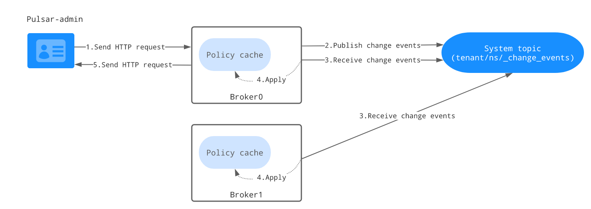

# 多租户
    Pulsar是作为一个多租户系统创建的。为了支持多租户，Pulsar有一个租户的概念。租户可以分布在多个集群中，每个集群都可以应用自己的身份验证和授权方案。
    它们还是可以管理存储配额、消息TTL和隔离策略的管理单元
Pulsar的多租户特性主要体现在具有这种结构的主题url中:
```text
persistent://tenant/namespace/topic
```
可以看到，租户是主题的最基本分类单元(比名称空间和主题名称更基本)

可以分配给Pulsar实例中的每个租户:
- 授权方案
- 租户配置应用到的集群集

# 命名空间
    租户和名称空间是Pulsar支持多租户的两个关键概念
- Pulsar为指定的租户提供，并为租户分配适当的容量
- 名称空间是租户中的管理单元命名法。在命名空间上设置的配置策略应用于该命名空间中创建的所有主题。租户可以使用REST API和pulse -admin CLI工具通过自我管理创建多个名称空间。例如，拥有不同应用程序的租户可以为每个应用程序创建单独的名称空间

相同名称空间中的主题名称如下所示：
```text
persistent://tenant/app1/topic-1

persistent://tenant/app1/topic-2

persistent://tenant/app1/topic-3
```
# 名称空间更改事件和主题级策略
Pulsar是一个多租户事件流系统。管理员可以通过设置不同级别的策略来管理租户和命名空间。但是，这些策略(如保留策略和存储配额策略)仅在命名空间级别可用。
在许多用例中，用户需要在主题级别设置策略。命名空间更改事件方法的提出是为了以一种有效的方式支持主题级策略。在这种方法中，Pulsar被用作事件日志来存储名称空间更改事件
(例如主题策略更改)。这种方法有一些好处:

- 避免使用ZooKeeper，给ZooKeeper带来更多负载
- 使用Pulsar作为传播策略缓存的事件日志。它可以有效地扩展
- 使用Pulsar SQL查询命名空间的更改并审计系统

每个名称空间都有一个名为__change_events的更改事件的系统主题。此系统主题存储给定名称空间的更改事件。下图说明了如何利用它来更新主题级策略。

- Pulsar Admin客户端与Admin Restful API通信以更新主题级策略
- 接收到Admin HTTP请求的任何代理都将主题策略更改事件发布到名称空间的相应系统主题(__change_events)
- 拥有名称空间包的每个代理都订阅系统主题(__change_events)以接收名称空间的更改事件
- 每个代理将更改事件应用到其策略缓存
- 策略缓存更新后，代理将响应发送回Pulsar Admin客户端