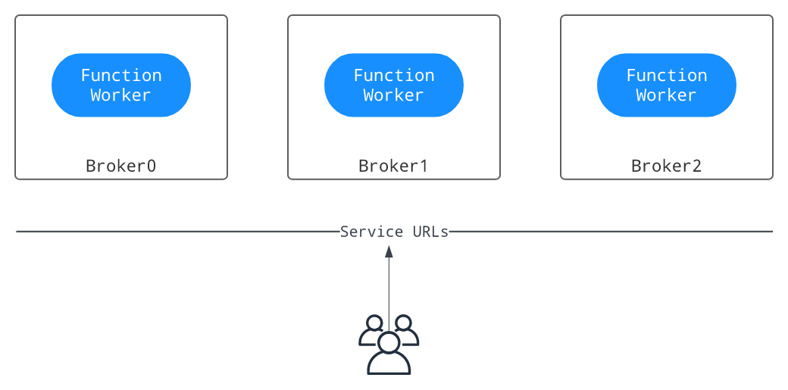
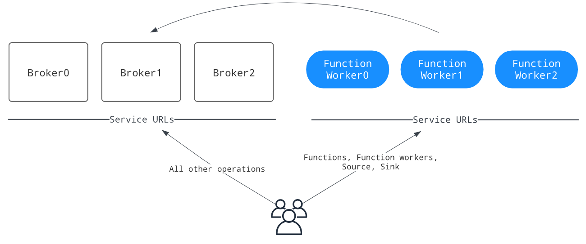
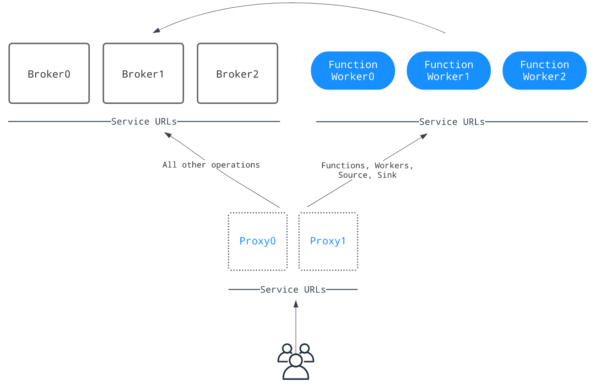

# 设置Functions Workers
我们有两种方式设置Functions Workers：
- 使用brokers 运行function workers
  - 在进程或线程模式下运行函数时，不需要资源隔离
  - 将function workers配置为在Kubernetes上运行函数(Kubernetes解决资源隔离问题)
- 隔离使用function workers：当我们想隔离函数和broker
## 使用brokers 运行function workers
下图演示了与broker一起运行的函数工作者的部署：

图中的service url表示Pulsar client和Pulsar admin用来连接到Pulsar集群的Pulsar服务url
### 在brokers开启function workers运行
在conf/broker.conf文件（conf/standalone.conf for pulsar standalone）中，将functionsWorkereNabled设置为true
```text
functionsWorkerEnabled=true
```
### 在brokers配置function workers
    在与run-with-brokers模式下，大多数function workers的设置是从我们的代理配置继承的（例如，配置存储设置，认证设置等）
    我们可以根据我们的需求配置conf/functions_worker.yml文件来自定义其他workers设置
提示优化点：
1. 要确保生产部署(具有多个代理的集群)中的高可用性，请将numFunctionPackageReplicas设置为与代理的数量相等。仅在单节点集群部署时，默认值为“1”
2. 在运行时初始化分布式日志元数据(initializedDlogMetadata = true)，可以通过bin/pulsar initialize-cluster-metadata 命令进行初始化

在BookKeeper集群上启用身份验证时，需要为function workers配置以下身份验证设置：
- bookkeeperClientAuthenticationPlugin:BookKeeper客户端的认证插件名
- bookkeeperClientAuthenticationParametersName:BookKeeper客户端的认证插件参数，包括名称和值
- bookkeeperClientAuthenticationParameters:BookKeeper客户端认证插件参数

### 启动function worker以与代理一起运行
    一旦正确配置了function workers，就可以启动代理
要验证每个worker是否正在运行，可以使用以下命令:
```text
curl <broker-ip>:8080/admin/v2/worker/cluster
```

如果返回活动function workers的列表，则意味着它们已经成功启动。回显信息如下所示:
```text
[{"workerId":"<worker-id>","workerHostname":"<worker-hostname>","port":8080}]
```
## 隔离运行function workers
下图说明了function workers如何在不同的机器中作为单独的进程运行:


图中的service url表示Pulsar client和Pulsar admin用来连接到Pulsar集群的Pulsar服务url

### 配置
    需要进行隔离运行function worker ,需要设置functionsWorkerEnabled=false(conf/broker.conf)
#### 配置相关参数
配置worker所需的参数(conf/functions_worker.yml):
- workerId:工作节点的标识，在集群中是唯一的。类型是字符串
- workerHostname:工作节点的主机名
- workerPort:工作服务器侦听的端口。如果不进行自定义，则保持默认值。设置为null可以禁用明文端口
- workerPortTls:工作服务器侦听的TLS端口。如果不进行自定义，则保持默认值

**当访问函数工作者来管理函数时，pulse-admin CLI或任何客户端应该使用配置的workerHostname和workerPort来生成--admin-url**

#### 配置函数包参数  
配置numFunctionPackageReplicas用来存储功能包的副本数量（conf/functions_worker.yml）

要确保生产部署中的高可用性，请将numFunctionPackageReplicas设置为与bookies数量相等。仅在单节点集群部署时，默认值为“1”

#### 配置函数的元数据参数
为函数元数据配置所需的参数（conf/functions_worker.yml）：
- pulsarServiceUrl：代理集群的Pulsar服务URL
- pulsarWebServiceUrl：代理集群的Pulsar web服务URL
- pulsarFunctionsCluster：将该值设置为Pulsar集群名称（same as the clusterName setting in the conf/broker.conf file）

如果在代理集群上启用了身份验证，则必须为函数工作者配置以下身份验证设置，以便与代理通信：
- brokerClientAuthenticationEnabled：是否启用函数工作者用于与代理通信的代理客户端身份验证
- clientAuthenticationPlugin：工作服务中使用的Pulsar客户端使用的身份验证插件
- clientAuthenticationParameters：工作服务中使用的Pulsar客户端使用的身份验证参数

####  启用安全设置
    当我们在配置了身份验证的集群中单独运行函数worker时，我们的函数worker需要与代理通信并验证传入的请求。因此，我们需要配置代理进行身份验证和授权所需的属性
**我们必须为服务器配置工作人员身份验证和授权功能，以便对传入请求进行身份验证，并配置经过身份验证的客户端与代理通信**
使用token认证时，需要配置以下属性(conf/function-worker.yml)：
```text
brokerClientAuthenticationPlugin: org.apache.pulsar.client.impl.auth.AuthenticationToken
brokerClientAuthenticationParameters: file:///etc/pulsar/token/admin-token.txt
configurationMetadataStoreUrl: zk:zookeeper-cluster:2181 # auth requires a connection to zookeeper
authenticationProviders:
 - "org.apache.pulsar.broker.authentication.AuthenticationProviderToken"
authorizationEnabled: true
authenticationEnabled: true
superUserRoles:
  - superuser
  - proxy
properties:
  tokenSecretKey: file:///etc/pulsar/jwt/secret # if using a secret token, key file must be DER-encoded
  tokenPublicKey: file:///etc/pulsar/jwt/public.key # if using public/private key tokens, key file must be DER-encoded
```
我们可以设置如下的安全策略：
- 启用TLS加密
- 启用认证providers
- 启用授权providers
- 启用端到端加密
#### 启用TLS加密
```text
useTLS: true
pulsarServiceUrl: pulsar+ssl://localhost:6651/
pulsarWebServiceUrl: https://localhost:8443

tlsEnabled: true
tlsCertificateFilePath: /path/to/functions-worker.cert.pem
tlsKeyFilePath:         /path/to/functions-worker.key-pk8.pem
tlsTrustCertsFilePath:  /path/to/ca.cert.pem

// The path to trusted certificates used by the Pulsar client to authenticate with Pulsar brokers
brokerClientTrustCertsFilePath: /path/to/ca.cert.pem
```
#### 启用认证providers
1. 要在函数工作者上启用身份验证提供程序，请将authenticationProviders参数替换为我们希望启用的提供程序:
```text
authenticationEnabled: true
authenticationProviders: [provider1, provider2]
```
2. 对于mTLS身份验证提供程序，按照下面的示例添加所需的设置:
```text
brokerClientAuthenticationPlugin: org.apache.pulsar.client.impl.auth.AuthenticationTls
brokerClientAuthenticationParameters: tlsCertFile:/path/to/admin.cert.pem,tlsKeyFile:/path/to/admin.key-pk8.pem

authenticationEnabled: true
authenticationProviders: ['org.apache.pulsar.broker.authentication.AuthenticationProviderTls']
```
3. 对于SASL身份验证提供者，在属性下添加saslJaasClientAllowedIds和saslJaasServerSectionName
```text
properties:
  saslJaasClientAllowedIds: .*pulsar.*
  saslJaasServerSectionName: Broker
```
4. 对于令牌身份验证提供程序，在属性下添加所需的设置:
```text
properties:
  tokenSecretKey:       file://my/secret.key
  # If using public/private
  # tokenPublicKey:     file://path/to/public.key
```
**密钥文件必须是DER(区分编码规则)编码的**
#### 启用授权providers
要对函数工作者启用授权，请完成以下步骤:
1. 在functions_worker.yml中配置authorizationEnabled, authorizationProvider和configurationMetadataStoreUrl。身份验证提供程序连接到configurationMetadataStoreUrl以接收名称空间策略
```text
authorizationEnabled: true
authorizationProvider: org.apache.pulsar.broker.authorization.PulsarAuthorizationProvider
configurationMetadataStoreUrl: <meta-type>:<configuration-metadata-store-url>
```
2. 配置超级用户角色列表。超级用户角色可以访问任何管理API
```text
superUserRoles:
  - role1
  - role2
  - role3
```
##### 配置BookKeeper授权
如果在BookKeeper集群上启用了身份验证，则需要为函数工作者配置以下BookKeeper身份验证设置：
1. bookkeeperClientAuthenticationPlugin：BookKeeper客户端的认证插件名
2. bookkeeperClientAuthenticationParametersName：BookKeeper客户端的认证插件参数，包括名称和值
3. bookkeeperClientAuthenticationParameters：BookKeeper客户端认证插件参数

### 启动函数工作者
    在启动函数工作者之前，请确保配置了函数运行时
我们可以使用pulse-daemon CLI工具在后台启动函数工作：
```text
bin/pulsar-daemon start functions-worker
```
要在前台启动一个函数工作者，可以使用pulse-admin CLI，如下所示:
```text
bin/pulsar functions-worker
```
### 为独立的功能工作者配置代理
当我们在一个单独的集群中运行函数工作者时，admin rest endpoints被分成两个集群，如下图所示。function、function-worker、source和sink现在由工作者集群提供服务，
而所有其他剩余端点由代理集群提供服务。这要求我们在pulse-admin CLI中相应地使用正确的服务URL。为了解决这种不便，我们可以启动一个代理集群，作为管理服务的中央入口点，用于路由管理rest请求

启用代理，将与函数相关的管理请求路由到函数工作者，我们需要做如下配置（conf/proxy.conf）：
```text
functionWorkerWebServiceURL=<pulsar-functions-worker-web-service-url>
functionWorkerWebServiceURLTLS=<pulsar-functions-worker-web-service-url>
```

## 配置临时文件路径

函数工作者使用JVM中的java.io.tmpdir作为默认的临时文件路径，它也用作每个NAR包的默认提取文件路径。NAR包需要一个本地文件路径来提取并加载到Java类加载器

如果希望将NAR包的默认提取文件路径更改到另一个目录，可以在functions_worker.yml中添加以下参数和所需的目录。配置取决于我们使用的函数运行时
1. Thread runtime/Process runtime:narExtractionDirectory
2. Kubernetes runtime:functionRuntimeFactoryConfigs.narExtractionDirectory

## 启用有状态函数
    当需要Pulsar函数的有状态api时，例如putState()和queryState()相关的接口，我们需要在函数工作者中启用有状态函数特性
1. 在BookKeeper中启用streamStorage服务。目前，该服务使用的是NAR包，因此需要在conf/bookkeeper.conf中配置：
```text
##################################################################
##################################################################
# Settings below are used by stream/table service
##################################################################
##################################################################

### Grpc Server ###

# the grpc server port to listen on. default is 4181
storageserver.grpc.port=4181

### Dlog Settings for table service ###

#### Replication Settings
dlog.bkcEnsembleSize=3
dlog.bkcWriteQuorumSize=2
dlog.bkcAckQuorumSize=2

### Storage ###

# local storage directories for storing table ranges data (e.g. rocksdb sst files)
storage.range.store.dirs=data/bookkeeper/ranges

# whether the storage server capable of serving readonly tables. default is false.
storage.serve.readonly.tables=false

# the cluster controller schedule interval, in milliseconds. default is 30 seconds.
storage.cluster.controller.schedule.interval.ms=30000
```
2. 启动bookie后，通过以下方法检查streamStorage服务是否启动成功
```text
telnet localhost 4181
```
3. 配置stateStorageServiceUrl 在conf/functions_worker.yml文件中，bk-service-url是指向BookKeeper表服务的服务URL
```text
stateStorageServiceUrl: bk://<bk-service-url>:4181
```

## 为地理复制集群配置功能工作者 
    当使用地理复制运行多个集群时，需要为每个集群使用不同的函数名称空间。否则，所有函数共享一个名称空间，并可能跨集群调度分配
例如，如果我们有两个集群:east-1和west-1，我们可以分别在conf/functions_worker.yml文件中配置，这确保了两个不同职能的worker使用不同的主题集进行内部协调
```text
pulsarFunctionsCluster: east-1
pulsarFunctionsNamespace: public/functions-east-1
```
```text
pulsarFunctionsCluster: west-1
pulsarFunctionsNamespace: public/functions-west-1
```
## 故障排除
**Error message: Namespace missing local cluster name in clusters list**

```text
Failed to get partitioned topic metadata: org.apache.pulsar.client.api.PulsarClientException$BrokerMetadataException: Namespace missing local cluster name in clusters list: local_cluster=xyz ns=public/functions clusters=[standalone]
```
当发生以下任何情况时，将显示错误消息:
1. 代理以functionsWorkerEnabled=true启动,但是pulsarFunctionsCluster 在conf/functions_worker.yml没有设置正确的集群
2. 设置一个地理复制的Pulsar集群，使用functionsWorkerEnabled=true，当一个集群中的代理运行良好时，另一个集群中的代理运行不好

### 应变方法
如果发生上述任何一种情况，请按照下面的说明解决问题：
1. 通过设置functionsWorkerEnabled=false禁用函数工作者，并重新启动代理
2. 获取当前集群列表public/functions命名空间
```text
bin/pulsar-admin namespaces get-clusters public/functions
```
3. 检查集群是否在集群列表中。如果不是，添加它并更新列表
```text
bin/pulsar-admin namespaces set-clusters --clusters <existing-clusters>,<new-cluster> public/functions
```
4. 集群设置成功后，通过设置functionsWorkerEnabled=true启用函数工作者
5. 为pulsarFunctionsCluster参数设置正确的集群名称(conf/functions_worker.yml)
6. 重启代理


