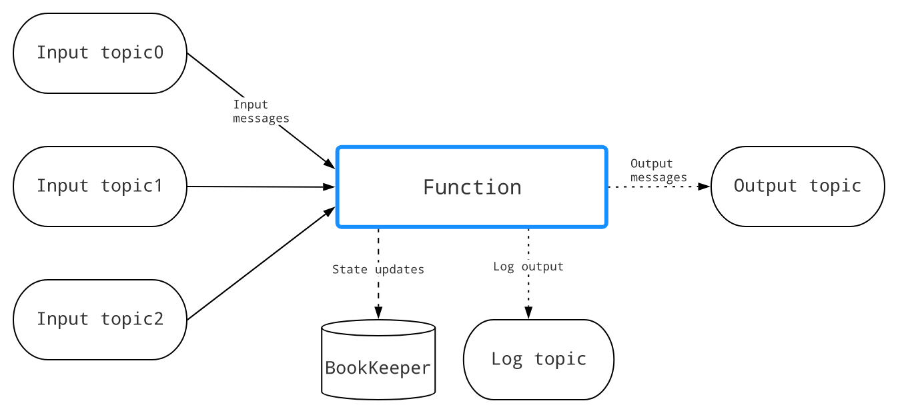
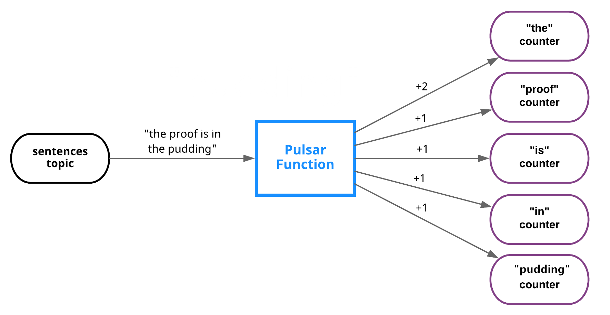
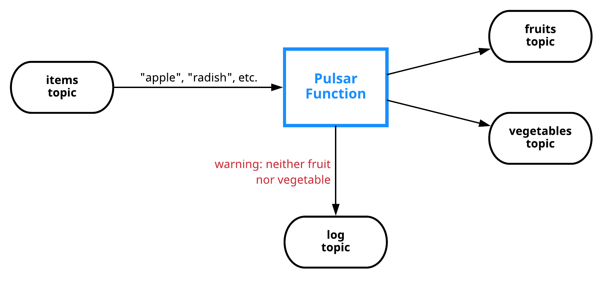
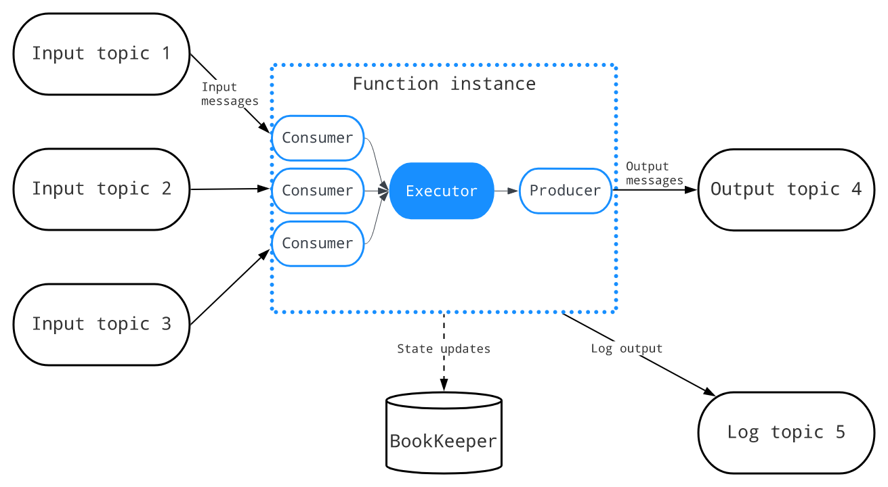
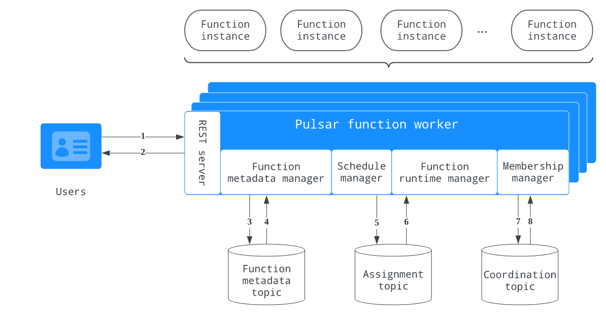
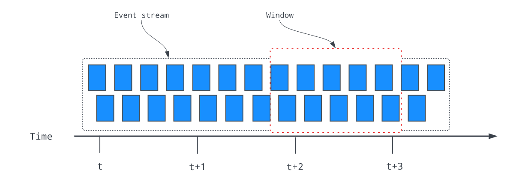
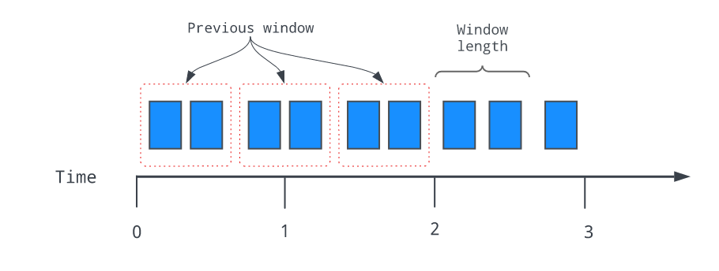
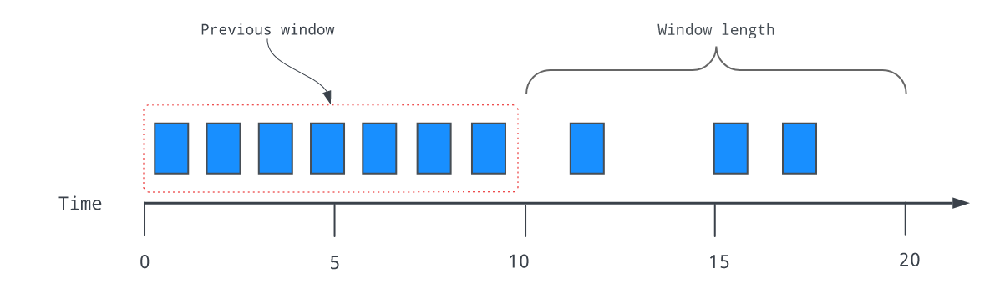
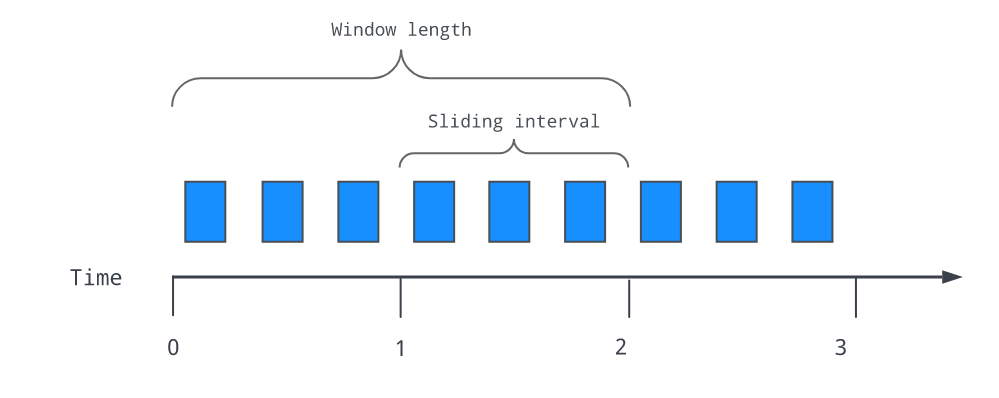

# Pulsar Functions
## Pulsar Functions是什么？
    Pulsar Functions是一个运行在Pulsar之上的无服务器计算框架
Pulsar Functions是一个运行在Pulsar之上的无服务器计算框架，并以以下方式处理消息：
- 使用来自一个或多个主题的消息
- 对消息应用用户定义的处理逻辑
- 将消息的输出发布到其他主题

下图说明了函数计算过程中的三个步骤：

每次函数接收到消息时，它都会完成以下消费-应用-发布步骤:
1. 使用来自一个或多个输入主题的消息
2. 将定制的(用户提供的)处理逻辑应用到消息
3. 发布消息的输出，包括
   1. 将输出消息写入Pulsar中的输出主题
   2. 将日志写入日志主题(如果已配置)以进行调试
   3. 将状态更新写入BookKeeper(如果已配置)
      
我们可以用Java、Python和Go编写函数。例如，您可以使用Pulsar Functions来设置以下处理链.
1. Python函数监听原始语句主题并“消毒”传入字符串(删除多余的空白并将所有字符转换为小写)，然后将结果发布到已消毒的语句主题
2. Java函数监听经过处理的句子主题，计算每个单词在指定时间窗口内出现的次数，并将结果发布到结果主题
3. Python函数监听结果主题并将结果写入MySQL表

## 为什么使用Pulsar Functions？
    Pulsar函数在将消息路由到消费者之前对消息执行简单的计算。这些lambda风格的功能是专门设计的，并与Pulsar集成在一起。
    该框架在Pulsar集群上提供了一个简单的计算框架，并负责发送和接收消息的底层细节。我们只需要关注业务逻辑。
Pulsar函数使我们的组织能够最大限度地发挥数据的价值，并享受数据的好处：
1. 简化部署和操作——无需部署单独的流处理引擎(SPE)，如Apache Storm、Apache Heron或Apache Flink，即可创建数据管道
2. 无服务器计算(当您使用Kubernetes运行时)
3. 最大化开发人员的生产力
4. 故障排除简单

## 实例
1. 该图显示了实现经典单词计数用例的过程：

2. 该图演示了实现基于内容的路由用例的过程：

# 完全限定函数名
    每个函数都有一个完全限定函数名(FQFN)，具有指定的租户、命名空间和函数名。使用FQFN，我们可以在不同的名称空间中使用相同的函数名创建多个函数。
```text
tenant/namespace/name
```
## 函数实例
函数实例是函数执行框架的核心元素，由以下元素组成：
1. 消费来自不同输入主题的消息的消费者的集合
2. 调用函数的执行程序
3. 将函数的结果发送到输出主题的生产者

一个函数可以有多个实例，每个实例执行一个函数的副本。可以在配置文件中指定实例数

函数实例中的使用者使用FQFN作为订阅者名，以基于订阅类型在多个实例之间实现负载平衡。订阅类型可以在函数级别指定

每个函数都有一个单独的FQFN状态存储。我们可以指定一个状态接口，以便在BookKeeper中持久化中间结果。其他用户可以查询函数的状态并提取这些结果
## 函数worker
      函数worker是一个逻辑组件，用于在Pulsar Functions的集群模式部署中监视、编排和执行单个函数
在函数工作者中，每个函数实例都可以作为线程或进程执行，具体取决于所选的配置。或者，如果Kubernetes集群可用，则可以在Kubernetes中以StatefulSets的形式生成函数

下图说明了函数工作者的内部架构和工作流：

函数工作者形成了一个工作者节点集群，其工作流程描述如下：
1. 用户向REST服务器发送请求以执行函数实例
2. REST服务器响应请求并将请求传递给功能元数据管理器
3. 函数元数据管理器将请求更新写入函数元数据主题。它还跟踪所有与元数据相关的消息，并使用函数元数据主题持久化函数的状态更新
4. 函数元数据管理器从函数元数据主题读取更新，并触发调度管理器计算分配
5. 日程管理器将作业更新写入作业主题
6. 函数运行时管理器侦听分配主题，读取分配更新，并更新其内部状态，该状态包含所有工作人员的所有分配的全局视图。如果更新更改了工作对象上的赋值，函数运行时管理器将通过启动或停止函数实例的执行来具体化新的赋值
7. 成员管理器要求协调主题选举一个领导工作者。所有工作人员都订阅故障转移订阅中的协调主题，但活动的工作人员成为领导者并执行分配，从而保证该主题只有一个活动消费者
8. 成员管理器从协调主题读取更新
## Functions 运行时
      函数实例是在运行时内调用的，许多实例可以并行运行。Pulsar支持三种不同成本和隔离保证的函数运行时类型，以最大限度地提高部署灵活性
下表概述了三种类型的函数运行时：

|类型|描述|
|----|----|
|线程运行（Thread runtime）|每个实例都作为一个线程运行，由于线程模式的代码是用Java编写的，所以它只适用于Java实例。当函数以线程模式运行时，它与函数工作者运行在同一个Java虚拟机(JVM)上|
|进程运行时（process runtime）|每个实例都作为一个进程运行，当函数以进程模式运行时，它运行在函数工作者运行的同一台机器上|
|K8s运行时（Kubernetes runtime）|函数由worker以Kubernetes StatefulSet的形式提交，每个函数实例作为pod运行。Pulsar支持在启动函数时向Kubernetes StatefulSets和服务添加标签，这有助于选择目标Kubernetes对象|
## 处理保证和订阅类型
      Pulsar提供了三种不同的消息传递语义，我们可以将它们应用于一个函数。根据ack时间节点确定不同的传递语义实现
|传递语义|描述|采用的订阅类型|
|----|----|----|
|最多传送一次|发送到函数的每个消息都将尽最大努力处理。不能保证信息是否会被处理 当我们选择这个语义时，autoAck配置必须设置为true，否则启动将失败(autoAck配置将在将来的版本中被弃用) Ack时间节点:函数处理之前|Shared|
|至少一次递送 默认|发送到函数的每个消息都可以被处理多次(以防处理失败或重新交付) 如果创建函数时没有指定--processing-guaranteed标志，则该函数提供至少一次交付保证 Ack时间节点:发送消息到输出后|Shared|
|一次有效交付|发送到函数的每条消息都可以被处理多次，但它只有一个输出。重复的消息将被忽略 有效地在至少一次处理和有保证的服务器端重复数据删除的基础上实现一次。这意味着一个状态更新可以发生两次，但是相同的状态更新只应用一次，另一个重复的状态更新在服务器端被丢弃 Ack时间节点:发送消息到输出后|Failover|
|人工投放|当我们选择这个语义时，框架不会执行任何ack操作，我们需要在函数中调用context.getCurrentRecord().ack()方法来手动执行ack操作 Ack时间节点:在函数方法中自定义|Shared|

- 默认情况下，Pulsar函数提供至少一次交付保证。如果创建函数时没有为--processingGuarantees标志提供值，则该函数提供至少一次保证
- 在Pulsar函数中不可用独占订阅类型，因为
  - 如果只有一个实例，exclusive等于故障转移
  - 如果有多个实例，exclusive可能会在函数重新启动时崩溃并重新启动。在这种情况下，排他不等于故障转移。因为当主使用者断开连接时，所有未被确认的和后续的消息将被传递到队列中的下一个使用者
- 要将订阅类型从共享更改为密钥共享，可以使用pulse-admin中的保留密钥排序选项。
```text
bin/pulsar-admin functions create \
  --name my-effectively-once-function \
  --processing-guarantees EFFECTIVELY_ONCE \
```
update:
```text
bin/pulsar-admin functions update \
  --processing-guarantees ATMOST_ONCE \
```
## 上下文
Java、Python和Go sdk提供了对函数可以使用的上下文对象的访问。这个上下文对象为函数提供了各种各样的信息和功能，包括
- 函数的名称和ID
- 消息的消息ID。每条消息都会自动分配一个ID
- 消息的键、事件时间、属性和分区键
- 消息被发送到的主题的名称
- 与函数相关联的所有输入主题以及输出主题的名称
- 用于SerDe的类的名称
- 与函数关联的租户和命名空间
- 运行该函数的函数实例的ID
- 函数的版本
- 函数使用的记录器对象，用于创建日志消息
- 访问通过CLI提供的任意用户配置值
- 用于记录度量的接口
- 用于在状态存储器中存储和检索状态的接口
- 将新消息发布到任意主题的函数
- 用于确认正在处理的消息的函数(如果禁用了自动ack)
- (Java)一个函数来获得pulsar管理客户端
- (Java)创建一个Record的函数，该函数返回从Context和输入Record中获取的默认值
## 函数消息类型
- Schema Registry：Pulsar有一个内置的模式注册表，并与流行的模式类型捆绑在一起，如Avro、JSON和Protobuf。Pulsar Functions可以利用来自输入主题的现有模式信息并派生输入类型。模式注册表也适用于输出主题。
- SerDe：Pulsar函数在向Pulsar主题发布数据或从Pulsar主题消费数据时使用SerDe(序列化和反序列化)。SerDe在默认情况下的工作方式取决于对特定函数使用的语言(Java或Python)。但是，在这两种语言中，我们都可以为更复杂的、特定于应用程序的类型编写自定义SerDe逻辑。
## Window function
```text
目前，窗口函数仅在Java中可用，并且不支持MANUAL和effective-once delivery语义
```
窗口函数是跨数据窗口(即事件流的有限子集)执行计算的函数。如下图所示，流被划分为“桶”，其中可以应用函数

函数的数据窗口定义涉及两个策略:
- 驱逐策略:控制在窗口中收集的数据量
- 触发策略:控制何时触发一个函数并执行该函数以根据清除策略处理窗口中收集的所有数据

触发策略和驱逐策略都由时间或计数驱动:

同时支持处理时间和事件时间:
- 处理时间是根据函数实例构建和处理窗口时的壁时间定义的。窗口完整性的判断很简单，我们不必担心数据到达混乱
- 事件时间是根据事件记录附带的时间戳定义的。它保证了事件时间的正确性，但也提供了更多的数据缓冲和有限的完整性保证

## window的类型
根据相邻的两个窗口是否可以共享公共事件，窗口可以分为以下两种类型：
- 轮转：轮转窗口将元素分配给具有指定时间长度或计数的窗口。轮转窗口的驱逐策略总是基于窗口已满。因此，我们只需要指定触发器策略，基于计数或基于时间，在具有基于计数的触发策略的滚动窗口中，
如以下示例所示，触发策略被设置为2。当窗口中有两个项目时，无论时间如何，都会触发并执行每个函数

相反，如下面的示例所示，滚动窗口的窗口长度为10秒，这意味着当10秒的时间间隔过去时，函数将被触发，而不管窗口中有多少事件：

- 滑动：滑动窗口方法通过设置清除策略来限制保留用于处理的数据量，并使用滑动间隔设置触发器策略来定义固定的窗口长度。如果滑动间隔小于窗口长度，则存在数据重叠，这意味着同时落入相邻窗口的数据将被多次用于计算。
如下面的示例所示，窗口长度为2秒，这意味着任何超过2秒的数据都将被清除，不会在计算中使用。滑动间隔被配置为1秒，这意味着该函数每秒执行一次，以处理整个窗口长度内的数据：

## 快速开始
- 添加functionsworker配置（conf/standalone.conf）:
```text
functionsWorkerEnabled=true
```
- 启动pulsar
```text
./bin/pulsar standalone
```
- 检查是否是否启动
```text
telnet localhost 6650
```
- 检查functions 集群
```text
./bin/pulsar-admin functions-worker get-cluster
```
```json
{
  "workerId" : "c-standalone-fw-localhost-8080",
  "workerHostname" : "localhost",
  "port" : 8080
}
```
- 确认公共tenant是否存在（public）：
```text
./bin/pulsar-admin tenants list 
```
```text
public
pulsar
sample
```
- 确认默认的namespaces是否存在（default）:
```text
./bin/pulsar-admin namespaces list public
```
```text
public/default
public/functions
```
- 确认table 服务有没有启动成功
```text
telnet localhost 4181
```
- 创建一个测试租户和namespaces
```text
./bin/pulsar-admin tenants create test
```
```text
public
pulsar
sample
test
```
```text
./bin/pulsar-admin namespaces create test/test-namespace
```
```text
test/test-namespace
```
- 开始创建functions，通过提供的example进行创建（免得写yaml文件）
```text
./bin/pulsar-admin functions create --function-config-file examples/example-function-config.yaml --jar examples/api-examples.jar
```
```text
Created successfully
```
- 查询functions的配置
```text
 ./bin/pulsar-admin functions get --tenant test --namespace test-namespace --name example
```
```json
{
  "tenant": "test",
  "namespace": "test-namespace",
  "name": "example",
  "className": "org.apache.pulsar.functions.api.examples.ExclamationFunction",
  "inputSpecs": {
    "test_src": {
      "isRegexPattern": false,
      "schemaProperties": {},
      "consumerProperties": {},
      "poolMessages": false
    }
  },
  "output": "test_result",
  "producerConfig": {
    "useThreadLocalProducers": false,
    "batchBuilder": ""
  },
  "processingGuarantees": "ATLEAST_ONCE",
  "retainOrdering": false,
  "retainKeyOrdering": false,
  "forwardSourceMessageProperty": true,
  "userConfig": {
    "PublishTopic": "test_result"
  },
  "runtime": "JAVA",
  "autoAck": true,
  "parallelism": 1,
  "resources": {
    "cpu": 1.0,
    "ram": 1073741824,
    "disk": 10737418240
  },
  "cleanupSubscription": true,
  "subscriptionPosition": "Latest"
}
```
- 查询functions的状态
```text
./bin/pulsar-admin functions status --tenant test --namespace test-namespace --name example
```
```json
{
  "numInstances" : 1,
  "numRunning" : 1,
  "instances" : [ {
    "instanceId" : 0,
    "status" : {
      "running" : true,
      "error" : "",
      "numRestarts" : 0,
      "numReceived" : 0,
      "numSuccessfullyProcessed" : 0,
      "numUserExceptions" : 0,
      "latestUserExceptions" : [ ],
      "numSystemExceptions" : 0,
      "latestSystemExceptions" : [ ],
      "averageLatency" : 0.0,
      "lastInvocationTime" : 0,
      "workerId" : "c-standalone-fw-localhost-8080"
    }
  } ]
}
```
- 订阅一个output topic为test_result
```text
./bin/pulsar-client consume -s test-sub -n 0 test_result
```
- 生产一个输入主题为test_src
```text
./bin/pulsar-client produce -m "test-message-`date`" -n 10 test_src
```
- 消费端会消费当前这个消息
```text
2023-03-24T17:41:29,306+0800 [pulsar-client-io-1-1] INFO  com.scurrilous.circe.checksum.Crc32cIntChecksum - SSE4.2 CRC32C provider initialized
----- got message -----
key:[null], properties:[__pfn_input_msg_id__=CNbSARAAIAAwAQ==, __pfn_input_topic__=persistent://public/default/test_src], content:test-message-Fri Mar 24 17:41:22 CST 2023!
----- got message -----
key:[null], properties:[__pfn_input_msg_id__=CNbSARABIAAwAQ==, __pfn_input_topic__=persistent://public/default/test_src], content:test-message-Fri Mar 24 17:41:22 CST 2023!
----- got message -----
key:[null], properties:[__pfn_input_msg_id__=CNbSARACIAAwAQ==, __pfn_input_topic__=persistent://public/default/test_src], content:test-message-Fri Mar 24 17:41:22 CST 2023!
----- got message -----
key:[null], properties:[__pfn_input_msg_id__=CNbSARADIAAwAQ==, __pfn_input_topic__=persistent://public/default/test_src], content:test-message-Fri Mar 24 17:41:22 CST 2023!
----- got message -----
key:[null], properties:[__pfn_input_msg_id__=CNbSARAEIAAwAQ==, __pfn_input_topic__=persistent://public/default/test_src], content:test-message-Fri Mar 24 17:41:22 CST 2023!
----- got message -----
key:[null], properties:[__pfn_input_msg_id__=CNbSARAFIAAwAQ==, __pfn_input_topic__=persistent://public/default/test_src], content:test-message-Fri Mar 24 17:41:22 CST 2023!
----- got message -----
key:[null], properties:[__pfn_input_msg_id__=CNbSARAGIAAwAQ==, __pfn_input_topic__=persistent://public/default/test_src], content:test-message-Fri Mar 24 17:41:22 CST 2023!
----- got message -----
key:[null], properties:[__pfn_input_msg_id__=CNbSARAHIAAwAQ==, __pfn_input_topic__=persistent://public/default/test_src], content:test-message-Fri Mar 24 17:41:22 CST 2023!
----- got message -----
key:[null], properties:[__pfn_input_msg_id__=CNbSARAIIAAwAQ==, __pfn_input_topic__=persistent://public/default/test_src], content:test-message-Fri Mar 24 17:41:22 CST 2023!
----- got message -----
key:[null], properties:[__pfn_input_msg_id__=CNbSARAJIAAwAQ==, __pfn_input_topic__=persistent://public/default/test_src], content:test-message-Fri Mar 24 17:41:22 CST 2023!
2023-03-24T17:41:36,948+0800 [pulsar-timer-6-1] INFO  org.apache.pulsar.client.impl.ConsumerStatsRecorderImpl - [test_result] [test-sub] [c48f6] Prefetched messages: 0 --- Consume throughput received: 0.17 msgs/s --- 0.00 Mbit/s --- Ack sent rate: 0.17 ack/s --- Failed messages: 0 --- batch messages: 0 ---Failed acks: 0
```
## 启用有状态的函数
    Pulsar的独立模式为有状态函数提供了BookKeeper table 服务
- 创建一个example/example-stateful-function-config.yaml
```text
tenant: "test"
namespace: "test-namespace"
name: "word_count"
className: "org.apache.pulsar.functions.api.examples.WordCountFunction"
inputs: ["test_wordcount_src"] # this function will read messages from these topics
autoAck: true
parallelism: 1
```
- 创建一个有状态的functions
```text
./bin/pulsar-admin functions create --function-config-file examples/example-stateful-function-config.yaml --jar examples/api-examples.jar
```
```text
Created successfully
```
- 查看函数信息
```text
bin/pulsar-admin functions get --tenant test --namespace test-namespace --name word_count
```
```json
{
  "tenant": "test",
  "namespace": "test-namespace",
  "name": "word_count",
  "className": "org.apache.pulsar.functions.api.examples.WordCountFunction",
  "inputSpecs": {
    "test_wordcount_src": {
      "isRegexPattern": false,
      "schemaProperties": {},
      "consumerProperties": {},
      "poolMessages": false
    }
  },
  "producerConfig": {
    "useThreadLocalProducers": false,
    "batchBuilder": ""
  },
  "processingGuarantees": "ATLEAST_ONCE",
  "retainOrdering": false,
  "retainKeyOrdering": false,
  "forwardSourceMessageProperty": true,
  "userConfig": {},
  "runtime": "JAVA",
  "autoAck": true,
  "parallelism": 1,
  "resources": {
    "cpu": 1.0,
    "ram": 1073741824,
    "disk": 10737418240
  },
  "cleanupSubscription": true,
  "subscriptionPosition": "Latest"
}
```
- 查看functions状态
```text
./bin/pulsar-admin functions status --tenant test --namespace test-namespace --name word_count
```
```json
{
  "numInstances" : 1,
  "numRunning" : 1,
  "instances" : [ {
    "instanceId" : 0,
    "status" : {
      "running" : true,
      "error" : "",
      "numRestarts" : 0,
      "numReceived" : 0,
      "numSuccessfullyProcessed" : 0,
      "numUserExceptions" : 0,
      "latestUserExceptions" : [ ],
      "numSystemExceptions" : 0,
      "latestSystemExceptions" : [ ],
      "averageLatency" : 0.0,
      "lastInvocationTime" : 0,
      "workerId" : "c-standalone-fw-localhost-8080"
    }
  } ]
}
```
- 查询带有hello键的函数的状态表。该操作监视与hello相关的更改
```text
./bin/pulsar-admin functions querystate --tenant test --namespace test-namespace --name word_count -k hello -w
```
这样会不断的监听数据
```text
key 'hello' doesn't exist.
key 'hello' doesn't exist.
key 'hello' doesn't exist.
key 'hello' doesn't exist.
key 'hello' doesn't exist.
key 'hello' doesn't exist.
key 'hello' doesn't exist.
key 'hello' doesn't exist.
key 'hello' doesn't exist.
key 'hello' doesn't exist.
key 'hello' doesn't exist.
key 'hello' doesn't exist.
.....
```
- 输入主题test_wordcount_src生成10条带有hello的消息,hello的值更新为10
```text
./bin/pulsar-client produce -m "hello" -n 10 test_wordcount_src
```
```text
{
  "key": "hello",
  "numberValue": 10,
  "version": 9
}
{
  "key": "hello",
  "numberValue": 10,
  "version": 9
}
.....
```
- 再产生十条hello的数据进行，让numbervalue变为20
```text
./bin/pulsar-client produce -m "hello" -n 10 test_wordcount_src
```
```text
{
  "key": "hello",
  "numberValue": 20,
  "version": 19
}
{
  "key": "hello",
  "numberValue": 20,
  "version": 19
}
{
  "key": "hello",
  "numberValue": 20,
  "version": 19
}
......
```
## 使用Pulsar Window functions
    窗函数是脉冲星函数的一种特殊形式
- 创建一个window functions
```text
./bin/pulsar-admin functions create --function-config-file examples/example-window-function-config.yaml --jar examples/api-examples.jar
```
这里会报错，因为yaml指定的function 的name为example，与我们之前的创建重复了，所以有如下错误：
```text
Function example already exists
```
- 修改yaml文件如下：
```yaml
tenant: "test"
namespace: "test-namespace"
name: "example_window"
className: "org.apache.pulsar.functions.api.examples.AddWindowFunction"
inputs: ["test_src_window"]
userConfig:
  "PublishTopic": "test_result_window"

output: "test_result_window"
autoAck: true
parallelism: 1
windowConfig:
  windowLengthCount: 10
  slidingIntervalCount: 5
```
就可以创建成功了，Created successfully
- 查询functions信息
```text
 ./bin/pulsar-admin functions get --tenant test --namespace test-namespace --name example_window
```
```json
{
  "tenant": "test",
  "namespace": "test-namespace",
  "name": "example_window",
  "className": "org.apache.pulsar.functions.api.examples.AddWindowFunction",
  "inputSpecs": {
    "test_src_window": {
      "isRegexPattern": false,
      "schemaProperties": {},
      "consumerProperties": {},
      "poolMessages": false
    }
  },
  "output": "test_result_window",
  "producerConfig": {
    "useThreadLocalProducers": false,
    "batchBuilder": ""
  },
  "processingGuarantees": "ATLEAST_ONCE",
  "retainOrdering": false,
  "retainKeyOrdering": false,
  "forwardSourceMessageProperty": true,
  "userConfig": {
    "PublishTopic": "test_result_window"
  },
  "runtime": "JAVA",
  "autoAck": false,
  "parallelism": 1,
  "resources": {
    "cpu": 1.0,
    "ram": 1073741824,
    "disk": 10737418240
  },
  "windowConfig": {
    "windowLengthCount": 10,
    "slidingIntervalCount": 5,
    "actualWindowFunctionClassName": "org.apache.pulsar.functions.api.examples.AddWindowFunction"
  },
  "cleanupSubscription": true,
  "subscriptionPosition": "Latest"
}
```
- 查询functions的状态
```text
./bin/pulsar-admin functions status --tenant test --namespace test-namespace --name example_window
```
```json
{
  "numInstances" : 1,
  "numRunning" : 1,
  "instances" : [ {
    "instanceId" : 0,
    "status" : {
      "running" : true,
      "error" : "",
      "numRestarts" : 0,
      "numReceived" : 0,
      "numSuccessfullyProcessed" : 0,
      "numUserExceptions" : 0,
      "latestUserExceptions" : [ ],
      "numSystemExceptions" : 0,
      "latestSystemExceptions" : [ ],
      "averageLatency" : 0.0,
      "lastInvocationTime" : 0,
      "workerId" : "c-standalone-fw-localhost-8080"
    }
  } ]
}
```
- 创建一个输出topic test_result_window
```text
./bin/pulsar-client consume -s test-sub -n 0 test_result_window
```
- 创建一个输入topic test_src_window
```text
./bin/pulsar-client produce -m "3" -n 10 test_src_window
```
- 消费端显示
```text
----- got message -----
key:[null], properties:[], content:15
----- got message -----
key:[null], properties:[], content:30
```