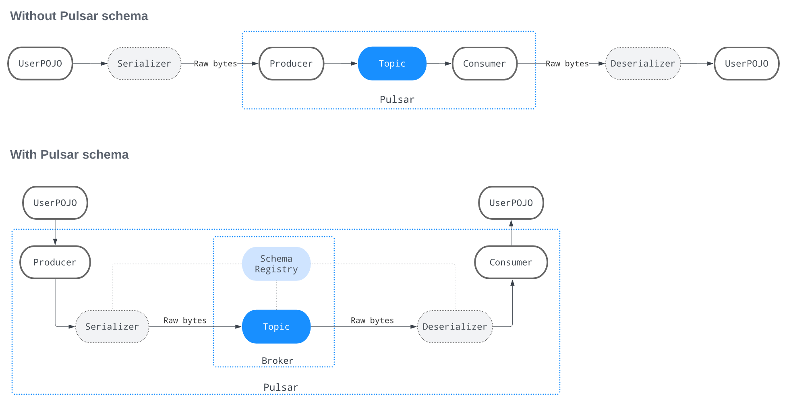
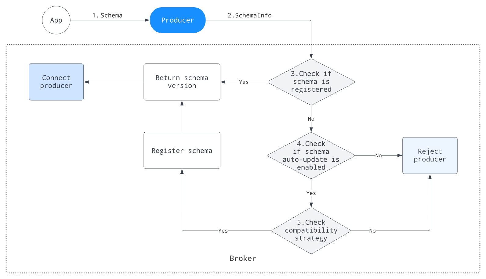
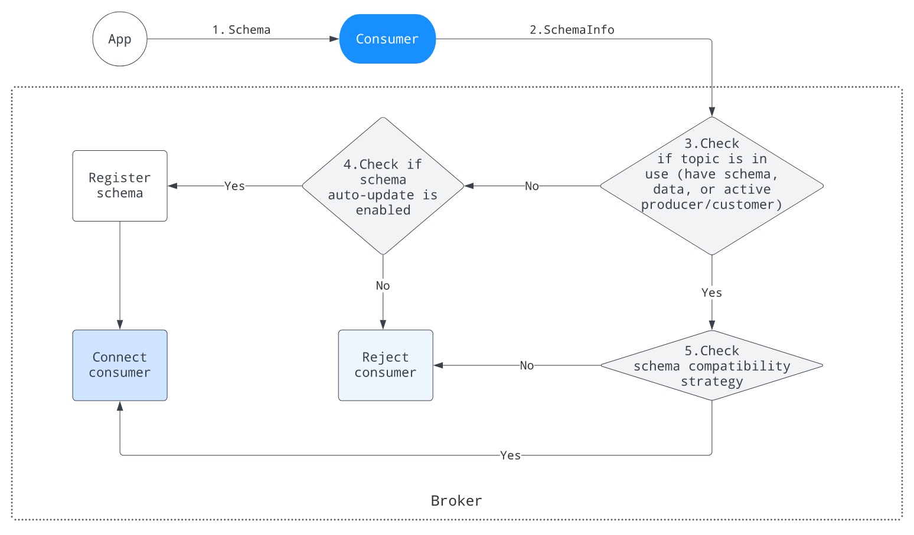

# Schema 数据结构
    Pulsar消息存储为非结构化字节数组，数据结构(称为模式)仅在读取数据时应用于该数据。因此，生产者和消费者都需要就消息的数据结构(包括字段及其相关类型)达成一致
    Pulsar Schema是定义如何将原始消息字节转换为更正式的结构类型的元数据，作为生成消息的应用程序和使用消息的应用程序之间的协议。它在将数据发布到主题之前将数据序列化为原始字节，
    并在将原始字节交付给消费者之前将其反序列化
    Pulsar使用Schema注册中心作为存储已注册Schema信息的中央存储库,通过代理协调主题消息的Schema

# 为什么需要使用Schema？
    类型安全在任何围绕消息传递和流系统构建的应用程序中都非常重要，原始字节对于数据传输来说很灵活，但灵活性和中立性是有代价的：
    我们必须覆盖数据类型检查，需要序列化和反序列化,确保输入系统的字节可以被读取并成功使用。换句话说，我们需要确保数据对应用程序是可理解的和可用的
Pulsar Schema通过以下功能解决了痛点：
- 提供用于存储关于组织中使用的Schema的信息的中心位置，从而极大地简化了跨应用程序团队共享这些信息
- 当主题定义了Schema时，执行数据类型安全。因此消费者和生产者只有在使用“兼容”模式时才允许连接
- 作为跨所有服务和开发团队使用的所有消息模式的单一真实来源，这使他们更容易协作
- 保持Schema版本之间的数据兼容性。上传新Schema时，旧用户可以读取新版本
- 存储在现有的存储层BookKeeper中，无需额外的系统

# 怎么使用？
    Pulsar Schema在主题级别应用和执行。生产者和消费者可以将模式上传到代理，因此Pulsar模式在双方都可以工作
# 生产者端
该图说明了Pulsar模式如何在生产者端工作：

1. 应用程序使用模式实例来构造生产者实例。模式实例为使用生产者实例生成的数据定义模式。以Avro为例，Pulsar从POJO类中提取模式定义并构造SchemaInfo
2. 生产者请求使用从传入的模式实例中提取的SchemaInfo连接到代理
3. 代理查找模式注册表，以检查它是否是已注册的模式
    - 如果模式已注册，代理将模式版本返回给生产者
    - 否则，代理检查模式是否可以自动更新
4. 代理检查模式是否可以自动更新
    - 如果不允许自动更新，则模式不能注册，代理将拒绝生产者
    - 否则，代理执行为主题定义的模式兼容性检查
5. 代理执行为主题定义的模式兼容性检查
    - 如果模式通过了兼容性检查，代理将其存储在模式注册表中，并将模式版本返回给生产者。此生成器生成的所有消息都使用模式版本进行标记。
    - 否则，代理拒绝生产者
# 消费者端
该图说明了模式如何在消费者端工作：

1. 应用程序使用模式实例来构造使用者实例
2. 使用者使用从传入的模式实例中提取的SchemaInfo连接到代理
3. 代理检查主题是否正在使用(至少有一个对象:模式、数据、活动生产者或消费者)
    - 如果主题至少包含上述对象之一，代理执行模式兼容性检查
    - 否则，代理检查模式是否可以自动更新
4. 代理检查模式是否可以自动更新
   - 如果模式可以自动更新，代理将注册模式并连接使用者
   - 否则，代理拒绝消费者
5. 代理执行模式兼容性检查
   - 如果模式通过兼容性检查，代理将连接使用者
   - 否则，代理将拒绝使用者
# 使用用例
    在构造和处理从简单数据类型(如字符串)到更复杂的特定于应用程序类型的消息时，可以使用特定于语言的数据类型
创建一个user对象：
```java
public class User {
   public String name;
   public int age;
   
   User() {}
   
   User(String name, int age) {
      this.name = name;
      this.age = age;
   }
}
```
不使用Schema：
```java
Producer<byte[]> producer = client.newProducer()
        .topic(topic)
        .create();
User user = new User("Tom", 28);
byte[] message = … // 这里就需要自己实现序列化;   
producer.send(message);
```
使用Schema：
```java
// send with json schema
Producer<User> producer = client.newProducer(JSONSchema.of(User.class))
        .topic(topic)
        .create();
User user = new User("Tom", 28);
producer.send(user);

// receive with json schema
Consumer<User> consumer = client.newConsumer(JSONSchema.of(User.class))
   .topic(schemaTopic)
   .subscriptionInitialPosition(SubscriptionInitialPosition.Earliest)
   .subscriptionName("schema-sub")
   .subscribe();
Message<User> message = consumer.receive();
User user = message.getValue();
assert user.age == 28 && user.name.equals("Tom");
```
# Schema定义
    Pulsar模式定义在名为SchemaInfo的数据结构中。它是在每个主题的基础上存储和执行的，不能存储在名称空间或租户级别
这是SchemaInfo的一个字符串示例：
```json
{
    "name": "test-string-schema",
    "type": "STRING",
    "schema": "",
    "properties": {}
}
```
1. name: schema名称
2. type：schema类型，它决定如何序列化和反序列化模式数据
3. schema：模式数据，这是一个8位无符号字节序列和特定的模式类型
4. properties：用户定义的属性是String/String的键值对，应用程序可以使用它来承载任何特定于应用程序的逻辑
# Schema类型
Pulsar支持多种模式类型，主要分为两类：
- Primitive type(基本类型)
- Complex type(复合类型)
# 基本类型
    概述了Pulsar模式支持的基本类型，以及模式类型和特定于语言的基本类型之间的转换
| 类型 | 描述 | 对应java类型 |
|----|----|----|
|BOOLEAN|二进制值|boolean|
|INT8|8 位有符号整数|int|
|INT16|16 位有符号整数|int|
|INT32|32 位有符号整数|int|
|INT64|64 位有符号整数|int|
|FLOAT|一个单精度(32位)IEEE 754浮点数|float|
|DOUBLE|一个双精度(64位)IEEE 754浮点数|double|
|BYTES|8位无符号字节序列|byte[], ByteBuffer, ByteBuf|
|STRING|Unicode字符序列|string|
|TIMESTAMP (DATE, TIME)|逻辑类型表示具有毫秒精度的特定时刻。它将自1970年1月1日00:00:00 GMT以来的毫秒数存储为INT64值|java.sql.Timestamp (java.sql.Time, java.util.Date)|
|INSTANT|时间轴上的一个瞬间点，精确到纳秒|java.time.Instant|
|LOCAL_DATE|表示日期的不可变日期-时间对象，通常视为年-月-日|java.time.LocalDate|
|LOCAL_TIME|表示时间的不可变日期-时间对象，通常视为小时-分钟-秒。时间以纳秒精度表示|java.time.LocalDateTime|
|LOCAL_DATE_TIME|一个表示日期-时间的不可变日期-时间对象，通常被视为年-月-日-小时-分-秒|java.time.LocalTime|
    Pulsar在SchemaInfo中不为基本类型存储任何模式数据。一些基本模式实现可以使用属性参数来存储特定于实现的可调设置。
    例如，字符串模式可以使用属性存储编码字符集，以序列化和反序列化字符串
# 复合类型
- KeyValue：表示复合体key/value键值对
- Struct：结构体，表示结构化数据，包括AvroBaseStructSchema, ProtobufNativeSchema和NativeAvroBytesSchema
## KeyValue schema
      KeyValue模式帮助应用程序定义键和值的模式。Pulsar将键模式和值模式的SchemaInfo存储在一起
Pulsar提供了以下方法来编码单个key/value键值对消息：
- INLINE：key/value键值对在消息有效负载中一起编码
- SEPARATED：Key存储为消息键，而值存储为消息有效负载
## Struct schema
下表概述了Pulsar模式支持的结构类型：

|类型|描述|
|----|----|
|AvroBaseStructSchema|Pulsar使用Avro规范声明AvroBaseStructSchema的模式定义，AvroBaseStructSchema支持AvroSchema、JsonSchema和ProtobufSchema|
|ProtobufNativeSchema|ProtobufNativeSchema是基于protobuf本机描述符的|
|NativeAvroBytesSchema|NativeAvroBytesSchema包装了原生Avro模式类型org.apache.avro.Schema。结果是一个模式实例接受序列化的Avro有效负载，而不根据包装的Avro模式验证它.当我们从外部系统(如Kafka和Cassandra)迁移或摄取事件或消息数据时，数据通常已经以Avro格式序列化。生成数据的应用程序通常已经根据其模式验证了数据(包括兼容性检查)，并将其存储在数据库或专用服务(如模式注册中心)中。每个序列化数据记录的模式通常可以通过附加到该记录的元数据进行检索.在这种情况下，Pulsar生成器在将摄入的事件发送到主题时不需要重复模式验证。它所需要做的就是将每个消息或事件及其模式传递给Pulsar|
## Pulsar提供了以下方法来使用结构模式
- static:我们可以预定义结构模式，它可以是Java中的POJO, Go中的结构，或者由Avro或Protobuf工具生成的类。
- generic:有时应用程序没有预定义的结构，我们可以使用此方法定义模式和访问数据。我们可以使用GenericSchemaBuilder定义结构模式，使用GenericRecordBuilder生成泛型结构，并将消息消费到GenericRecord中。
- SchemaDefinition：我们可以定义schemaDefinition来生成一个结构模式
### static
1. 创建pojo对象
```java
# If you use Lombok

@Builder
@AllArgsConstructor
@NoArgsConstructor
public static class User {
    public String name;
    public int age;
}

# If you DON'T use Lombok you will need to add the constructor like this
# 
#   public static class User {
#    String name;
#    int age;
#    public User() { } 
#    public User(String name, int age) { this.name = name; this.age = age; } }
#}

```
2. 使用结构模式创建生产者并发送消息
```java
Producer<User> producer = client.newProducer(Schema.AVRO(User.class)).create();
producer.newMessage().value(new User("pulsar-user", 1)).send();
```
3. 使用结构模式创建消费者并接收消息
```java
Consumer<User> consumer = client.newConsumer(Schema.AVRO(User.class)).subscribe();
User user = consumer.receive().getValue();
```
### generic
1. 使用RecordSchemaBuilder构建模式
```java
RecordSchemaBuilder recordSchemaBuilder = SchemaBuilder.record("schemaName");
        recordSchemaBuilder.field("intField").type(SchemaType.INT32);
        SchemaInfo schemaInfo = recordSchemaBuilder.build(SchemaType.AVRO);

        Consumer<GenericRecord> consumer = client.newConsumer(Schema.generic(schemaInfo))
        .topic(topicName)
        .subscriptionName(subscriptionName)
        .subscribe();
        Producer<GenericRecord> producer = client.newProducer(Schema.generic(schemaInfo))
        .topic(topicName)
        .create();
```
2. 使用RecordBuilder构建结构记录
```java
GenericSchemaImpl schema = GenericAvroSchema.of(schemaInfo);
// send message
GenericRecord record = schema.newRecordBuilder().set("intField", 32).build();
producer.newMessage().value(record).send();
// receive message
Message<GenericRecord> msg = consumer.receive();

Assert.assertEquals(msg.getValue().getField("intField"), 32);
```
# 自动Schema
    如果没有机会提前知道Pulsar主题的模式类型，我们可以使用自动的模式进行消息的传递
自动模式包含两个类别：
1. AUTO_PRODUCE：将数据从生产者传输到具有模式的Pulsar主题，并帮助生产者验证出站字节是否与主题的模式兼容
2. AUTO_CONSUME：将具有模式的Pulsar主题的数据传输给使用者，并帮助该主题验证出站字节是否与使用者兼容。换句话说，主题使用从代理检索的SchemaInfo将消息反序列化为特定于语言的对象GenericRecord

# Schema验证实施
      模式验证强制允许代理拒绝没有Schema的生产者和消费者
默认情况下，模式验证强制只对生产者禁用(isSchemaValidationEnforced =false)，这意味着：
- 没有模式的生产者可以向具有模式的主题生成任何消息，这可能导致向主题生成垃圾数据
- 不支持模式的客户端允许向具有模式的主题生成消息
# Schema演化
      Schema存储属性和类型的详细信息。为了满足新的业务需求，Schema会随着时间的推移进行版本控制
注意：Schema演化只适用于Avro、JSON、Protobuf和ProtobufNative Schema

Schema演变可能会影响现有消费者。设计了以下控制措施来服务于Schema演变，并确保下游消费者能够无缝地处理Schema演变：
- Schema兼容性检查
- Schema自动更新
# Schema版本控制
      与主题一起存储的每个SchemaInfo都有一个版本。模式版本管理主题中发生的模式更改
使用SchemaInfo生成的消息被标记为Schema版本。当Pulsar客户端使用消息时，客户端可以使用Schema版本检索相应的SchemaInfo，并使用正确的模式反序列化数据。
一旦一个版本被分配给一个Schema或从一个Schema获取，该生产者产生的所有后续消息都被标记为适当的版本

假设我们正在使用Pulsar Java客户端创建一个生产者并发送消息：
```java
PulsarClient client = PulsarClient.builder()
        .serviceUrl("pulsar://localhost:6650")
        .build();

Producer<SensorReading> producer = client.newProducer(JSONSchema.of(SensorReading.class))
        .topic("sensor-data")
        .sendTimeout(3, TimeUnit.SECONDS)
        .create();
```
下表概述了发生此连接尝试时的可能场景以及每个场景的结果:
- 主题不存在Schema:(1)生产者是用给定的Schema创建的。(2)Schema被传输到代理并存储，因为没有现有的Schema(3)使用相同Schema或主题创建的任何消费者都可以消费来自传感器数据主题的消息
- Schema已经存在。生产者使用已经存储的相同Schema进行连接:1)Schema被传输到代理(2)代理确定Schema是兼容的(3)代理试图将Schema存储在BookKeeper中，但随后确定它已经被存储，因此它被用于标记生成的消息
- Schema已经存在。生产者使用兼容的新Schema进行连接:(1)Schema被传输到代理。代理确定Schema是兼容的，并将新Schema存储为当前版本(带有新的版本号)
# Schema兼容性检查
      Schema兼容性检查的目的是确保现有的使用者可以处理引入的消息
当从生产者接收SchemaInfo时，代理识别模式类型，并为该模式类型部署模式兼容性检查器(schemaRegistryCompatibilityCheckers)，通过应用配置的兼容性检查策略来检查SchemaInfo是否与主题的模式兼容

schemaRegistryCompatibilityCheckers的默认值,conf/broker.conf配置文件中:
```text
schemaRegistryCompatibilityCheckers=org.apache.pulsar.broker.service.schema.JsonSchemaCompatibilityCheck,org.apache.pulsar.broker.service.schema.AvroSchemaCompatibilityCheck,org.apache.pulsar.broker.service.schema.ProtobufNativeSchemaCompatibilityCheck
```
每种模式类型都对应于模式兼容性检查器的一个实例。Avro、JSON和Protobuf模式有它们自己的兼容性检查器，而所有其他模式类型共享默认的兼容性检查器，这将禁用模式演化
# Schema兼容性检查策略
假设您有一个包含三个模式(V1、V2和V3)的主题。V1是最古老的，V3是最新的。下表概述了8种模式兼容性策略及其工作原理：

|兼容检查策略|定义|允许的更改|根据哪个模式检查|
|----|----|----|----|
|ALWAYS_COMPATIBLE|禁用Schema兼容性检查|允许所有更改|所有以前的版本|
|ALWAYS_INCOMPATIBLE|禁用Schema演化，即拒绝任何模式更改|不允许更改|N/A|
|BACKWARD|使用模式V3的消费者可以处理使用上一个模式版本V2的生产者写入的数据|允许添加可选字段 允许删除字段|最新版本|
|BACKWARD_TRANSITIVE|使用模式V3的消费者可以处理使用所有以前的模式版本V2和V1的生产者写入的数据|允许添加可选字段 允许删除字段|所有以前的版本|
|FORWARD|使用上一个模式版本V2的消费者可以处理使用新模式V3的生产者写入的数据，尽管他们可能无法使用新模式的全部功能|允许添加字段 允许删除可选字段|最新版本|
|FORWARD_TRANSITIVE|使用所有以前的模式版本V2或V1的消费者可以处理使用新模式V3的生产者写入的数据|允许添加字段 允许删除可选字段|所有以前的版本|
|FULL|模式既向后兼容，也向前兼容。使用上一个模式V2的消费者可以处理使用新模式V3的生产者写入的数据。使用新模式V3的消费者可以处理使用上一个模式V2的生产者写入的数据|修改可选字段|最新版本|
|FULL_TRANSITIVE|模式V3、V2和V1之间的向后和向前兼容性。使用模式V3的消费者可以处理使用模式V2和V1的生产者写入的数据。使用模式V2或V1的消费者可以处理使用模式V3的生产者写入的数据|修改可选字段|所有以前的版本|
# Schema自动更新
      默认情况下，Schema AutoUpdate是启用的。当Schema通过Schema兼容性检查时，生产者自动将该Schema更新为它所生成的主题
## 生产者端（producer）
对于生产者，在以下情况下发生AutoUpdate：
- 如果主题没有模式(意味着数据是原始字节)，Pulsar会自动注册模式
- 如果一个主题有一个模式，而生产者不携带任何模式(意味着它产生原始字节)：
  - 如果在主题所属的名称空间中禁用模式验证强制(schemaValidationEnforced=false)，则允许生产者连接到主题并生成数据
  - 否则，将拒绝生产者
  - 如果一个主题有一个模式，生产者也携带一个模式
## 消费端（Consume）
对于消费者，在以下情况下发生AutoUpdate：
- 如果使用者连接到一个没有模式的主题(意味着它消耗原始字节)，则使用者可以成功连接到主题，而无需进行任何兼容性检查
- 如果使用者使用模式连接到主题
# 客户端升级顺序
      为了适应模式演变和自动更新，我们需要相应地升级客户端应用程序。根据配置的模式兼容性检查策略不同，升级顺序可能不同
模式兼容性检查策略与客户端升级顺序的对应关系如下表所示：

|兼容检查策略|升级顺序|描述|
|----|----|----|
|ALWAYS_COMPATIBLE|任何顺序|禁用兼容性检查。因此，我们可以以任何顺序升级生产者和消费者|
|ALWAYS_INCOMPATIBLE|N/A|Schema演变已禁用|
|BACKWARD / BACKWARD_TRANSITIVE|消费者优先|不能保证使用旧模式的消费者可以读取使用新模式产生的数据。因此，首先升级所有消费者，然后开始生成新数据|
|FORWARD / FORWARD_TRANSITIVE|生产者优先|不能保证使用新模式的消费者可以读取使用旧模式产生的数据。因此，首先升级所有生产者以使用新模式，并确保已经使用旧模式生成的数据对消费者不可用，然后升级消费者|
|FULL / FULL_TRANSITIVE|任何顺序|可以保证使用旧模式的消费者可以读取使用新模式产生的数据，使用新模式的消费者可以读取使用旧模式产生的数据。因此，我们可以以任何顺序升级生产者和消费者|


