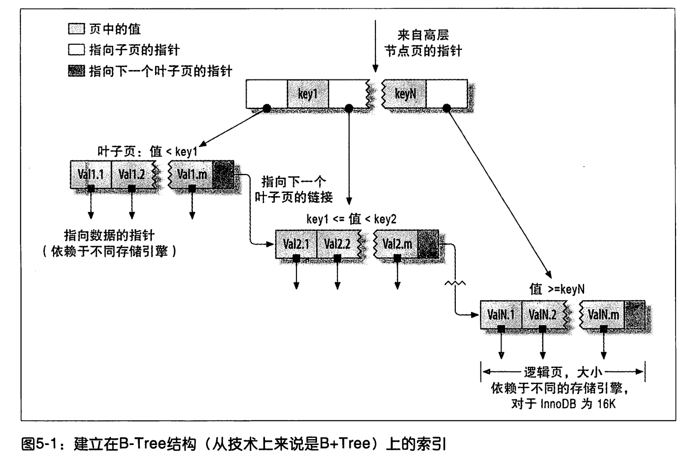
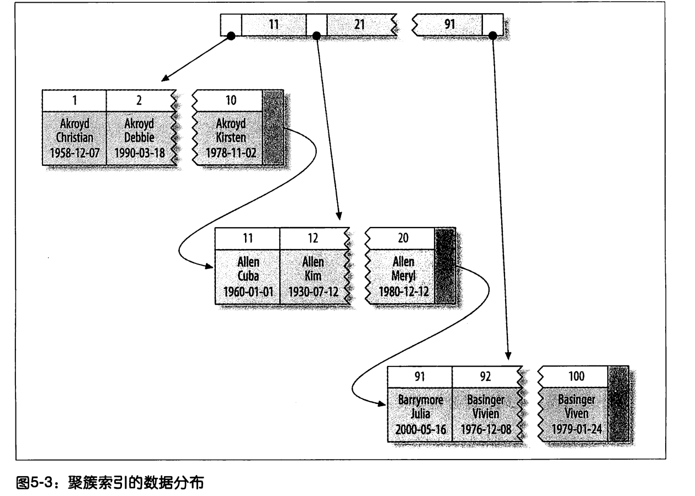

# Mysql优化之如何创建高性能的索引
- 索引是存储引擎用于快速找到记录的一种数据结构。索引对于性能非常关键。在数据量大的情况下，不恰当的索引对性能的影响很大。索引优化是对查询性能优化最有效的手段。
- 索引的使用是先在索引中找到对应值，然后根据匹配的索引记录找到对应的数据行。
- 索引可以包含一个或多个列的值，如果索引包含多个列，那么列的顺序也十分重要，因为mysql只能高效的使用索引的最左前缀列

## 索引的类型
索引有很多中类型，可以在不同的场景使用。在mysql中，索引是在存储引擎层而不是服务器层实现的。
- **B-Tree索引**
  - 使用B-Tree数据结构来存储数据。但是不同的的存储引擎，底层可能使用不同的存储结构
    - NDB集群存储引擎内部使用了T-Tree结构存储，及为BTREE
    - InnoDB存储引擎使用的是B+Tree，InnoDB根据主键引用被索引的行
  - B-Tree通常意味着所有的值都是按顺序存储的，并且每一个叶子到根的距离相同

  - B-Tree索引能够加快访问数据的速度，因为存储引擎不在需要进行全表扫描来获取需要的数据，是从索引的根节点开始进行搜索。根节点的槽中存放了指向子节点的指针，存储引擎根据这些指针向下层查找。
通过比较节点页的值和要查找的值可以找到合适的指针进入下层子节点，这些指针实际上定义了子节点页中值的上线和下限。子节点的指针指向的被索引的数据，而不是其他的节点页。树的深度和表的大小直接相关。
  - 注意：索引对多个值进行排序的依据是create table语句中定义索引时列的顺序
  - B-Tree适用于全键值，键值范围或键前缀查找。键前缀查找只适用于根据最左前缀的查找。
    - 全值匹配：指的是和索引中的所有列进行匹配
    - 匹配最左前缀：即只使用索引的第一列
    - 匹配列前缀：也可以只匹配某一列的值的开头部分，也只使用索引的第一列
    - 匹配范围值：也只使用了索引的第一列
    - 精确匹配某一列并范围匹配另外一列
    - 只访问索引的查询：B-Tree通过可以支持“只访问索引的查询”，即查询只需要访问索引，而无须访问数据行。
  - **B-Tree索引的限制**
    - 如果不是按照索引的最左列开始查找，则无法使用索引
    - 不能跳过索引中的列
    - 如果查询中有某一个列的范围查询，则其右边所有列都无法使用索引优化查找。
- **哈希索引**：基于哈希表实现，只有精确匹配索引所有列的查询才有效。对于每一行数据，存储引擎都会对所有的索引列计算一个哈希码，哈希码是一个较小的值，并且不同的键值的行计算出来的哈希码也不一样，
哈希索引将所有的哈希码存储在索引中，同时在哈希表中保存指向每一个数据行的指针。
  - **哈希索引的限制**
    - 哈希索引只包含哈希值和行指针，而不存储字段值，所以不能使用索引中的值来避免读取行。
    - 哈希索引数据并不是按照索引值顺序存储的，不能进行排序。
    - 哈希索引也不支持索引匹配查找，因为哈希索引始终是使用索引的全部内容来计算哈希值的
    - 哈希索引只支持等值比较
    - 访问哈希索引的数据非常快，除非有很多哈希冲突（不同的索引列值却有相同的哈希值）
    - 如果哈希冲突很多的话，一些索引维护操作的代价也会很高
    - 处理哈希冲突可以再查询的时候，必须在查询的时候where中包含常量值
- **空间数据索引**
  - MyISAM表支持空间索引，可以用于地理数据存储
  - 空间索引无须前缀查询，空间索引会从所有维度来索引数据
- **全文索引**
  - 全文索引查找的文本中的关键词，而不是直接比较索引中的值
  - 全文索引更像搜索引擎做的事情，不是简单的where条件匹配

# 索引的优点
- 索引大大减少了服务器需要扫描的数据量
- 索引可以帮助服务器避免排序和临时表
- 索引可以将随机I/O变为顺序I/O
- 三星系统
  - 索引将相关的记录放到一起则获得一星
  - 如果索引中的数据顺序和查找中的排序顺序一致则获得二星
  - 如果索引中的列包含了查询中需要的全部列则获得三星

# 高性能索引的策略
- 独立的列：指索引列不能是表达式的一部分，也不能是函数的参数
- 前缀索引和索引选择性
  - 索引的选择性：不重复的索引值和数据表的记录总数(#T)的比值，范围从1/#T到1之间。
  - 创建前缀索引：alter table table_name add key (column(7));
  - **mysql无法使用前缀索引做order by和group by，也无法使用前缀索引做覆盖扫描**
- 多列索引
  - 当出现服务器对多个索引做相交操作时，通常多个AND查询，通常意味着需要一个包含所有相关列的多列索引，而不是多个独立的单列索引
  - 当服务器需要对多个索引做联合查询时，多个or查询，通常需要耗费大量CPU和内存资源在算法的缓存、排序和合并操作上。特别是当其中有些索引的选择性不高，需要合并扫描返回的大量数据的时候
  - 如果遇到索引合并，就需要进行优化了，可以通过参数optimizer_switch来关闭索引合并，或者使用ignore index提示优化器忽略掉某些索引
- 选择合适的索引列顺序
  - 在一个多列B-Tree索引中，索引列的顺序意味着索引首先按最左列进行排序，其次是第二列，以此类推。所以索引可以按照升序或者降序进行扫描。所以多列索引的顺序很重要
  - 如何选择索引的顺序呢？
    - 将选择性最高的列放到索引最前列。（不考虑排序和分组的时候）
    - 选择性和基数法则
- 聚簇索引
  - 不是一个单独的索引类型，而是一种数据存储方式。在InnoDB的聚簇索引实际上在同一个结构中保存了B-Tree索引和数据行。
  - 一个表只能有一个聚簇索引，因为无法同时把数据行存放在两个不同的地方。当表有聚簇索引时，它的数据行实际存放在索引的叶子页中。
  
  - 聚集的数据优点：
    - 可以把相关的数据保存在一起
    - 数据访问更快
    - 使用覆盖索引扫描的查询可以直接使用页节点中的主键值
  - 缺点
    - 聚簇索引最大限度地提高了I/O密集性应用的性能，但如果将数据全部放在内存中，聚簇索引就没有优势了
    - 插入速度严重依赖于插入的顺序
    - 更新的代价比较高，因为会强制InnoDB将每个被更新的行移动到新的位置
    - 插入的时候会发现页分裂的问题，导致占用更多的磁盘空间
    - 聚簇索引可能导致全表扫描变慢
    - 二级索引可能比想象的要更大，因为在二级索引的叶子节点包含了引用行的主键列
    - 二次索引访问需要两次索引查找，而不是一次
- 覆盖索引
  如果一个索引包含所有需要查询的字段的值，我们称为覆盖索引
  - 

