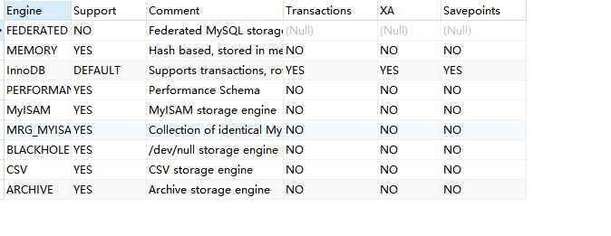

# Mysql 存储引擎
在文件系统中，Mysql为每一个数据库（schema）保存为数据目录下的一个子目录。创建表时，mysql会在数据库子目录下创建一个和表同名的.frm文件保存
表的定义，如创建一个名为T_USER_INFO的表，mysql会在T_USER_INFO.frm文件中保存该表的定义。因为mysql使用文件系统的目录和文件夹保存数据库和
表的定义，大小写敏感性和具体的平台密切相关。在windows中，大小写不敏感，而在unix中则是敏感的。不同的存储引擎保存数据和索引的方式是不同的，但
表的定义则是在mysql服务层统一处理的。
我们可以使用SHOW TABLE STATUS LIKE 表名,显示表的相关信息。
```mysql
SHOW TABLE STATUS LIKE 'msg_template';
```

下面展示的JSON格式：
```json
{
  "RECORDS": [
    {
      "Name": "msg_template",
      "Engine": "InnoDB",
      "Version": 10,
      "Row_format": "Dynamic",
      "Rows": 22,
      "Avg_row_length": 744,
      "Data_length": 16384,
      "Max_data_length": 0,
      "Index_length": 0,
      "Data_free": 0,
      "Auto_increment": 559,
      "Create_time": "7/7/2022 16:19:23",
      "Update_time": "19/7/2022 13:52:43",
      "Check_time": null,
      "Collation": "utf8mb4_bin",
      "Checksum": null,
      "Create_options": "",
      "Comment": ""
    }
  ]
}
```
相关字段含义：
- Name： 表名称
- Engine：表的存储引擎类型。在旧版本中，该列的名字叫type
- Version：表版本号
- Row_format：行的格式。对于MyISAM表，可选的值为‘Dynamic’、‘Fixed’或者Compressed。
  Dynamic的行长度是可变的，一般包含可变长度的字段，如varchar或BLOB。
  Fixed的行长度则是固定的，只包含固定长度的列，如char和Integer。
  Compressed的行则只在压缩表中存在
- Rows：表中的行数，对于MyISAM是精确的，对于InnoDB该值是估计值
- Avg_row_length：平均每行包含的字节数
- Data_length：表数据的大小
- Max_data_length：表数据的最大容量，与存储引擎有关
- Index_length：索引的大小
- Data_free：对于MyISAM表，表示已分担但目前没有使用的空间。这部分空间包括了之前删除的行，以及后续可以被Insert利用到的空间。
- Auto_increment：下一个AUTO_INCREMENT的值
- Create_time：表的创建时间
- Update_time：表数据的最后修改时间
- Check_time：使用check table命令或myisamchk工具最后一次检查表的时间
- Collation：表的默认字符集和字符列排序规则
- Checksum：如果启用，保存的是整个表的实时检验和
- Create_options：创建表时指定的其他选项
- Comment：该列包含了一些其他的额外信息。对于MyISAM表，保存的是表在创建时带的注释。对于InnoDB表，则保存的是InnoDB表空间的剩余空间信息。
  如果是一个视图，则该列包含“VIEW”的文本字样。
我们可以通过如下命令查看mysql支持的存储引擎：
```MYSQL
SHOW ENGINES; 
```

## [InnoDB存储引擎](https://dev.mysql.com/doc/refman/8.0/en/innodb-storage-engine.html)
InnoDB存储引擎是mysql的默认事务型引擎。也是最重要和使用最广泛的存储引擎。它被设计用来处理大量的短期事务。短期事务大部分情况是正常提交的，很少会被回滚。
InnoDB的性能和自动崩溃恢复特性，使得它在非事务型存储的需求中也很流行。
### InnoDB概览
- InnoDB的数据存储在表空间中，表空间是由InnoDB管理的一个黑盒子，由一系列的数据文件组成。在mysql 4.1以后的版本中，InnoDB可以将每个表的数据和索引
存放在单独的文件中。InnoDB也可以使用裸设备作为表空间的存储介质，但现代的文件系统使得裸设备不再是必要的选择。
- InnoDB采用MVCC来支持高并发，并且实现了四个标准的隔离级别。默认的隔离级别为**REPEATABLE READ**(可重复读)，并且通过间隙锁策略防止幻读的出现。
间隙锁使得InnoDB不仅仅锁定查询设计的行，而且对索引中的间隙进行锁定，已防止幻影行的插入。
- InnoDB表是基于聚簇索引建立的。InnoDB的索引结构和Mysql的其他存储引擎有很大不同，聚簇索引对主键查询有很高的性能。不过它的二级索引中必须包含主键
列，所以如果主键列很大的话，其他的所有索引都会很大。因此当表上的索引较多的情况下，主键应当尽量的小。InnoDB的存储格式是平台独立的。
- InnoDB内部做了很多的优化，比如从磁盘读取数据时采用的可预测预读，能够自动在内存中创建hash索引以加速读操作的自适应哈希索引。
- 作为事务型的存储引擎，InnoDB通过一些机制和工具支持真正的热备份。
## [MyISAM存储引擎](https://dev.mysql.com/doc/refman/8.0/en/myisam-storage-engine.html)
在mysql 5.1及之前的版本，MyISAM存储引擎是默认的存储引擎。MyISAM提供了大量的特性，包括全文索引，压缩，空间函数等。但MyISAM存储引擎不支持事务和行级锁。
有一个比较严重的问题就是崩溃了后无法安全恢复。建议默认使用InnoDB存储引擎，不要使用MyISAM存储引擎。
### 存储
MyISAM存储引擎会将表存储在两个文件中：数据文件和索引文件，分别以.MYD和.MYI为扩展名。MyISAM表可以包含动态或者静态（长度固定）行。mysql会根据表的定义来
决定采用何种行格式。MyISAM表可以存储的行记录数，一般受限于可用的磁盘空间或者操作系统中单个文件的最大尺寸。
在Mysql 5.0中，MyISAM表如果是变长行，则默认配置只能处理256TB的数据。因为指向数据记录的指针长度为6个字节。而在更早的版本中，指针的默认长度为4字节，所以只能处理
4GB的数据。而所有的mysql版本都支持8字节的指针。可以通过修改MAX_ROWS和AVG_ROW_LENGTH选项的值来实现，两者相乘就是表可能达到的最大大小。修改
这两个参数会导致重建整个表和表的所有索引，这可能需要很长时间才能完成。
### 特性
- 加锁与并发：MyISAM对整张表加锁，而不是针对行。读取时会对需要读到的所有表加共享锁，写入则对表加排它锁。但是可以在读取查询的同时，也可以往表中插入新的记录。
- 修复：对于MyISAM表，mysql可以手工或者自动执行检查和修复操作。执行表的修复可能导致一些数据丢失。而且修复是非常慢的。可以通过**CHECK TABLE 表名**检查表的错误，如果错误可以通过执行
**REPAIR TABLE 表名**进行修复。如果mysql服务器已经关闭，也可以通过myisamchk命令行工具进行检查和修复操作。
- 索引特性：MyISAM表，即使是BLOB和TEXT等长字段，也可以基于前500个字符创建索引。MyISAM存储引擎也支持全文索引，这是一种基于分词创建的索引，可以支持复杂的查询
- 延迟更新索引键：创建MyISAM表的时候，如果指定了DELAY_KEY_WRITE选项，在每次修改完成时，不会立刻将修改的索引数据写入磁盘，而是会写到内存中的键缓冲区。只有在清理
键缓冲区或者关闭表的时候才会将对应的索引块写入到磁盘。延迟更新索引可以全局设定，也可以只作用到相应的表中。如果数据库或者服务器主机崩溃时会造成索引损坏，需要执行修复操作。
### MyISAM存储引擎压缩表
如果表在创建并导入数据以后，不会再对其进行修改操作，那么这样的表或许适合作为MyISAM的压缩表。
可以使用myisampack对MyISAM表进行压缩。压缩表是不能进行修改的。压缩表可以极大地减少磁盘的空间占用，因此也可以减少磁盘I/O,从而提升查询的性能。
压缩表也支持索引，但是索引为只读。
### MyISAM存储引擎性能
MyISAM存储引擎设计简单，数据已紧密格式存储。所有在某些场景下的性能很好。MyISAM有一些服务器级别的性能扩展限制，如对索引缓存区的Mutex锁。MariaDB基于
段的索引键缓冲区机制来避免问题。最典型的性能问题就是表锁的问题。
## mysql其他内部存储引擎
- [Archive存储引擎](https://dev.mysql.com/doc/refman/8.0/en/archive-storage-engine.html) :这些紧凑的、未索引的表用于存储和检索大量很少引用的历史、归档或安全审计信息。
- [Blackhole引擎](https://dev.mysql.com/doc/refman/8.0/en/blackhole-storage-engine.html) : Blackhole存储引擎接受但不存储数据，类似于Unix/dev/null设备。查询总是返回空集。这些表可用于复制配置，其中DML语句被发送到副本服务器，但源服务器不保留其自己的数据副本.
- [CSV引擎](https://dev.mysql.com/doc/refman/8.0/en/csv-storage-engine.html) :它的表实际上是带有逗号分隔值的文本文件。CSV表允许以CSV格式导入或转储数据，以便与读写相同格式的脚本和应用程序交换数据。因为CSV表没有索引，所以在正常操作过程中，通常将数据保存在InnoDB表中，只在导入或导出阶段使用CSV表。
- [Federated引擎](https://dev.mysql.com/doc/refman/8.0/en/federated-storage-engine.html) :提供链接独立的MySQL服务器，从许多物理服务器创建一个逻辑数据库的能力。非常适合分布式或数据集市环境。
- [memory引擎](https://dev.mysql.com/doc/refman/8.0/en/memory-storage-engine.html) :将所有数据存储在RAM中，以便在需要快速查找非关键数据的环境中进行快速访问。这个引擎以前称为HEAP引擎。它的用例正在减少;InnoDB和它的缓冲池内存区提供了一种通用和持久的方法来将大部分或所有数据保存在内存中，而NDBCLUSTER为巨大的分布式数据集提供了快速的键值查找。
- [merge引擎](https://dev.mysql.com/doc/refman/8.0/en/merge-storage-engine.html) :允许MySQL DBA或开发人员对一系列相同的MyISAM表进行逻辑分组，并将它们作为一个对象引用。适合于数据仓库等VLDB环境
- [EXAMPLE引擎](https://dev.mysql.com/doc/refman/8.0/en/example-storage-engine.html) :该引擎在MySQL源代码中作为示例，演示如何开始编写新的存储引擎。它主要是开发人员感兴趣的。存储引擎是一个不做任何事情的存根。您可以使用该引擎创建表，但不能在其中存储数据或从其中检索数据。
- [NDB引擎](https://dev.mysql.com/doc/refman/8.0/en/mysql-cluster.html): 这种集群数据库引擎特别适合那些需要尽可能高的正常运行时间和可用性的应用程序。
## 如何选择存储引擎？

| Feature                                | MyISAM       | Memory           | InnoDB       | Archive      | NDB          |
| :------------------------------------- | :----------- | :--------------- | :----------- | :----------- | :----------- |
| B-tree indexes                         | Yes          | Yes              | Yes          | No           | No           |
| Backup/point-in-time recovery (note 1) | Yes          | Yes              | Yes          | Yes          | Yes          |
| Cluster database support               | No           | No               | No           | No           | Yes          |
| Clustered indexes                      | No           | No               | Yes          | No           | No           |
| Compressed data                        | Yes (note 2) | No               | Yes          | Yes          | No           |
| Data caches                            | No           | N/A              | Yes          | No           | Yes          |
| Encrypted data                         | Yes (note 3) | Yes (note 3)     | Yes (note 4) | Yes (note 3) | Yes (note 3) |
| Foreign key support                    | No           | No               | Yes          | No           | Yes (note 5) |
| Full-text search indexes               | Yes          | No               | Yes (note 6) | No           | No           |
| Geospatial data type support           | Yes          | No               | Yes          | Yes          | Yes          |
| Geospatial indexing support            | Yes          | No               | Yes (note 7) | No           | No           |
| Hash indexes                           | No           | Yes              | No (note 8)  | No           | Yes          |
| Index caches                           | Yes          | N/A              | Yes          | No           | Yes          |
| Locking granularity                    | Table        | Table            | Row          | Row          | Row          |
| MVCC                                   | No           | No               | Yes          | No           | No           |
| Replication support (note 1)           | Yes          | Limited (note 9) | Yes          | Yes          | Yes          |
| Storage limits                         | 256TB        | RAM              | 64TB         | None         | 384EB        |
| T-tree indexes                         | No           | No               | No           | No           | Yes          |
| Transactions                           | No           | No               | Yes          | No           | Yes          |
| Update statistics for data dictionary  | Yes          | Yes              | Yes          | Yes          | Yes          |

## 转换表的存储引擎
通过修改表的存储引擎，有很多的方法，都有相应的优点和缺点。下面有如下三种方式：

- ALTER TABLE
  将表从一个引擎修改为另一个引擎最简单的办法是使用**ALTER TABLE**语句。
  ```mysql
    ALTER TABLE `msg_template` ENGINE  = InnoDB;
  ```
  上述的语法可以使用任何的存储引擎，但是有一个问题，执行时间很长。mysql会按行的将数据从原表复制到一张新表中，I/O消耗很大，同时会在原表上加上读锁。 如果转换表的存储引擎，将会失去和原引擎相关的所有特性
- 导出和导入
  为了更好的控制转换的过程，可以使用mysqldump工具将数据导出到文件，然后修改文件中**create table**语句的存储引擎选项。注意同时修改表名，因为同一个数据库中不能存在相同的表名。注意mysqldump默认会自动在**create table**前面加上**drop table**语句
- 创建与查询
  这种方法是先创建一个新的存储引擎的表，然后利用**insert ... select**语句来导数据。
  ```MYSQL
  CREATE TABLE innodb_table like myisam_table;
  alter table innodb_table engine = InnoDB;
  insert into innodb_table select * from myisam_table;
  ```
  如果数据量比较小，可以使用上面的操作，如果数据量很大，就需要分批进行处理。针对每一段数据执行事务提交操作，以避免大量事务产生过多的undo。
```MYSQL
START TRANSACTION ;
INSERT INTO innodb_table select * from myisam_table where id between x and y;
commit ;
```
这样操作完之后，新表是原表的一个全量复制，原表还在，如果需要可以删除原表。如果要求数据一致性，可以在执行的过程中对原表进行加锁，以确保数据的一致性。
我们也可以使用[percona toolkit](https://www.percona.com/downloads/percona-toolkit/LATEST/) 很方便的操作。
