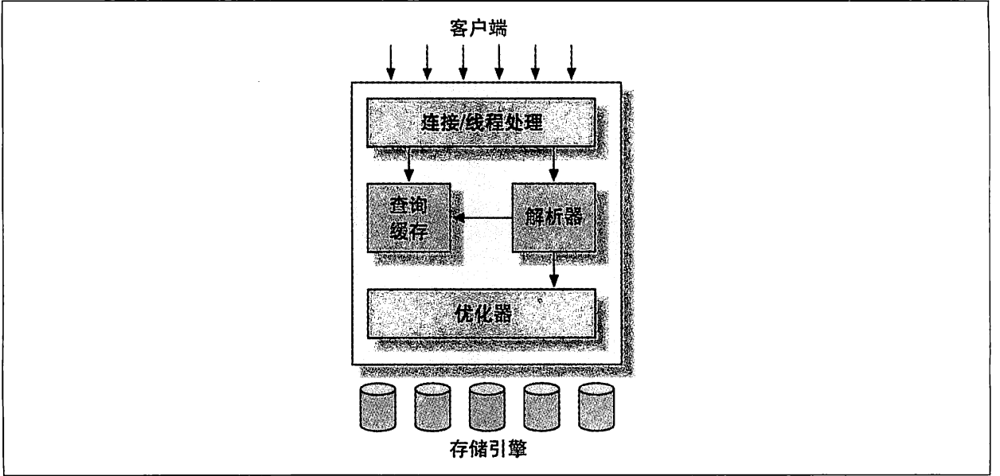

# Mysql逻辑架构



## 连接处理和安全性

每一个客户端链接都会在服务器进程中拥有一个线程。这个链接的查询只会在这个单独的线程中执行，该线程只能轮流在某个CPU核心或者CPU中运行。服务器会负责缓存线程，因此不需要为每一个新建的连接创建或者销毁线程。

客户端连接mysql数据库时，有两种方式：

1.通过用户名和密码

2.通过ssl的方式进行连接，需要使用X.509证书认证

当连接上数据库服务器之后，服务器会继续验证该客户端是否具有执行某个特性查询的权限。

## 优化与执行

mysql会解析查询，并创建内部数据结构（解析树），然后对其进行各种优化，包括重新查询，决定表的读取顺序以及选择合适的索引等。

对于select语句，在解析查询之前，服务器会先检查查询缓存，如果能够在其中找到对应的查询，服务器就不必再执行查询解析、优化和执行的整个过程，而是直接返回查询缓存中的结果集。

## 并发控制

共享锁（读锁）：读锁是共享的，或者说是相互不阻塞的。多个客户在同一时刻可以同时读取同一个资源，而互不干扰。

排它锁（写锁）：写锁则是排他的，也就是说一个写锁会阻塞其他的写锁和读锁。只有这样才能确保在给定的时间里，只有一个用户能执行写入，并防止其他用户读取正在写入的同一资源。

## 锁粒度

表锁：是mysql中最基本的锁策略，并且是开销最小的策略。表锁是锁定整张表。一个用户在对表进行操作（插入、修改、删除等）前，需要先获取写锁。这会阻塞其他用户对该表的所有读写操作。只有没有写锁时，其他读取的用户才能获得读锁，读锁之间是不互相阻塞的。alert table之类的语句会使用表锁，而忽略存储引擎的锁机制。

行级锁：行级锁可以最大程度地支持并发处理。

## 事务

事务就是一组原子性的sql查询。如果数据库引擎能够成功的对数据库应用该组查询的全部语句，那么就执行该组查询。如果其中有任何一条语句因为崩溃或其他原因无法执行，那么所有的语句都不会执行。

ACID：

A:原子性：一个事务必须被视为一个不可分割的最小工作单元，整个事务中的所有操作要么全部提交成功，要么全部失败回滚，对于一个事务来说，不可能只执行其中的一部分操作。

C：一致性：数据库总是从一个一致性的状态转换到另外一个一致性的状态。

I：隔离性：一个事务所做的修改在最终提交以前，对其他事务是不可见的。

D：持久性：一旦事务提交，则其所做的修改就会永久保存到数据库中。

## 隔离级别

**READ UNCOMMITTED**(未提交读)：在该级别中，事务中的修改，即使没有提交，对其他事务也都是可见的。事务可以读取未提交的数据，会出现脏读。这个级别会导致很多问题，一般很少用到。

**READ COMMITTED**（提交读）：大多数数据库系统默认的隔离级别，但是mysql不是。**READ COMMITTED**满足前面提到的隔离性：一个事务开始时，只能看到已经提交的事务所做的修改。一个事务从开始直到提交之前，所做的任何修改对其他事务都是不可见的。这个级别有时候也叫不可重复读，因为两次执行同样的查询，可能会得到不同的结果。

**REPEATABLE READ**（可重复读）：REPEATABLE READ解决了脏读的问题。该级别保证了在同一个事务中多次读取同样的记录结果是一致的。但是理论上，可重复读隔离级别还是无法解决另外一个幻读的问题。所谓幻读，指的是当某个事务在读取某个范围内的记录时，另外一个事务又在该范围内插入了新的记录，当之前的事务再次读取该范围的记录时，会产生幻行。Innodb和Xtradb存储引擎通过多版本并发控制解决了幻读的问题。

**SERIALIZABLE**（可串行化）：**SERIALIZABLE**是最高的隔离级别。他通过强制事务串行执行，避免了前面所的幻读的问题。SERIALIZABLE会在读取的每一行数据上都加锁，所以可能导致大量的超时和锁争用的问题。

|       隔离级别       | 脏读可能性 | 不可重复读可能性 | 幻读可能性 | 加锁读 |
| :------------------: | ---------- | ---------------- | ---------- | ------ |
| **READ UNCOMMITTED** | YES        | YES              | YES        | NO     |
|  **READ COMMITTED**  | NO         | YES              | YES        | NO     |
| **REPEATABLE READ**  | NO         | NO               | YES        | NO     |
|   **SERIALIZABLE**   | NO         | NO               | NO         | YES    |

## 死锁

死锁是指两个或者多个事务在同一资源上相互占用，并请求锁定对方占用的资源，从而导致恶性循环的现象。当多个事务试图已不同的顺序锁定资源时，就可能会产生死锁。多个事务同时锁定同一个资源时，也会产生死锁。

InnoDB目前处理死锁的方法是将持有最少行级排它锁的事务进行回滚。

## 事务日志

事务日志可以帮助提高事务的效率。使用事务日志，存储引擎在修改表的数据时只需要修改其内存拷贝，再把该修改行为记录到持久在硬盘上的事务日志中，而不用每次都将修改的数据本身持久到磁盘。事务日志采用的是追加的方式，因此写日志的操作是磁盘上一小块区域内的顺序I/O，而不像随机I/O需要在磁盘的多个地方移动磁头。所以采用事务日志的方式相对来讲要快得多。事务日志持久以后，内存中被修改的数据在后台可以慢慢地刷回到磁盘，称为预写式日志，修改数据需要写两次磁盘。

如果数据的修改已经记录到事务日志并持久化，但数据本身还没有写回磁盘，此时系统崩溃，存储引擎在重启时能够自动恢复这部分修改的数据。

## Mysql中的事务

Mysql中提供了两个事务型的存储引擎，InnoDB和NDB Cluster。

### 自动提交

Mysql默认采用自动提交模式。如果不是显式地开始一个事务，则每一个查询都被当作一个事务执行提交操作。在当前连接中，可以通过设置AUTOCOMMIT变量来启动或在禁用自动提交模式：

```MYSQL
SHOW VARIABLES LIKE 'AUTOCOMMIT';

SET AUTOCOMMIT = 1;
```
1或者ON表示启用，0或者OFF表示禁止。当AUTOCOMMIT=0的时候，所有的查询都是在一个事务中，直到显式地执行commit或者rollback回滚，该事务结束。
修改AUTOCOMMIT对非事务型的表，不会有任何影响。相当于一直处于AUTOCMMIT启用的模式。
有一些场景会强制执行COMMIT提交当前的活动事务。如：在DDL中，如果是会导致大量数据改变的操作，ALTER TABLE，LOCK TABLES等。
MYSQL可以通过执行如下命令来设置隔离级别：
```MYSQL
SET SESSION TRANSACTION ISOLATION LEVEL read committed ;
```
MYSQL能够识别所有的4个ANSI隔离级别，InnoDB引擎也支持所有的隔离级别。
### 在事务中混合使用存储引擎
Mysql服务器层不管理事务，事务是由下层的存储引擎实现的。所以在同一个事务中，使用多种存储引擎是不可靠的。也不推荐。
如果在事务中混合使用了事务型和非事务型的表，正常情况下没有什么问题，但是回滚的时候将会有问题。非事务型表将不能进行撤销回滚，这会导致数据库处
于不同的状态。最好为每张表选择合适的存储引擎。
### 隐式和显示锁定
InnoDB采用的是两阶段锁定协议。在事务执行过程中，随时都可以执行锁定。锁只有在执行commit或者rollback的时候才会释放，并且所有的锁在同一时刻
被释放。InnoDB会根据隔离级别在需要的时候自动加锁。另外，InnoDB也支持通过特定的语句进行`显式锁定`。
```MYSQL
SELECT ... LOCK IN SHARE MODE
SELECT ... FOR UPDATE
```
同时mysql也支持lock tables和unlock tables语句，这是在服务器层实现的，和存储引擎无关。不能替代事务处理，如果需要用到事务，还是需要选择事务型存储引擎。
```text
    LOCK TABLES和事务之间相互影响的话，情况就会比较复杂，在某些mysql版本中甚至会产生无法预料的结果。建议，除了事务中禁用了AUTOCOMMIT可以使用LOCK TABLES
    之外，其他任何时候不要显式地执行LOCK TABLES，不管选择什么存储引擎。
```
## 多版本并发控制（MVCC）
MVCC多版本并发控制没有一个统一的实现标准，每个数据库都有实现自己的一套MVCC。
MVCC是行级锁的一个变种，但是它在很多情况下避免了加锁操作，因此开销会更低。虽然实现机制不同，基本大都是实现了非阻塞的读操作，写操作也只锁定必要的行。
MVCC的实现是通过保存数据在某个时间点的快照来实现的。也就是说，不管需要执行多长时间，每个事务看到的数据都是一致的。根据事务开始的时间不同，每一个事务
对同一个表，同一时刻看到的数据可能不一样的。
不同存储引擎的MVCC的实现是不同的。典型的有乐观并发控制和悲观并发控制。
InnoDB实现MVCC是通过在每行记录后面保存两个隐藏的列来实现的。这两个列为：1.一个保存行的创建时间  2.一个保存行的过期时间（或者删除时间）
存储的并不是实际的时间值，而是系统版本号。每开始一个新的事务，系统版本号就会自动递增。事务开始时刻的系统版本号会作为事务的版本号，用来和查询
到的每行记录的版本号进行比较。
在**REPEATABLE READ**的隔离级别情况下，看看MVCC的操作：
- select:
    InnoDB会根据一下两个条件检查每行的记录：
    1. InnoDB只查找版本早于当前事务版本的数据行，这样可以确保事务读取的行，要么是在事务开始前已经存在，要么是事务自身插入或者修改过的。
    2. 行的删除版本要么未定义，要么大于当前事务版本号。这可以确保事务读取到的行，在事务开始之前未被删除。
  只有符合上面两个条件的记录，才会返回作为查询结果
- insert
    InnoDB为新插入的每一行保存当前系统版本号作为行版本号
- delete
    InnoDB为删除的每一行保存当前系统版本号作为删除标识
- update
  InnoDB为插入一行新纪录，保存当前系统版本号作为行版本号，同时保存当前系统版本号到原来的行作为行删除标识
保存这两个额外系统版本号，使大多数读操作都可以不用加锁。
MVCC只在**REPEATABLE READ**和**READ COMMITTED**两个隔离级别下工作。其他两个隔离级别不兼容，因为**READ UNCOMMITTED**总是读取最新的数据行，而不是服务当前事务版本的数据行
而**SERIALIZABLE**则会对所有读取的行都加锁。

