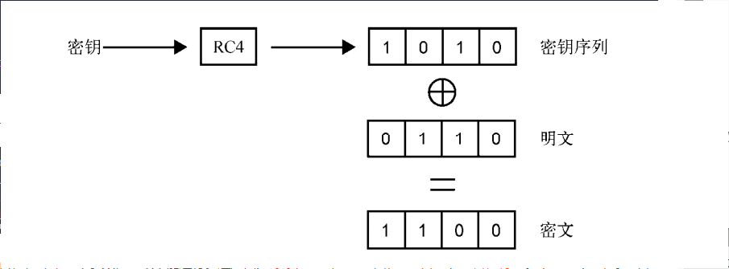
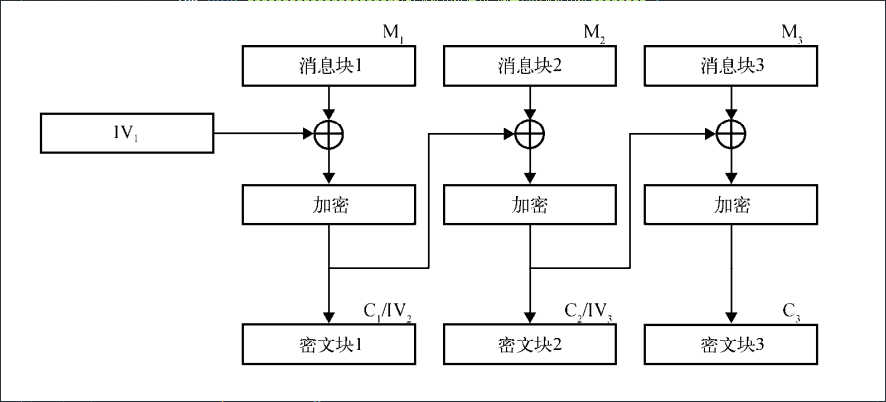
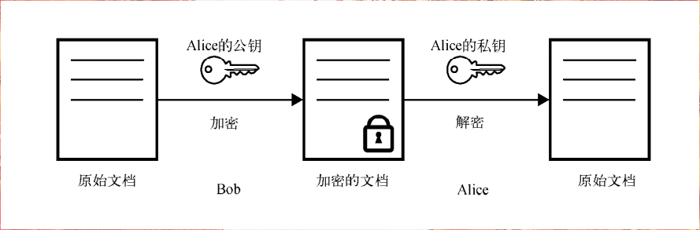
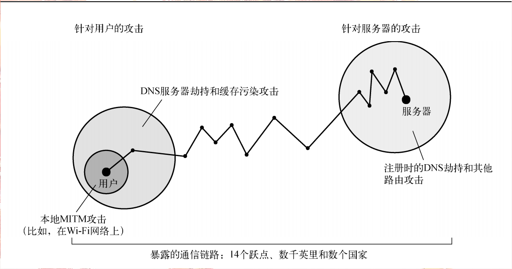

# HTTPS
HTTPS （全称：Hypertext Transfer Protocol Secure ），是以安全为目标的 HTTP 通道，在HTTP的基础上通过传输加密和身份认证保证了传输过程的安全性 。
HTTPS 在HTTP 的基础下加入SSL，HTTPS 的安全基础是 SSL，因此加密的详细内容就需要 SSL。 HTTPS 存在不同于 HTTP 的默认端口及一个加密/身份验证层（在 HTTP与 TCP 之间）。
这个系统提供了身份验证与加密通讯方法。它被广泛用于万维网上安全敏感的通讯，例如交易支付等方面

## HTTPS与HTTP原理区别
HTTPS 主要由两部分组成：HTTP+SSL/TLS，也就是在HTTP上又加了一层处理加密信息的模块。服务端和客户端的信息传输都会通过TLS进行加密，所以传输的数据都是加密后的数据。

### HTTP 原理

1. 客户端的浏览器首先要通过网络与服务器建立连接，该连接是通过TCP 来完成的，一般 TCP 连接的端口号是80。 建立连接后，客户机发送一个请求给服务器，请求方式的格式为：统一资源标识符（URL）、协议版本号，后边是 MIME 信息包括请求修饰符、客户机信息和许可内容。
2. 服务器接到请求后，给予相应的响应信息，其格式为一个状态行，包括信息的协议版本号、一个成功或错误的代码，后边是 MIME 信息包括服务器信息、实体信息和可能的内容。

### HTTPS 原理
1. 客户端将它所支持的算法列表和一个用作产生密钥的随机数发送给服务器
2. 服务器从算法列表中选择一种加密算法，并将它和一份包含服务器公用密钥的证书发送给客户端；该证书还包含了用于认证目的的服务器标识，服务器同时还提供了一个用作产生密钥的随机数
3. 客户端对服务器的证书进行验证，并抽取服务器的公用密钥；然后，再产生一个称作 pre_master_secret 的随机密码串，并使用服务器的公用密钥对其进行加密，并将加密后的信息发送给服务器
4. 客户端与服务器端根据 pre_master_secret 以及客户端与服务器的随机数值独立计算出加密和 MAC密钥
5. 客户端将所有握手消息的 MAC 值发送给服务器
6. 服务器将所有握手消息的 MAC 值发送给客户端

## 传输层安全
SSL和TLS都是加密协议，旨在基于不安全的基础设施提供安全的通信。如果正确部署这些协议，就可以对互联网上的任意一个服务打开通信信道，并且可以确信你会
与正确的服务器通信，安全的交换信息，SSL和TLS保护着通信链路，即传输层

目标：

1. 加密安全
2. 互操作性
3. 可扩展性
4. 效率

## 网络层
我们使用最多的是IP/TCP协议，这些协议用于将数据分割成小数据包进行传输。我们在传输中会经过许多计算机系统（跃点）。由于核心协议本身不提供任何安全保障
，任何有权访问通信链路的人都可以获取到对应的数据和在不被察觉的情况下改变这些数据。

如果部署了加密，攻击者也许有能力得到加密数据的访问权限，但是不能解密数据或者篡改数据。为了避免伪装攻击，SSL和TLS依赖另外一项被称为公钥基础设施（public key infrastructure，PKI）的重要技术，确保将流量发送到正确的接收端。

## OSI网络模型
1. 物理层：直接物理数据连接（电缆）
2. 数据链路层：可靠的本地数据连接（ LAN）
3. 网络层：网络节点间的路由与数据分发
4. 传输层：包或流的可靠传输
5. 会话层：多连接管理
6. 表示层：数据表示、转换和加密
7. 应用层：应用数据

高层的协议不必担心在底层实现的功能

## 对称加密
对称加密又称私钥加密，是一种混淆算法

步骤：（用户A和用户B进行交互）
1. 用户A将原文（明文）进行私钥（密钥）加密
2. 用户A生成加密文档（密文）
3. 用户B接收到之后通过私钥（密钥）进行解密，获得原文（明文）

序列密码：
序列密码的操作过程和加密的过程一致。将1字节的明文输入加密算法，就得到1字节的密文输出。在对端则进行相反的过程。重复上面的过程直到所有的数据处理完成

序列密码的核心是生成一串称为密钥序列的无穷序列。加密就是将密钥序列中的1字节与明文序列中的1字节进行异或操作。因为异或操作是可逆的，所以解密就是将
密文序列中的1字节与密钥序列中的相同字节进行异或操作

分组密码：每次加密一整块数据，并且现代的分组密码倾向于使用128位大小的块。一个分组密码就是一个变换函数：接受输入并生成看似杂乱无章的输出。只要
使用相同的密钥，每一个可能的输入组合都有一个唯一的输出。分组密码的关键特性是在输入上制造一个小变化，从而得到大量输出变体。

分组密码的问题：（AES是分组密码）
1. 只能使用他们加密长度等于加密块大小的数据。因此在实际的使用中，需要一个方法处理任意长度的数据。
2. 分组密码是确定的，对于相同的输入，输出也是相同的。

为了解决以上的两个问题，我们可以使用分组密码模式的加密方案来使用分组密码。

填充：从分组密码可以知道，处理数据长度小于加密块大小的数据加密。如我们使用128位的AES需要16字节的输入数据并且产出长度的输出。如果我们的数据刚好能
归入16字节的块中，那这个号，如果不足16字节的怎么办呢？我们一种解决方式就是追加额外的数据到明文的尾部。这个添加的数据就是填充。

填充不能由任何随机数据构成，它必须遵循某种格式，这样接收方才可以发现填充并了解需要丢弃多少字节

散列函数（hash function）:是将任意长度的输入转化为定长输出的算法。
散列函数有以下几个额外特性：
1. 抗原像性（单向性）：给定一个散列，计算上无法找到或者构造出生成它的消息
2. 抗第二原像性（弱抗碰撞性）：给定一条消息和它的散列，计算上无法找到一条不同的消息具有相同的散列
3. 强抗碰撞性：计算上无法找到两条散列相同的消息
   
散列函数最常用的使用场合是以紧凑的方式表示并比较大量数据

消息验证代码：散列函数可以用于验证数据的完整性，但仅在数据的散列与数据本身分开传输的条件下如此，否则攻击者可以同时修改数据和散列，从而轻易的避开检测。
消息验证代码（ message authentication code， MAC）或者使用密钥的散列（ keyed-hash）是以身份验证扩展了散列函数的 密码学函数。只有拥有散列密钥，才能生成合法的MAC
任何散列函数都能用作MAC的基础，另一个基础是基于散列的消息验证代码（ hash-based message authentication code， HMAC）。 HMAC本质就是将散列密钥和消息以一种安全的方式交
织在一起。

分组密码模式：分组密码模式是为了加密任意长度的数据而设计的密码学方案，是对分组密码的扩展。一些模式会将分组密码转换成序列密码。
它有许多输出模式，通常以首字母缩写来引用： ECB、 CBC、 CFB、 OFB、 CTR、 GCM，诸 如此类（不用担心这些缩写都代表什么）。
ECB是设计一种分组 加密模式的反面例子，而CBC则仍是SSL和TLS的主要模式。 GCM是TLS中相对较新的模式，从 1.2版本开始才能使用。
它提供了机密性和完整性，是当前可用的最好模式。

电码本（ electronic codebook， ECB）模式是最简单的分组密码模式，它只支持数据长度正好是块大小的整数倍的情况，如果数据长度不满足这个条件，
就得事先实施填充。加密就是将数据按块大小切分，再分别加密每一块。

问题：
1. 密文中出现的模式显示出明文中对应出现的模式； 
2. 攻击者可以发现信息是否重复； 
3. 攻击者可以观察密文并且提交任意明文加密（在HTTP中通常是可能的，在一些其他情况下也可以），如此尝试足够的次数，就能猜出明文

加密块链接（ cipher block chaining， CBC）模式是从ECB发展而来，为了解决ECB天生的确定性， CBC引入了初始向量（ initialization vector， IV）的概念。
即使输入相同， IV也可以使每次的输出都不相同

## 非对称加密
非对称加密又名公钥加密，使用两个密钥，一个公钥，一个私钥。这两个密钥存在一些特殊的数学关系。使得密钥具备一些有用的特性。如果用公钥机密，只能使用
对应的私钥进行解密，如果某人用私钥加密，那么知道对应的公钥的人都可以进行解密。

## 中间人攻击
针对传输层安全性的攻击绝大多数来自中间人攻击。如果攻击者只是监听双方的会话，我们称之为被动网络攻击。如果攻击者主动改变数据流或者影响双方会话，我们
则称之为主动网络攻击。

1. ARP欺骗

地址解析协议用于在局域网中将MAC地址与IP地址进行关联。进入网络的攻击者可以声明任何IP地址，并对网络流量进行有效的重路由。

2. WPAD劫持

浏览器使用Web代理自动发现协议自动获取HTTP代理的配置。WPAD使用了好几种方法，包括DHCP和DNS。为了攻击WPAD，攻击者在局域网
中启动一台服务器并将其通知到那些寻找服务的本地客户端。

3. DNS劫持

只要攻击者能通过注册或者改变DNS配置来劫持某个域名，就可以劫持访问这个域名的所有流量。

4. DNS缓存中毒

DNS缓存中毒是一种攻击者利用DNS缓存服务器的缺陷在缓存中注入非法域名信息的攻击方式。成功完成这种攻击以后，受影响的DNS服务器的所有用户都将收到
攻击者构造的非法信息。

5. BGP路由劫持

边界网关协议是一种互联网骨干网络用于发现如何精确定位IP地址段的路由协议。如果某个非法路由信息被一个或更多路由器所接受，所有通往某个特定
IP地址段的流量都将被重定向到另一处，即攻击者那里。
