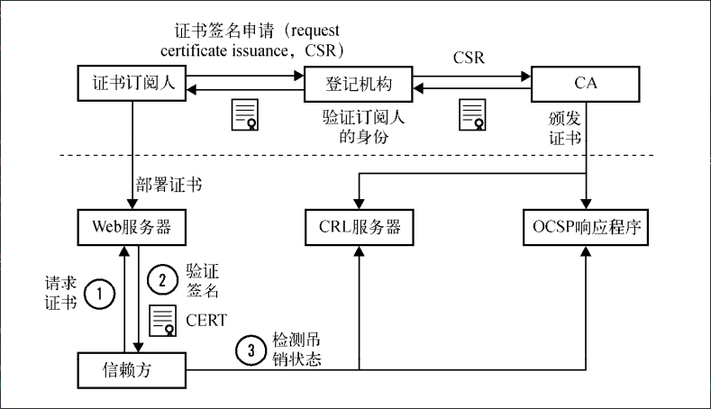
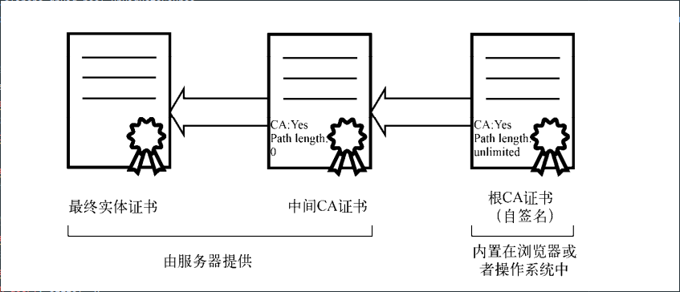

# 公钥基础设施(PKI)
PKI的目标就是实现不同成员在不见面的情况下进行安全通信，当前采用的模型是基于可信的第三方机构，证书颁发机构（CA）签发证书。

包含信息如下：
1. 订阅人：指那些需要证书来提供安全服务的团体
2. 登记机构（RA）：主要是完成一些证书签发的相关管理工作
3. 证书颁发机构（CA）：只信任的证书颁发机构，会在确认申请用户的身份之后签发证书。同时CA会在线提供其所签发证书的最新吊销信息
4. 信赖方：是指证书的使用者，技术上来讲，一般是指那些执行证书验证的网页浏览器，其他程序以及操作系统

PKI证书的生命周期：

## 证书的字段
1. 版本：证书一共由三个版本，分别用0，1，2编码表示版本1，版本2，版本3.版本1只支持简单的字段，版本2添加了两个标识符，而版本3则增加了扩展功能
2. 序列号：是每个CA用来唯一标识其所签发的证书
3. 签名算法
4. 颁发者：包括了证书颁发者的可分辨名称（DN）
5. 有效期：证书的有效期包括开始日期和结束日期
6. 使用者：使用者是实体的可分辨名称，和公钥一起用于证书的签发。在自签名证书里，使用者（subject）和颁发者（issuer）字段的可分辨名称是一样的
在最开始，可分辨名称里面的 公用名（ common name， CN）主要用于服务器主机名（例如/CN=www.example.com用于www.example.com域名的证书），但是如何为一个证书匹配多个主机名就变得比较麻烦了。如今，使用者字段已经废弃，转而使用使用者可选名称扩展
7. 公钥：这个包含了公钥，以使用者公钥信息结构呈现

## 证书链
在大多数情况下，仅仅有最终的实体证书是无法进行有效性验证的，服务器需要提供证书链才能一步步地最终验证到可信根证书。
最好不要由根证书直接签发最终实体证书，这样是非常不安全的

## 证书颁发机构
证书颁发机构（ certification authority， CA）是当前互联网信任模型最重要的部分，他们可以签发任何域名的证书，所以是非常权威的

怎么才能成为一个公开的CA？

1. 建立CA组织
   1. 在PKI和CA的运营上非常专业
   2. 需要设计一个健壮，安全，隔离的网络，以便在支持商业运作的同时，能够保证根证书以及二级证书密钥的安全
   3. 支持证书生命周期管理流程
   4. 符合Baseline Requirements的规定
   5. 符合EV SSL证书指导规范
   6. 提供全球化的CRL和OCSP基础服务
2. 符合当地法律，这意味着可能需要按照当地的法规要求获取相应许可证
3. 通过根证书库认可的那些审计
4. 将你的根证书内置到尽可能多的设备或者软件中
5. 找个已经内置的CA完成交叉证书

