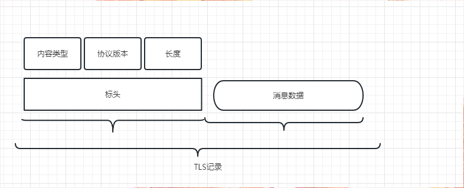
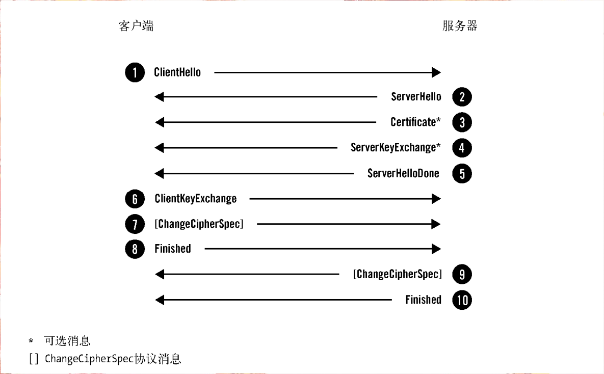
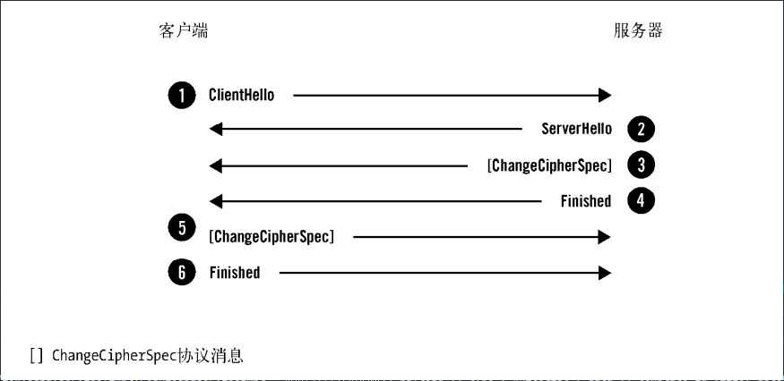
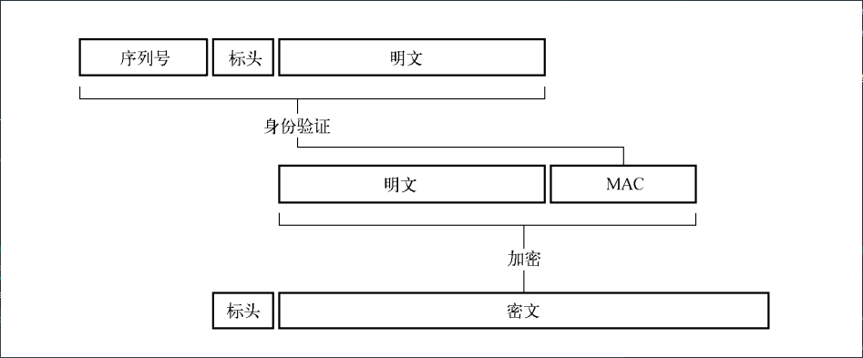
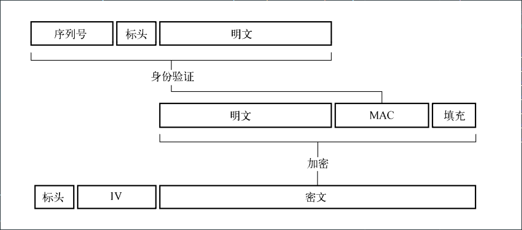
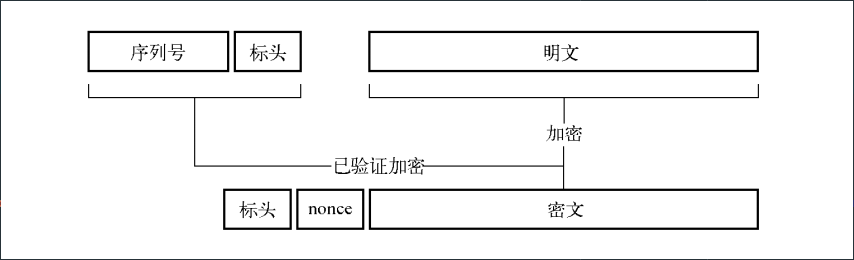

# TLS协议
## 记录协议
    TLS以记录协议实现。记录协议负责在传输连接上交换的所有底层消息，并可以配置加密
TLS消息结构包含如下：

1. 短标头
2. 短表头中包含记录内容的类型（或子协议）/协议版本/长度
3. 消息数据

每一个TLS记录都会指定一个唯一的64位序列号

### 消息传输
记录协议传输由其他协议层提交给它的不透明数据缓冲区。如果缓冲区超过记录的长度限制（ 16 384字节），记录协议会将其切分成更小的片段。
反过来也是可能的，属于同一个子协议的小缓冲区也可以组合成一个单独的记录。

### 加密以及完整性验证
在一个刚建立起来的连接上，最初的消息传输没有受到任何保护（从技术上讲，就是使用了TLS_NULL_WITH_NULL_NULL密码套件）。
这是必需的，否则第一次协商就无法进行。但一旦握手完成，记录层就开始按照协商取得的连接参数进行加密和完整性验证

### 压缩
由于安全性不再被使用

### 扩展性
记录协议只关注数据传输和加密，而将所有其他特性转交给子协议。这个方法使TLS可以扩展，因为可以很方便地添加子协议。
伴随着记录协议而被加密，所有子协议都会以协商取得的连接参数自动得到保护。

## TLS四个核心子协议
1. 握手协议
* 包含三种流程
    * 完整的握手
    * 对客户端和服务器都进行身份验证的握手
    * 恢复之前会话的简短握手

### 完整的握手
    
    每一个TLS连接都会以握手开始，如果客户端此前没有与服务器建立会话，那么双方会执行一次完整的握手流程来协商TLS会话
握手过程中，主要有下面四个过程：

   1. 交换各自支持的功能，对需要的连接参数达成一致
   2. 验证出示的证书，或使用其他方式进行身份验证
   3. 对将用于保护会话的共享主密钥达成一致
   4. 验证握手消息并未被第三方团队修改

对服务器进行身份验证的完整握手

* 客户端开始新的握手，并将自身支持的功能提交给服务器
* 服务器选择连接参数
* 服务器发送其证书链（仅发生在需要服务器身份验证时）

    典型的Certificate消息用于携带服务器X.509证书链。证书链是以ASN.1 DER编码的一系列证书，一个接着一个组合而成。
    主证书必须第一个发送，中间证书按照正确的顺序跟在主证书之后。
    服务器必须保证它发送的证书与选择的算法套件一致
    
* 根据选择的密钥交换方式，服务器发送生成主密钥的额外信息
* 服务器通知自己完成了协商过程
* 客户端发送生成主密钥所需的额外信息
* 客户端切换认证加密方式并通知服务器
* 客户端计算发送和接手到的握手消息的MAC并发送
* 服务器切换加密方式并通知客户端
* 服务器计算发送和接收到的握手小

### 完整的身份验证
尽管我们可以选择对任意一端进行身份验证，但几乎都启用了对服务器的身份验证。如果服务器的套件不是匿名的，那么就需要在Certificate消息中跟上相关的证书
相比之下，服务器通过发送CertificateRequest消息请求对客户端进行身份验证。消息中列出所有可接受的客户端证书。
作为响应，客户端发送自己的Certificate消息（使用与服务器发送证书相同的格式），并附上证书。此后，客户端发送CertificateVerify消息，证明自己拥有对应的私钥

只有已经过身份验证的服务器才被允许请求客户端身份验证。基于这个原因，这个选项被称为相互身份验证（双向认证）。

### 会话恢复
完整的握手协议非常复杂，需要很多握手消息和两次网络往返才能开始发送客户端应用数据。此外，握手执行的密钥学操作通常需要密集的CPU处理。身份验证通常以客户端和服务器证
书验证（以及证书吊销检查）的形式完成，需要更多的工作。这其中的许多消耗都可以通过简短握手的方式节约下来。
最开始的会话恢复机制是在完成一次协商的连接断开时，客户端和服务器都会将会话的安全参数保存一段时间。希望使用会话恢复的服务器为会话指定唯一的标识，称为会话ID。服务器在
ServerHello消息中将会话ID发回客户端。
希望恢复之前的会话的客户端将适当的会话ID放入ClientHello消息，然后提交。如果服务器愿意恢复会话，就会将相同的会话ID放入ServerHello消息返回，接着使用之前协商的主密钥
生成一套新的密钥，在切换到加密模式，发送Finished消息
客户端收到会话已恢复的消息以后，也进行相同的操作。这样的结果是握手只需要一次网络往返

用来替代服务器会话缓存和恢复的方案是使用会话票证（sesession ticket）。它是2006年引入的，随后在2008年进行了更新。使用这种方式，除了所有的
状态都保持在客户端（与HTTP Cookie的原理类似）之外，其消息流与服务器会话缓存是一样的。

2. 密钥规格变更协议
在TLS中，会话安全性取决于称为主密钥的48字节共享密钥。密钥交换的目的是计算另一值，即预主密钥，这个是组成主密钥的来源
- RSA密钥交换

客户端生成预主密钥，使用服务器公钥进行加密，将其包含在ClientKeyExchange消息中，发送出去。服务器只需要解密这条消息就能取出预主密钥

注意： 因为RSA算法可以同时用于加密和数字签名，所以RSA密钥交换可以按照这种方式工作。其他流行的密钥类型，比如DSA（DSS）和ECDSA，只能用于签名

- DH（Diffie-Hellman）密钥交换

DH密钥交换是一种密钥协定的协议，它使两个团体在不安全的信道上生成共享密钥成为可能。

注意：以这种方式协商共享密钥时不会受到被动攻击的威胁，但主动攻击者却可以劫持通信信道，冒充对端。这就是DH密钥交换通常与身份验证联合使用的原因

DH密钥交换需要6个参数：其中两个（dh_p和dh_g）称为域参数，由服务器选取。协商过程中，客户端和服务器各自生成另外两个参数，相互发送其中一个参数（dh_Ys和dh_Yc）到对端，再经过计算，最终得到共享密钥

- 椭圆曲线 Diffie-Hellman 密钥交换

ECDH密钥交换发生在一条由服务器定义的特定的椭圆曲线上。这条曲线代替了DH中域参数的角色。 理论上，ECDH支持静态的密钥交换，但实际使用时，只使用了这种临时的变种（ ECDHE）

ECDH密钥交换发生在一条由服务器定义的特定的椭圆曲线上。这条曲线代替了DH中域参数的角色。密钥交换由服务器发起，它选择一条椭圆曲线和公开参数并提交

- 加密

  - 序列密码
  
    在使用序列密码的时候，加密分为两步，1.计算MAC值，包括记录序列号，标头，明文，MAC的标头确保未进行加密的标头不会被篡改，MAC包含序列号，能确保消息不被重放 2.加密明文和MAC生成密文
    

  - 分组密码

    分组加密需要设计更多的内容，步骤如下：
  
    - 计算序列号，标头和明文的MAC
    - 构造填充，确认加密前的数据长度是分组的大小的整数倍
    - 生成一个长度与分组大小一致的不可预期的初始向量，初始向量能保证加密是不确定的
    - 使用CBC分组模式加密明文，MAC和填充
    - 将初始向量和密文一起发送
    

  - 已验证密码

    已验证的密码将加密和完整性验证合二为一（AEAD）。步骤如下：
    
    - 生成一个唯一的64位nonce
    - 使用已验证加密算法加密明文，同时将序列号和记录标头作为完整性验证依据的额外数据交给算法
    - 将nonce和密文一起发送
    

3. 应用数据协议
  
  应用数据协议携带着应用消息，只以TLS的角度考虑的话，这些就是数据缓冲区。记录层使用当前连接安全参数对这些消息进行打包，碎片整理和加密

4. 报警协议
  
  警报的目的是以简单的通知机制告知对端通信出现异常状况。通常携带close_notify异常，在连接关闭时使用。
  
## 密码套件

密码套件是一组选定的加密基元和其他参数，它可以精确定义如何实现安全。属性如下：
1. 身份验证方法
2. 密钥交换方法
3. 加密算法
4. 加密密钥大小
5. 密码模式（可应用时）
6. MAC算法（可应用时）
7. 伪随机数PRF（TLS 1.2时一定使用）
8. 用于Finished消息的散列函数（TLS 1.2）
9. verify_data结构的长度（TLS 1.2）

密码套件都倾向于使用较长的描述性名称，并且相当一致：它们都由密钥交换方法、身份验证方法、密码定义以及可选的MAC或PRF算法组合而成

## 协议限制
1. 加密保护TCP连接的内容，但TCP和所有其他更低层次的协议的元数据仍然是明文传输。因此，被动观察者可以确定源和目标的IP地址
2. 即使在TLS层，也会有很多信息是以明文的形式暴露的，第一次握手一定是非加密的，可以让被动观察者观察到如下：
   1. 了解客户端的功能，并使用其作为指纹
   2. 检查SNI信息确定期望访问的虚拟主机
   3. 检查主机证书，以及合适会使用客户端证书
   4. 存在得到足够信息以识别用户身份的可能性
3. 当启用加密后，某些协议信息仍然能被清楚的探查到