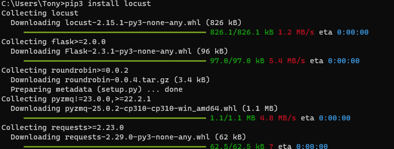
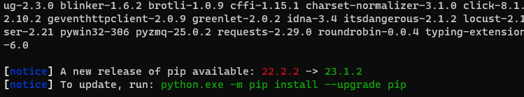
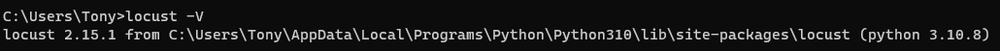

# 安装
安装locust其实很简单，只需要下面几步：
1. 如果本地没有安装python，需要安装python（3.7或者之后的版本 ）
2. 安装locust的包

```shell
pip3 install locust
```




3. 验证对应的安装

```shell
locust -V
```



## 安装预发布版本
如果我们需要最新最好的Locust版本，并且等不及下一个版本，我们可以安装预发布版本

```shell
pip3 install -U --pre locust
```