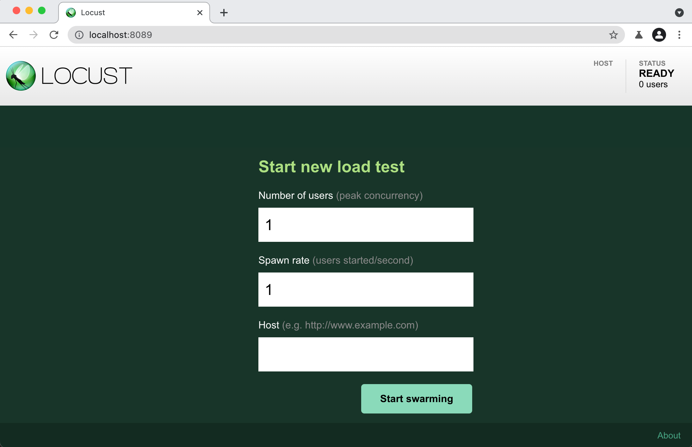
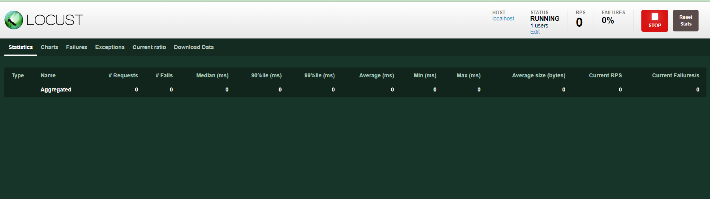
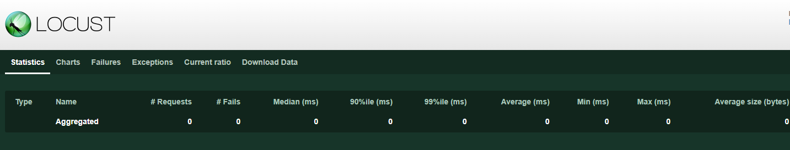
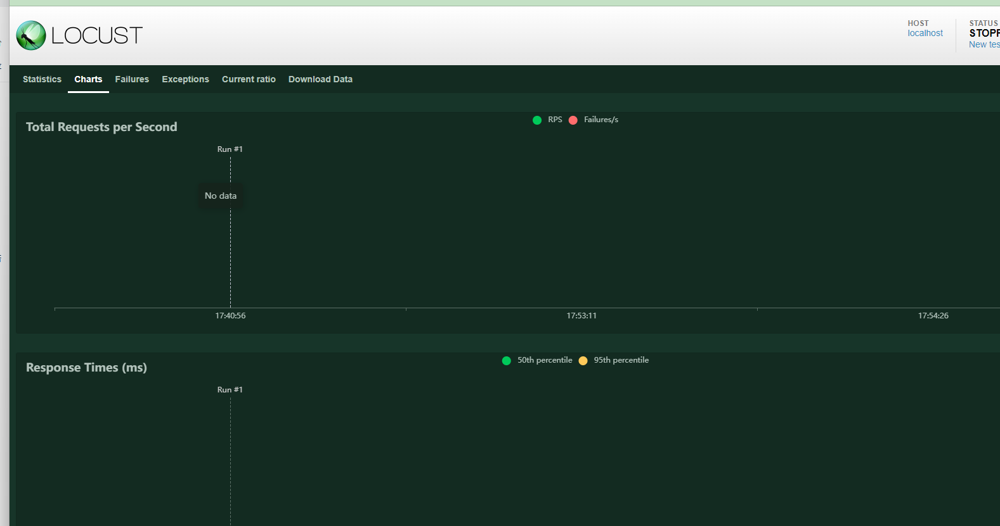
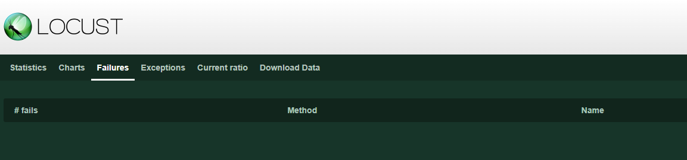
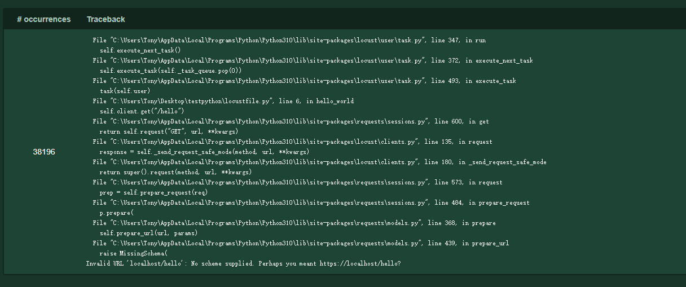
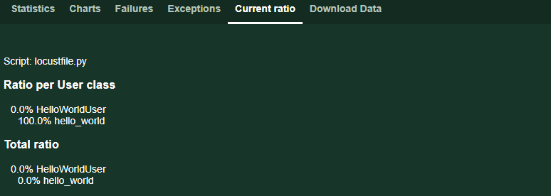
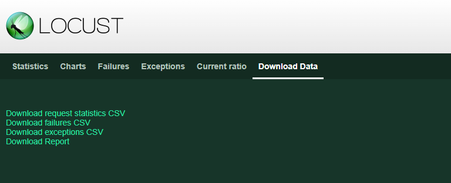

# 快速使用
    Locust测试本质上只是一个Python程序向要测试的系统发出请求。这使得它非常灵活，尤其擅长实现复杂的用户流

```text
from locust import HttpUser, task

class HelloWorldUser(HttpUser):
    @task
    def hello_world(self):
        self.client.get("/hello")
        self.client.get("/world")
```

用户不断的先请求/hello接口然后再/world接口，我们将上面的脚本保存为locustfile.py脚本文件，保存在指定的目录，如C:\Users\Tony

## 运行
我们进入C:\Users\Tony目录下，执行如下命令：

```shell
locust
```

输出如下说明启动成功：

```text
[2022-07-24 09:58:46,215] .../INFO/locust.main: Starting web interface at http://0.0.0.0:8089
[2022-07-24 09:58:46,285] .../INFO/locust.main: Starting Locust 2.15.1
```

## 界面
我们通过启动结果可以看到，我们可以通过http://0.0.0.0:8089取访问一个web界面，配置相关的数据，如下：



提供服务器的主机名并进行尝试，进入主页



界面中的相关tab说明：

- Statistics：统计

- Charts：报表数据

- Failures:失败统计

- Exceptions：异常

这个错误的原因也很明显，说明我本地没有/hello和/world接口
- Current ratio:当前比例

- Download Data:下载数据


我们可以通过**stop**按钮停止测试

## 使用命令行
使用Locust web UI是完全可选的。我们可以在命令行上提供加载参数，并以文本形式获得关于结果的报告：
```shell
locust --headless --users 10 --spawn-rate 1 -H http://localhost
[2022-07-24 10:41:10,947] .../INFO/locust.main: No run time limit set, use CTRL+C to interrupt.
[2022-07-24 10:41:10,947] .../INFO/locust.main: Starting Locust 2.15.1
[2022-07-24 10:41:10,949] .../INFO/locust.runners: Ramping to 10 users using a 1.00 spawn rate
Name              # reqs      # fails  |     Avg     Min     Max  Median  |   req/s failures/s
----------------------------------------------------------------------------------------------
GET /hello             1     0(0.00%)  |     115     115     115     115  |    0.00    0.00
GET /world             1     0(0.00%)  |     119     119     119     119  |    0.00    0.00
----------------------------------------------------------------------------------------------
Aggregated             2     0(0.00%)  |     117     115     119     117  |    0.00    0.00

[2022-07-24 10:44:42,484] .../INFO/locust.runners: All users spawned: {"HelloWorldUser": 10} (10 total users)

```

## 更多配置
要在多个Python进程或机器上运行分布式的Locust，可以使用--master命令行参数启动单个Locust主进程，
然后使用--worker命令行参数启动任意数量的Locust工作进程


